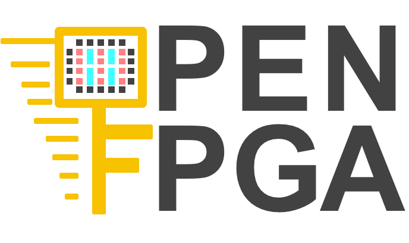

# Getting Started with OpenFPGA

## Introduction
The OpenFPGA framework is the **first open-source FPGA IP generator** supporting highly-customizable homogeneous FPGA architectures. OpenFPGA provides a full set of EDA support for customized FPGAs, including Verilog-to-bitstream generation and self-testing verification testbenches/scripts. OpenFPGA opens the door to democratizing FPGA technology and EDA techniques, with agile prototyping approaches and constantly evolving EDA tools for chip designers and researchers. 

## Compilation
Dependencies and help using docker can be found at [**./tutorials/building.md**](https://github.com/LNIS-Projects/OpenFPGA/blob/master/tutorials/building.md).

**Compilation Steps:**
1. git clone https://github.com/LNIS-Projects/OpenFPGA.git && cd OpenFPGA # *Clone the repository and go inside it*
2. mkdir build && cd build # *Create a folder named build in the OpenPFGA repository*
3. cmake ..  -DCMAKE_BUILD_TYPE=debug # *Create a Makefile in this folder using cmake*
4. make # *Compile the tool and its dependencies*

*We currently implemented OpenFPGA for:* 
*1. Ubuntu 16.04* 
*2. Red Hat 7.5* 
*3. MacOS Mojave 10.14.4*  
*Please note that those were the versions for which the tool was tested. It might work with earlier versions and other distributions.*

## Documentation
OpenFPGA's [full documentation](https://openfpga.readthedocs.io/en/master/) includes tutorials, descriptions of the design flow, and tool options.

## Tutorials
You can find some tutorials in the [**./tutorials**](https://github.com/LNIS-Projects/OpenFPGA/tree/master/tutorials) folder. This will help you get more familiar with the tool and use OpenFPGA under different configurations. 

Through those tutorials, users can learn how to use the flow and install the different dependencies. 
The [tutorial index](https://github.com/LNIS-Projects/OpenFPGA/blob/master/tutorials/tutorial_index.md) will guide you through training and explain the folder oraganization as well as introducing some tips and commonly used keywords.
