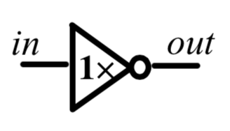
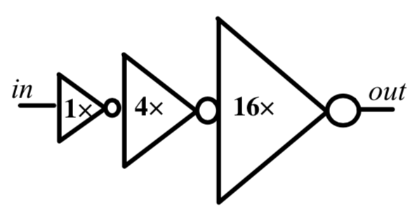
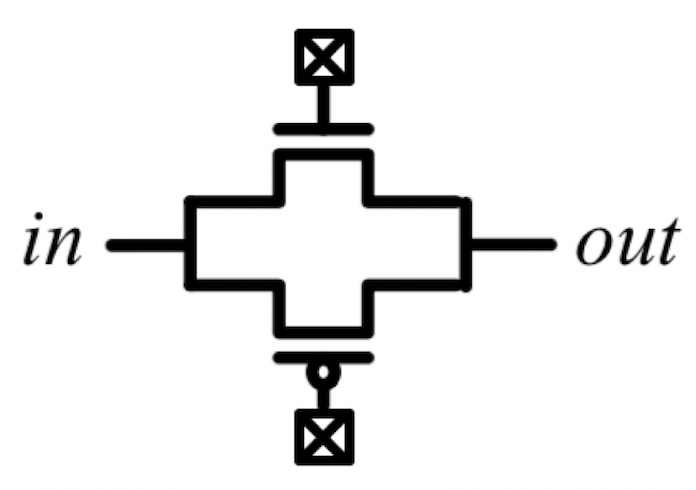
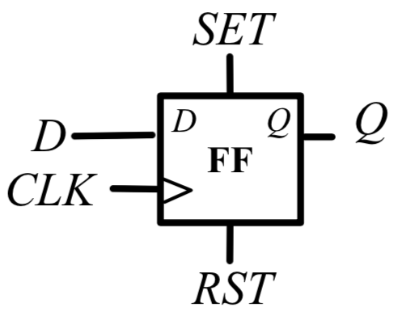

Circuit model examples
======================
The next subsections are dedicated to detailed examples of each circuit model type. Through these examples, we give a global overview of the different implementations which are available for the user.

Inverters and Buffers
---------------------

.. code-block:: xml

  <circuit_model type="inv_buf" name="string" prefix="string" netlist="string" is_default="int">
    <design_technology type="cmos" topology="string" size="int" tapered="off"/>
    <port type="input" prefix="string" size="int"/>
    <port type="output" prefix="string" size="int"/>
  </circuit_model>

.. note:: customized Verilog/SPICE netlists are not currently supported for inverters and buffers.

* design_technology:

	* **topology:** [``inverter`` | ``buffer``]. Specify the type of this component, can be either an inverter or a buffer.

	* **size:** Specify the driving strength of inverter/buffer. For a buffer, the size is the driving strength of the inverter at the second level. We consider a two-level structure for a buffer here. The support for multi-level structure of a buffer will be introduced in the tapered options.

	* **tapered:** [``on`` | ``off``]. Define if the buffer is a tapered (multi-level) buffer. When ``on`` is defined, the following parameter are required.*

		* **tap_drive_level:** Define the number of levels of a tapered buffer. This parameter is valid only when tapered is turned on.

		* **f_per_stage:** Define the ratio of driving strength between the levels of a tapered driver. This parameter is valid only when tapered is turned on. Default value is 4.

**Inverter x1 example**

:numref:`fig_inv1` is the inverter symbol depicted in this example.

.. _fig_inv1:

   Classical inverter x1 symbol.

The XML code describing this inverter is:

.. code-block:: xml

  <circuit_model type="inv_buf" name="inv1x" prefix="inv1x">
    <design_technology type="cmos" topology="inverter" size="1"/>
    <port type="input" prefix="in" size="1"/>
    <port type="output" prefix="out" size="1"/>
  </circuit_model>

This example shows:
	* The topology chosen as inverter
	* Size of 1 for the output strength
	* The tapered parameter is not declared and is off by default

**Power-gated Inverter x1 example**

The XML code describing an inverter which can be power-gated by the control signals ``EN`` and ``ENB`` :

.. code-block:: xml

  <circuit_model type="inv_buf" name="INVTX1" prefix="INVTX1">
    <design_technology type="cmos" topology="inverter" size="3" tapered="off" power_gated="true"/>
    <port type="input" prefix="in" size="1" lib_name="I"/>
    <port type="input" prefix="EN" size="1" lib_name="EN" is_global="true" default_val="0" is_config_enable="true"/>
    <port type="input" prefix="ENB" size="1" lib_name="ENB" is_global="true" default_val="1" is_config_enable="true"/>
    <port type="output" prefix="out" size="1" lib_name="Z"/>
  </circuit_model>

.. note:: For power-gated inverters: all the control signals must be set as ``config_enable`` so that the testbench generation will generate testing waveforms. If the power-gated inverters are auto-generated , all the ``config_enable`` signals must be ``global`` signals as well. If the pwoer-gated inverters come from user-defined netlists, restrictions on ``global`` signals are free.

**Buffer x2 example**

:numref:`fig_buff` is the buffer symbol depicted in this example.

.. _fig_buff:

.. figure:: ./figures/Buffer.png
   :scale: 100%
   :alt: buffer symbol composed by 2 inverter, its output strength equal 2

   Buffer made by two inverter, with an output strength of 2.

The XML code describing this buffer is:

.. code-block:: xml

  <circuit_model type="inv_buf" name="buf2" prefix="buf2">
    <design_technology type="cmos" topology="buffer" size="2"/>
    <port type="input" prefix="in" size="1"/>
    <port type="output" prefix="out" size="1"/>
  </circuit_model>

This example shows:
	* The topology chosen as buffer
	* Size of 2 for the output strength
	* The tapered parameter is not declared and is off by default

**Tapered inverter x16 example**

:numref:`fig_invtap4` is the tapered inverter symbol depicted this example.

.. _fig_invtap4:

   Inverter with high output strength made by 3 stage of inverter.

The XML code describing this inverter is:

.. code-block:: xml

  <circuit_model type="inv_buf" name="tapdrive4" prefix="tapdrive4">
    <design_technology type="cmos" topology=”inverter" size="1" tapered="on" tap_drive_level="3" 
	f_per_stage="4"/>
    <port type="input" prefix="in" size="1"/>
    <port type="output" prefix="out" size="1"/>
  </circuit_model>

This example shows:
	* The topology chosen as inverter
	* Size of 1 for the first stage output strength
	* The tapered parameter is on. Then the required sub parameters are declared
		* The number of stage is set to 3 by tap_drive_level
		* f_per_stage is set to 4. Then 2nd stage output strength is 4* the 1st stage output strength (so 4*1 = 4) and the 3rd stage output strength is 4* the 2nd stage output strength (so 4*4 =  16).

Pass-gate Logic
---------------

.. code-block:: xml

  <circuit_model type="pass_gate" name="string" prefix="string" netlist="string" is_default="int">
    <design_technology type="cmos" topology="string" nmos_size="int" pmos_size="int"/>
    <input_buffer exist="string" circuit_model_name="string" />
    <output_buffer exist="string" circuit_model_name="string" />
    <port type="input" prefix="string" size="int"/>
    <port type="output" prefix="string" size="int"/>
  </circuit_model>

.. note:: customized Verilog/SPICE netlists are not currently supported for pass-gate logics.

* design_technology:

	* **topology:** [``transmission_gate`` | ``pass_transistor``]. The transmission gate consists of a NMOS transistor and a PMOS transistor. The pass transistor consists of a NMOS transistor.

	* **nmos_size:** the size of NMOS transistor in a transmission gate or pass_transistor, expressed in terms of the min_width defined in XML node <transistors>.

	* **pmos_size:** the size of PMOS transistor in a transmission gate, expressed in terms of the min_width defined in XML node <transistors>.

**Transmission-gate example**

:numref:`fig_passgate` is the pass-gate symbol depicted in this example.

.. _fig_passgate:

   Pass-gate made by pmos ans nmos association.

The XML code describing this pass-gate is:

.. code-block:: xml

  <circuit_model type="pass_gate" name="tgate" prefix="tgate">
    <design_technology type="cmos" topology="transmission_gate"/>
    <port type="input" prefix="in" size="1"/>
    <port type="input" prefix="sram" size="1"/>
    <port type="input" prefix="sramb" size="1"/>
    <port type="output" prefix="out" size="1"/>
  </circuit_model>

This example shows:
	* Topology is ``transmission_gate``, which means the component need entries for each transistor gate (pmos and nmos)
	* 3 inputs considered, 1 for signal and 2 to control the transistors gates
	* No input or output buffer used, these parameters can be uninitialized

**Pass-transistor example**

:numref:`fig_passtran` is the pass-gate symbol depicted in this example.

.. _fig_passtran:

.. figure:: ./figures/pass_transistor.png
   :scale: 50%
   :alt: nmos transistortor forming a pass-gate

   Pass-gate made by a nmos transistor.

The XML code describing this pass-gate is:

.. code-block:: xml

  <circuit_model type="pass_gate" name="t_pass" prefix="t_pass">
    <design_technology type="cmos" topology="pass_transistor"/>
    <port type="input" prefix="in" size="1"/>
    <port type="input" prefix="sram" size="1"/>
    <port type="output" prefix="out" size="1"/>
  </circuit_model>

This example shows:
	* Topology is ``pass_transistor``, which means the component need an entry for the transistor gate (nmos)
	* 2 inputs considered, 1 for signal and 1 to control the transistor gate
	* No input or output buffer used, these parameters can be uninitialized

SRAMs
-----

.. code-block:: xml

  <circuit_model type="sram" name="string" prefix="string" netlist="string"/>
    <design_technology type="cmos"/>
    <input_buffer exist="string" circuit_model_name="string"/>
    <output_buffer exist="string" circuit_model_name="string"/>
    <port type="input" prefix="string" size="int"/>
    <port type="output" prefix="string" size="int"/>
  </circuit_model>

.. note::  The circuit designs of SRAMs are highly dependent on the technology node and well optimized by engineers. Therefore, FPGA-Verilog/SPICE requires users to provide their customized SRAM Verilog/SPICE/Verilog netlists. A sample Verilog/SPICE netlist of SRAM can be found in the directory SpiceNetlists in the released package. FPGA-Verilog/SPICE assumes that all the LUTs and MUXes employ the SRAM circuit design. Therefore, currently only one SRAM type is allowed to be defined.

.. note:: The information of input and output buffer should be clearly specified according to the customized Verilog/SPICE netlist! The existence of input/output buffers will influence the decision in creating testbenches, which may leads to larger errors in power analysis.

.. note:: The support SRAM modules should have a BL and a WL when the memory-bank-style configuration circuit is declared. Note that the WL should be the write/read enable signal, while BL is the data input.

Logic gates
-----------

.. code-block:: xml

  <circuit_model type="gate" name="string" prefix="string" netlist="string" dump_explicit_port_map="true|false"/>
    <design_technology type="cmos" topology="string"/>
    <input_buffer exist="string" circuit_model_name="string"/>
    <output_buffer exist="string" circuit_model_name="string"/>
    <port type="input" prefix="string" lib_name="string" size="int"/>
    <port type="output" prefix="string" lib_name="string" size="int"/>
  </circuit_model>

.. note::  The circuit model in the type of gate aims to support direct mapping to standard cells or customized cells provided by technology vendors or users. 

.. note:: The logic functionality of a gate can be defined through the XML keyword ``topology``. Currently, OpenFPGA supports AND, OR and MUX2 gates. As for standard cells, the size of each port is limited to 1. Currently, only 2-input and single-output logic gates are supported.

.. note:: It may happen that the port sequence in generated Verilog netlists has conflicts with the port sequence in standard and customized cells. To avoid this, users can set the XML keyword ``dump_explicit_port_map`` to be true, which enables explicit port mapping are dumped. Users can specify the pin/port name in the standard cell library using the XML keyword ``lib_name``.

Multiplexers
------------

.. code-block:: xml

  <circuit_model type="mux" name="string" prefix="string" is_default="int">
    <design_technology type="string" structure="string" num_level="int" add_const_input="string" const_input_val="int" local_encoder="string" ron="float" roff="float" prog_transistor_size="float"/>
    <input_buffer exist="string" circuit_model_name="string"/>
    <output_buffer exist="string" circuit_model_name="string"/>
    <pass_gate_logic type="string" circuit_model_name="string"/>
    <port type="input" prefix="string" size="int"/>
    <port type="output" prefix="string" size="int"/>
    <port type="sram" prefix="string" size="int"/>
  </circuit_model>

.. note:: customized Verilog/SPICE netlists are not currently supported for multiplexers.

* design_technology:

	* **structure:** can be [``tree`` \| ``multi-level`` \| ``one-level``]. The structure options are valid for SRAM-based multiplexers. For RRAM-based multiplexers, currently we only support the circuit design in [5]. If ``multi-level`` the following parameter is required:

		* **num_level:** specify the number of levels when multi-level structure is selected, only.
    
    * **add_const_input:** can be [``true`` \| ``false``]. When enabled, an extra input will be added to the multiplexer circuits defined in this ``circuit_model``. For example, an 4-input multiplexer will be turned to a 5-input multiplexer. The extra input will be wired to a constant value, which can be specified through the XML syntax ``const_input_val``. The constant value can be either 0 or 1 (By default it is 0). Note that adding such input will help reducing the leakage power of FPGA and parasitic signal activities, with a limited area overhead.

		* **const_input_val:** specify the constant value, to which the extra input will be connected. This syntax is only valid when the ``add_const_input`` is set to true.
  
    * **local_encoder:** can be [``true`` \| ``false``]. When enabled, an local encoder will be added to the multiplexer circuits defined in this ``circuit_model``. The local encoder will be interface the SRAM inputs of multiplexing structure and SRAMs. It can encode the one-hot codes (that drive the select port of multiplexing structure) to a binary code. For example, 8-bit ``00000001`` will be encoded to 3-bit ``000``. This will help reduce the number of SRAM cells used in FPGAs as well as configuration time (especially for scan-chain configuration protocols). But it may cost an area overhead.  

        .. note:: Local encoders are only applicable for one-level and multi-level multiplexers. Tree-like multiplexers are already encoded in their nature.

    * **prog_transistor_size:** valid only when the type of design technology is ``rram``. Specify the size of programming transistors used in the RRAM-based multiplexer, we use only n-type transistor and the size should be expressed in terms of the min_width defined in XML node ``transistors``. If type of design technology is ``rram``, then the following parameters are required:

		* **ron:** valid only when the type of design technology is rram. Specify the on-resistance of the RRAM device used in the RRAM-based multiplexer. 

		* **roff:** valid only when the type of design technology is rram. Specify the off-resistance of the RRAM device used in the RRAM-based multiplexer. 

* port: for a multiplexer, the three types of ports, ``input``, ``output`` and ``sram`` should be defined. 

.. note:: For tree-like multiplexers, they can be built with standard cell MUX2. To enable this, users should define a ``circuit_model``, which describes a 2-input multiplexer (See details and examples in how to define a logic gate using ``circuit_model``. In this case, the ``circuit_model_name`` in the ``pass_gate_logic`` should be the name of MUX2 ``circuit_model``.

**Mux 1 level example**

:numref:`fig_mux1` illustrates an example of multiplexer modelling, which consists of input/output buffers and a transmission-gate-based tree structure.

.. _fig_mux1:

.. figure:: ./figures/mux1lvl.png
   :scale: 60%
   :alt: Detailed one level Multiplexer

   An example of a one level multiplexer with transistor-level design parameters

The code describing this Multiplexer is:

.. code-block:: xml

  <circuit_model type="mux" name="mux_1level" prefix="mux_1level">
    <design_technology type="cmos" structure="one-level"/>
    <input_buffer exist="on" circuit_model_name="inv1x"/> 
    <output_buffer exist="on" circuit_model_name="tapbuf4"/> 
    <pass_gate_logic circuit_model_name="tgate"/>
    <port type="input" prefix="in" size="4"/>
    <port type="output" prefix="out" size="1"/>
    <port type="sram" prefix="sram" size="4"/> 
  </circuit_model>

**This example shows:**
	* Each circuit model composing the Multiplexer
	* The possibility to select the input or output buffers
	* The possibility to select the pass-gate inside the Mux.

**Mux-tree example**

:numref:`fig_mux` illustrates an example of multiplexer modelling, which consists of input/output buffers and a transmission-gate-based tree structure.

.. _fig_mux:

.. figure:: ./figures/mux.png
   :scale: 100%
   :alt: Examples of Mux-tree

   An example of a tree-like multiplexer with transistor-level design parameters

If we arbitrarily fix the number of Mux entries at 4, the following code could illustrate (a):

.. code-block:: xml

  <circuit_model type="mux" name="mux_tree" prefix="mux_tree">
    <design_technology type="cmos" structure="tree"/>
    <input_buffer exist="on" circuit_model_name="inv1x"/>
    <output_buffer exist="on" circuit_model_name="tapdrive4"/>
    <pass_gate_logic circuit_model_name="tgate"/>
    <port type="input" prefix="in" size="4"/>
    <port type="output" prefix="out" size="1"/>
    <port type="sram" prefix="sram" size="3"/>
  </circuit_model>

**This example shows:**
	* The tree topology, 4 entries split in 2 2-to-1 Muxes then another one make the final selection.
	* The possibility to select the input or output buffers
	* The number of entries parametrized by ``size`` in input port-type.

Look-Up Tables
--------------

.. code-block:: xml

  <circuit_model type="lut" name="string" prefix="string" is_default="int" netlist="string"/>
    <design_technology type="cmos" fracturable_lut="true|false"/>
    <input_buffer exist="string" circuit_model_name="string"/>
    <output_buffer exist="string" circuit_model_name="string"/>
    <lut_input_buffer exist="string" circuit_model_name="string"/>
    <lut_intermediate_buffer exist="string" circuit_model_name="string" location_map="string"/>
    <lut_input_inverter exist="string" circuit_model_name="string"/>
    <pass_gate_logic type="string" circuit_model_name="string"/>
    <port type="input" prefix="string" size="int" tri_state_map="----11" circuit_model_name="string"/>
    <port type="output" prefix="string" size="int" lut_frac_level="int" lut_output_mask="int"/>
    <port type="sram" prefix="string" size="int" mode_select="true|false" circuit_model_name="string" default_val="0|1"/>
  </circuit_model>

.. note:: The Verilog/SPICE netlists of LUT can be auto-generated or customized.
  The auto-generated LUTs are based on a tree-like multiplexer, whose gates of the transistors are used as the inputs of LUTs and the drains/sources of the transistors are used for configurable memories (SRAMs).
  The LUT provided in customized Verilog/SPICE netlist should have the same decoding methodology as the traditional LUT.

Additional design parameters for LUTs:

* **lut_input_buffer:** Define transistor-level description for the buffer for the inputs of a LUT (gates of the internal multiplexer). Use keyword circuit_model_name to specify the circuit_model that containing details of the circuit. 

* **lut_input_inverter:** Define transistor-level description for the inverter for the inputs of a LUT (gates of the internal multiplexer). Use keyword circuit_model_name to specify the circuit_model that containing details of the circuit. 

* **lut_intermediate_buffer:** Define transistor-level description for the buffer locating at intermediate stages of internal multiplexer of a LUT. Use keyword circuit_model_name to specify the circuit_model that containing details of the circuit. To customize the location, users can define an integer array in the XML keyword location_map. For example, "-1-1-" indicates buffer inseration to every two stages of the LUT multiplexer tree, considering a 6-input LUT. 

Instructions of defining design parameters:

* **input_buffer:** Specify the buffer/inverter that connects the SRAM outputs to the inputs of multiplexer.

* **pass_gate_logic:** Specify the pass-gates of the internal multiplexer, the same as the multiplexers.

* **port:** three types of ports (input, output and sram) should be defined. If the user provides an customized Verilog/SPICE netlist, the bandwidth of ports should be defined to the same as the Verilog/SPICE netlist. To support customizable LUTs, each type of port contain special keywords. For input ports, the keyword tri_state_map aims to customize which inputs are fixed to constant values when the LUT is in fracturable modes. For example, ``tri_state_map`` ="----11" indicates that the last two inputs will be fixed to be logic '1' when a 6-input LUT is in fracturable modes. The circuit_model_name of input port is used to specify which logic gates will be used to tri-state the inputs in fracturable LUT modes. It is required to use an AND gate to force logic '0' or an OR gate to force logic '1' for the input ports. For output ports, the keyword lut_frac_level is used to specify the level in LUT multiplexer tree where the output port are wired to. For example, lut_frac_level="4" in a fracturable LUT6 means that the output are potentially wired to the 4th stage of a LUT multiplexer and it is an output of a LUT4. The keyword lut_output_mask describes which fracturable outputs are used. For instance, in a 6-LUT, there are potentially four LUT4 outputs can be wired out. lut_output_mask="0,2" indicates that only the first and the thrid LUT4 outputs will be used in fracturable mode. Note that the size of the output port should be consistent to the length of lut_output_mask. 

* **SRAM port for mode selection:** To enable switch between different operating modes, the SRAM bits of a fracturable LUT consists of two parts: configuration memory and mode selecting. The SRAM port for mode selection is specified through the XML keyword mode_select. Note that the size of such SRAM port should be consistent to the number of 1s or 0s in the ``tri_state_map``.

**LUT example**

:numref:`fig_lut` illustrates an example of LUT modeling, which consists of input/output buffers and a transmission-gate-based tree structure.

.. _fig_lut:

.. figure:: ./figures/lut.png
   :scale: 100%
   :alt: Detailed LUT composition

   An example of a LUT with transistor-level design parameters.

The code describing this LUT is:

.. code-block:: xml

  <circuit_model type="lut" name="lut6" prefix="lut6">
    <input_buffer exist="on" circuit_model="inv1x"/>
    <output_buffer exist="on" circuit_model_name="inv1x"/>
    <lut_input_buffer exist="on" circuit_model_name="buf2"/>
    <pass_gate_logic circuit_model_name="tgate"/>
    <port type="input" prefix="in" size="6"/>
    <port type="output" prefix="out" size="1"/>
    <port type="sram" prefix="sram" size="64"/>
  </circuit_model>

**This example shows:**
	* The difference between ``input_buffer`` and ``lut_input_buffer`` and that they are independent.
	* How each blocks is defined

Flip-Flops
----------

.. code-block:: xml

  <circuit_model type="ff" name="string" prefix="string" netlist="string"/>
    <design_technology type="cmos"/>
    <input_buffer exist="string" circuit_model_name="string"/>
    <output_buffer exist="string" circuit_model_name="string"/>
    <port type="input" prefix="string" size="int"/>
    <port type="output" prefix="string" size="int"/>
    <port type="clock" prefix="string" size="int"/>
  </circuit_model>

.. note:: The circuit designs of flip-flops are highly dependent on the technology node and well optimized by engineers. Therefore, FPGA-Verilog/SPICE requires users to provide their customized FF Verilog/SPICE/Verilog netlists. A sample Verilog/SPICE netlist of FF can be found in the directory SpiceNetlists in the released package.
  
  The information of input and output buffer should be clearly specified according to the customized Verilog/SPICE netlist! The existence of input/output buffers will influence the decision in creating testbenches, which may leads to larger errors in power analysis.

  FPGA-Verilog/SPICE currently support only one clock domain in the FPGA. Therefore there should be only one clock port to be defined and the size of the clock port should be 1.

Instructions of defining design parameters:

* **circuit_model type:** can be ``ff`` or ``scff``. FF is typical Flip-Flop, SCFF is Scan-Chain Flip-Flop

* **port:** three types of ports (``input``, ``output`` and ``clock``) should be defined. If the user provides a customized Verilog/SPICE netlist, the bandwidth of ports should be defined to the same as the Verilog/SPICE netlist.

.. note:: In a valid FPGA architecture, users should provide at least either a SCFF or a SRAM, so that the configurations can loaded to core logic. 

**FF example**

:numref:`fig_ff` illustrates an example of LUT modeling, which consists of input/output buffers and a transmission-gate-based tree structure.

.. _fig_ff:

   An example of classical Flip-Flop.

The code describing this FF is:

.. code-block:: xml

  <circuit_model type="ff" name="dff" prefix="dff" verilog_netlist="ff.v">
    <port type="input" prefix="D" size="1"/>
    <port type="input" prefix="Set" size="1" is_global="true"/>
    <port type="input" prefix="Reset" size="1" is_global="true"/>
    <port type="output" prefix="Q" size="1"/>
    <port type="clock" prefix="clk" size="1" is_global="true"/>
  </circuit_model>

**This example shows:**
	* Circuit model type as ``ff``
	* The verilog netlist file associated to this component ``ff.v``
	* 3 ports, ``Set``, ``Reset`` and ``clk``, defined as global

**SCFF example**

:numref:`fig_scff` illustrates an example of LUT modeling, which consists of input/output buffers and a transmission-gate-based tree structure.

.. _fig_scff:

.. figure:: ./figures/scff.png
   :scale: 100%
   :alt: SCFF symbol

   An example of a Scan-Chain Flip-Flop.

The code describing this FF is:

.. code-block:: xml

  <circuit_model type="scff" name="scff" prefix="scff" verilog_netlist="scff.v">
    <port type="input" prefix="D" size="1"/>
    <port type="output" prefix="Q" size="2"/>
    <port type="clock" prefix="clk" size="1" is_global="true"/>
  </circuit_model>

**This example shows:**
	* Circuit model type as ``scff``
	* The verilog netlist file associated to this component ``scff.v``
	* 1 port, ``clk``, defined as global

Hard Logics
-----------

.. code-block:: xml

  <circuit_model type="hardlogic" name="string" prefix="string" netlist="string"/>
    <design_technology type="cmos"/>
    <input_buffer exist="string" circuit_model_name="string"/>
    <output_buffer exist="string" circuit_model_name="string"/>
    <port type="input" prefix="string" size="int"/>
    <port type="output" prefix="string" size="int"/>
  </circuit_model>

.. note:: Hard logics are defined for non-configurable resources in FPGA architectures, such as adders, multipliers and RAM blocks.
  Their circuit designs are highly dependent on the technology node and well optimized by engineers.
  As more functional units are included in FPGA architecture, it is impossible to auto-generate these functional units [3].
  Therefore, FPGA-Verilog/SPICE requires users to provide their customized Verilog/SPICE netlists. A sample Verilog/SPICE netlist of a 1-bit adder can be found in the directory SpiceNetlists in the released package.

  The information of input and output buffer should be clearly specified according to the customized Verilog/SPICE netlist! The existence of input/output buffers will influence the decision in creating testbenches, which may leads to larger errors in power analysis.

Instructions of defining design parameters:

* **port:** two types of ports (``input`` and ``output``) should be defined. If the user provides a user-defined Verilog/SPICE netlist, the bandwidth of ports should be defined to the same as the Verilog/SPICE netlist.

Routing Wire Segments
---------------------

FPGA-Verilog/SPICE provides two types of Verilog/SPICE models for the wire segments in FPGA architecture:

	* One type is called ``wire``, which targets the local wires inside the logic blocks. The wire has one input and one output, directly connecting the output of a driver and the input of the downstream unit, respectively
	* The other type is called ``chan_wire``, especially targeting the channel wires. The channel wires have one input and two outputs, one of which is connected to the inputs of Connection Boxes while the other is connected to the inputs of Switch Boxes. Two outputs are created because from the view of layout, the inputs of Connection Boxes are typically connected to the middle point of channel wires, which has less parasitic resistances and capacitances than connected to the ending point.

.. code-block:: xml

  <circuit_model type="string" name="string" prefix="string" netlist="string"/>
    <design_technology type="cmos"/>
    <input_buffer exist="string" circuit_model_name="string"/>
    <output_buffer exist="string" circuit_model_name="string"/>
    <port type="input" prefix="string" size="int"/>
    <port type="output" prefix="string" size="int"/>
    <wire_param model_type="string" res_val="float" cap_val="float" level="int"/>
  </circuit_model>

.. note:: FPGA-Verilog/SPICE can auto-generate the Verilog/SPICE model for wires while also allows users to provide their customized Verilog/SPICE netlists.

  The information of input and output buffer should be clearly specified according to the customized netlist! The existence of input/output buffers will influence the decision in creating testbenches, which may leads to larger errors in power analysis.

Instructions of defining design parameters:

* **type:** can be [``wire`` | ``chan_wire``]. The Verilog/SPICE model wire targets the local wire inside the logic block while the chan_wire targets the channel wires in global routing.

* **port:** two types of ports (``input`` and ``output``) should be defined. If the user provides an customized Verilog/SPICE netlist, the bandwidth of ports should be defined to the same as the Verilog/SPICE netlist.

* **wire_param:**

	* **model_type:** can be [``pi`` | ``T``], corresponding to the π-type and T-type RC wire models.
	* **res_val:** specify the total resistance of the wire
	* **cap_val:** specify the total capacitance of the wire.
	* **level:** specify the number of levels of the RC wire model.

**Chan-Wire example**

:numref:`fig_wire` depicts the modeling for a length-2 channel wire.

.. _fig_wire:

.. figure:: ./figures/wire.png
   :scale: 100%
   :alt: map to buried treasure

   An example of a length-2 channel wire modeling

The code describing this wire is:

.. code-block:: xml

  <circuit_model type="chan_wire" name="segment0" prefix="chan_wire"/>
    <design_technology type="cmos"/>
    <port type="input" prefix="mux_out" size="1"/>
    <port type="output" prefix="cb_sb" size="2"/>
    <wire_param model_type="pi" res_val="103.84" cap_val="13.80e-15" level="1"/>
  </circuit_model>

**This example shows**
	* How to use the ``wire_param`` for a π-type RC wire model
	* How to use this circuit_model to auto-generate the Verilog/SPICE netlist

I/O pads
--------

.. code-block:: xml

  <circuit_model type="iopads" name="string" prefix="string" netlist="string"/>
    <design_technology type="cmos"/>
    <input_buffer exist="string" circuit_model_name="string"/>
    <output_buffer exist="string" circuit_model_name="string"/>
    <port type="input" prefix="string" size="int"/>
    <port type="output" prefix="string" size="int"/>
    <port type="sram" prefix="string" size="int" mode_select="true|false" 
	circuit_model_name="string" default_val="int"/>
  </circuit_model>

.. note::  The circuit designs of I/O pads are highly dependent on the technology node and well optimized by engineers.
  Therefore, FPGA-Verilog/SPICE requires users to provide their customized Verilog/SPICE/Verilog netlists. A sample Verilog/SPICE netlist of an I/O pad can be found in the directory SpiceNetlists in the released package.

  The information of input and output buffer should be clearly specified according to the customized netlist! The existence of input/output buffers will influence the decision in creating testbenches, which may leads to larger errors in power analysis.

Instructions of defining design parameters:

* **port:** four types of ports (``input``, ``output``, ``inout`` and ``sram``) should be defined. If the user provides a user-defined Verilog/SPICE netlist, the bandwidth of ports should be defined to the same as the Verilog/SPICE netlist.

**IO-pad example**

:numref:`fig_iopad` depicts an IO-Pad.

.. _fig_iopad:

.. figure:: ./figures/iopad.png
   :scale: 100%
   :alt: IO-Pad symbol

   An example of an IO-Pad

The code describing this IO-Pad is:

.. code-block:: xml

  <circuit_model type="iopad" name="iopad" prefix="iopad" verilog_netlist="io.v">
    <port type="inout" prefix="pad" size="1"/>
    <port type="sram" prefix="dir" size="1" circuit_model_name="scff"/>
    <port type="input" prefix="data_in" size="1"/>
    <port type="input" prefix="zin" size="1" is_global="true"/>
    <port type="output" prefix="data out" size="1"/>
  </circuit_model>

**This example shows**

	* The association of the verilog netlist file ``io.v``
	* The inout pad port_type, which means as inout as output.
	* The instantiation of a SCFF as sram
