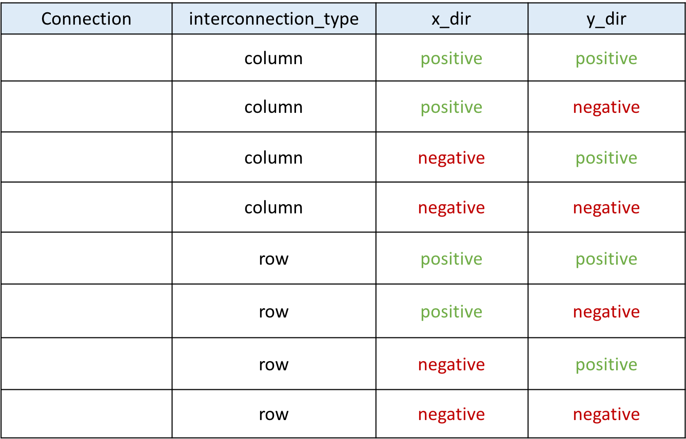

Interconnection extensions
==========================

This section will introduce extensions on the architecture description file about existing interconnection description.

Directlist
----------

The original direct connections in the directlist section is doccumented here_. Its description is given below:

.. _here: http://docs.verilogtorouting.org/en/latest/arch/reference/?highlight=directlist#direct-inter-block-connections

.. code-block:: xml

  <directlist>
    <direct name="string" from_pin="string" to_pin="string" x_offset="int" y_offset="int" z_offset="int" switch_name="string"/>
  </directlist>

.. note:: These options are required

Our extension include three more options:

.. code-block:: xml

  <directlist>
    <direct name="string" from_pin="string" to_pin="string" x_offset="int" y_offset="int" z_offset="int" switch_name="string" interconnection_type="string" x_dir="string" y_dir="string"/>
  </directlist>

* **interconnection_type**: [``NONE`` | ``column`` | ``row``], specifies if it applies on a column or a row ot if it doesn't apply. This option is optional and do not need to be set for any direct connection in the direclist. If this option is set *x_dir* and *y_dir* are required.

* **x_dir**: [``positive`` | ``negative``], specifies if the next cell to connect has a bigger or lower x value. Considering a coordinate system where (0,0) is the origin at the bottom left and *x* and *y* are positives: 

	* x_dir="positive": 

		* interconnection_type="column": a column will be connected to a column on the **right**, if it exists.

		* interconnection_type="row": the most on the **right** cell from a row connection will connect the most on the **left** cell of next row, if it exists.

	* x_dir="negative": 

		* interconnection_type="column": a column will be connected to a column on the **left**, if it exists.

		* interconnection_type="row": the most on the **left** cell from a row connection will connect the most on the **right** cell of next row, if it exists.

* **y_dir**: [``positive`` | ``negative``], specifies if the next cell to connect has a bigger or lower x value. Considering a coordinate system where (0,0) is the origin at the bottom left and *x* and *y* are positives:

	* y_dir="positive": 

		* interconnection_type="column": the **bottom** cell of a column will be connected to the next column **top** cell, if it exists.

		* interconnection_type="row": a row will be connected on an **above** row, if it exists.

	* y_dir="positive": 

		* interconnection_type="column": the **top** cell of a column will be connected to the next column **bottom** cell, if it exists.

		* interconnection_type="row": a row will be connected on a row **below**, if it exists.

Example
-------

For this example, we will study a scan-chain implementation.The description could be:

.. code-block:: xml

  <directlist>
    <direct name="scff_chain" from_pin="clb.sc_out" to_pin="clb.sc_in" x_offset="0" y_offset="-1" z_offset="0" interconnection_type="column" x_dir="positive" y_dir="positive"/>
  </directlist>

:numref:`fig_p2p_expl` is the graphical representation of the above scan-chain description on a 4x4 FPGA.

.. _fig_p2p_expl:

.. figure:: ./figures/point2point_example.png
   :scale: 100%
   :alt: example of scan-chain implementation

In this figure, the red arrows represent the initial direct connection. The green arrows represent the point to point connection to connect all the columns of CLB together.

Truth table
-----------

A point to point connection can be applied in different ways than showed in the example section. To help the designer implement his own point to point connection, a truth table with our new parameters id provided below.

:numref:`fig_p2p_trtable` provides all possible variable combination and the connection it will generate.

.. _fig_p2p_expl:

