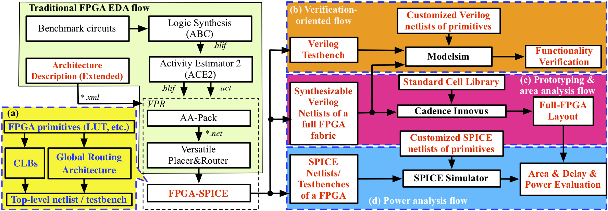

EDA flow
========

As illustrated in :numref:`fig_eda_flow`, FPGA-SPICE creates a modified VTR flow. All the input files for VPR do not need modifications except the architecture description XML. As simulation-based power analysis requires the transistor-level netlists, we extend the architecture description language to support transistor-level modeling (See details in "Tools Guide>Extended Architecture Description Language"). FPGA-SPICE, embedded in VPR, outputs the SPICE netlists and testbenches according to placement and routing results when enabled by command-line options. (See each "FPGA-*Branch*" about command-line options available) Besides automatically generating all the SPICE netlists, FPGA-SPICE supports user-defined SPICE netlists for modules. We believe the support on user-defined SPICE netlists allows FPGA-SPICE to be general enough to support novel circuit designs and even technologies. (See "FPGA-SPICE... > Create Customized SPICE Modules" for guidelines in customizing your FPGA-SPICE compatible SPICE netlists.) With the dumped SPICE netlists and testbenches, a SPICE simulator, i.e., HSPICE, can be called to conduct a power analysis. FPGA-SPICE automatically generates a shell script, which brings convenience for users to run all the simulations (See "FPGA-SPICE... > Run SPICE simulation").

.. _fig_eda_flow:

   Detailed EDA flows based on FPGA-SPICE/Verilog/Bitstream in the purpose of (a) architecture of the output of FPGA-SPICE (b) functionality verification; (c) prototyping and area analysis and (d) power analysis. *TBD: change for Yosys*

FPGA-Verilog is the part of the flow in charge of the Verilog and the semi-custom design flow. In our case, we use Cadence Innovus. The goal is to get the full-FPGA layout to complete the analysis provided by FPGA-SPICE. By having the layout, we can get an area analysis on the one hand and have new information concerning the power analysis. For instance, having the layout allows the user to have new information on the circuit such as the parasitics. 

FPGA-Bitstream is the part of the flow in charge of the functional verification of the produced FPGA. Testbenches are generated by FPGA-Verilog and are combined with the full FPGA fabric in Modelsim. A bitstream is generated at the same time as the testbenches. This bitstream configures the FPGA with the functionality given by the user to VPR at the beginning of the flow. First, we configure the FPGA with the bitstream, and then waveforms are sent onto the I/O pads to check the functionality.

How to compile
==============
Guides can be found in the *compilation* directory in the main folder. We tested it for MacOS High Sierra 10.13.4, Ubuntu 18.04 and Red Hat 7.5. This list is not exhaustive as other distributions could work as well.

As a general rule, the compilation follows these steps:

1) You clone the repository with:
git clone --recurse-submodules https://github.com/LNIS-Projects/OpenFPGA,git

Two different approaches exist from then on: Either you need the full flow, or you just need the extended version of VPR.
If you need the full flow:

2) Go into the folder you just cloned and make the different submodules through a global Makefile:
cd OpenFPGA 
mkdir build (*if folder doesn't already exist*)
cd build
cmake ..
make OR make -j (*if you have multiple cores, this will make the compilation way faster*) 

If you only need vpr:
cd OpenFPGA 
mkdir build (if folder doesn't already exist)
cd build
cmake ..
make vpr/make vpr -j

3) Architectures, circuits and already written scripts exist to allow you to test the flow without having to provide any new information to the system. For this:
cd vpr7_x2p
cd vpr
source ./go_fpga_verilog/spice.sh

They are scripts linking to a testing architecture and a simple circuit.

4) If you only need to see the new options implemented in vpr, do:
./vpr

This step will show you all the different options which were added on top of VPR to enable deeper analysis of FPGA architectures.

The released package includes a version of VPR with FPGA-SPICE, Verilog and Bitstream support, Yosys and ACE2.
