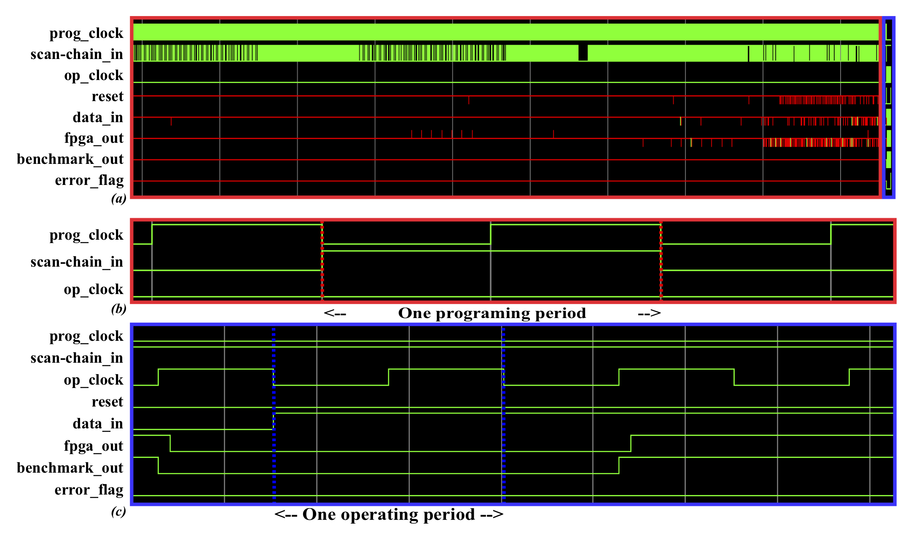

Perform Functionality Verification
==================================

If the --fpga_verilog_print_modelsim_autodeck option is selected, it is possible to directly generate scripts for Modelsim. Inside of the Verilog directory specified with --fpga_verilog_dir can be found name_runsim.tcl scripts which perform the functional verification onto the FPGA generated. 

The point of the verification step is to check that the FPGA reproduces the right function. As illustrated in :numref:`fig_ModelSim`, inside of the red rectangle is the programming of the FPGA. Each prog clock cycle corresponds to one bit added to the scan-chain. Inside of the blue rectangle, we see that the prog clock is set to 0 and the operating clock is toggled. Two outputs are shown, benchmark and FPGA, and by checking the value on both of them, we know if the functionality is respected.

.. _fig_ModelSim:

