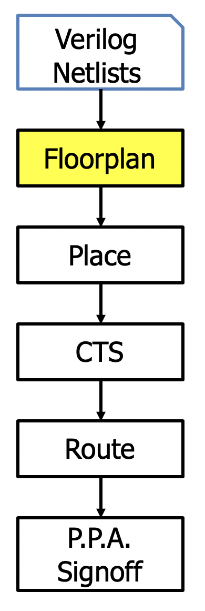
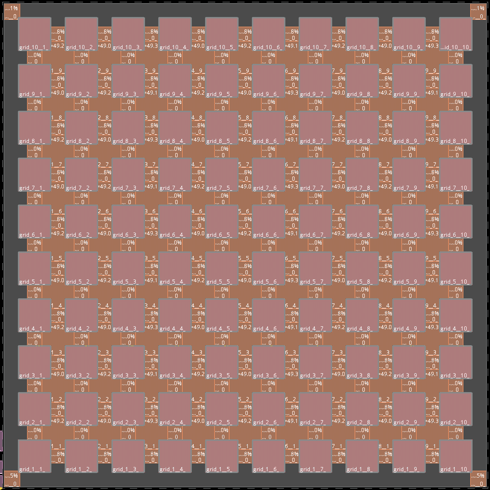

From Verilog to Layout
======================

The generated Verilog code can be used through a semi-custom design flow to generate the layout.

Contrary to ModelSim, we do not generate yet the scripts in order to directly implement the layout but results are already promising. We succeed in generating the layout for a 10x10 FPGA.
 
.. _Layout_Diagram:

:numref:`Layout_Diagram` shows the different steps involved into realizing the layout for any design. CTS stands for Clock Tree Synthesys and PPA stands for Power-Performance-Area. First, we create the floorplan with the different tiles involved in the FPGA i.e. the CLBs and place them. Then the clock tree is generated. Finally the design is routed and the PPA signoff is realized. Coupled with FPGA-SPICE, we get silicon level analysis on the design.

In :numref:`Layout_Floorplan`, we show the result we get from the floorplanning we get through Cadence Innovus. 

.. _Layout_Floorplan:

