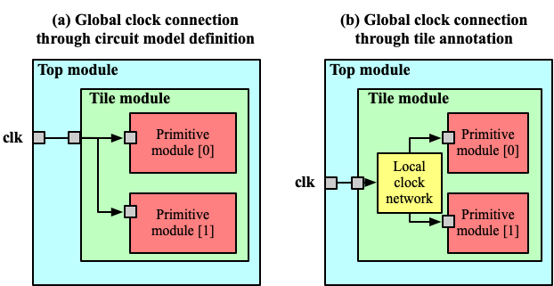

.. _annotate_vpr_arch:

Bind circuit modules to VPR architecture 
----------------------------------------
Each defined circuit model should be linked to an FPGA module defined in the original part of architecture descriptions. It helps FPGA-circuit creating the circuit netlists for logic/routing blocks. Since the original part lacks such support, we create a few XML properties to link to Circuit models.

Switch Blocks
~~~~~~~~~~~~~

Original VPR architecture description contains an XML node called switchlist under which all the multiplexers of switch blocks are described.
To link a defined circuit model to a multiplexer in the switch blocks, a new XML property circuit_model_name should be added to the descriptions.

Here is an example:

.. code-block:: xml

  <switch_block>
    <switch type="mux" name="<string>" circuit_model_name="<string>"/>
  </switch_block>

- ``circuit_model_name="<string>"`` should match a circuit model whose type is ``mux`` defined in :ref:`circuit_library`.

Connection Blocks
~~~~~~~~~~~~~~~~~

To link the defined circuit model of the multiplexer to the Connection Blocks, a ``circuit_model_name`` should be annotated to the definition of Connection Blocks switches.  

Here is the example:

.. code-block:: xml

  <connection_block>
    <switch type="ipin_cblock" name="<string>" circuit_model_name="<string>"/>
  </connection_block>

- ``circuit_model_name="<string>"`` should match a circuit model whose type is ``mux`` defined in :ref:`circuit_library`.

Channel Wire Segments
~~~~~~~~~~~~~~~~~~~~~

Similar to the Switch Boxes and Connection Blocks, the channel wire segments in the original architecture descriptions can be adapted to provide a link to the defined circuit model.

.. code-block:: xml

  <segmentlist>
    <segment name="<string>" circuit_model_name="<string>"/>
  </segmentlist>

- ``circuit_model_name="<string>"`` should match a circuit model whose type is ``chan_wire`` defined in :ref:`circuit_library`.

.. _annotate_vpr_arch_physical_tile_annotation:

Physical Tile Annotation
~~~~~~~~~~~~~~~~~~~~~~~~

Original VPR architecture description contains ``<tile>`` XML nodes to define physical tile pins.
OpenFPGA allows users to define pin/port of physical tiles as global ports.

Here is an example:

.. code-block:: xml

  <tile_annotations>
    <global_port name="<string>" is_clock="<bool>" is_reset="<bool>" is_set="<bool>" default_val="<int>">
      <tile name="<string>" port="<string>" x="<int>" y="<int>"/>
      ...
    </global_port>
  </tile_annotations>

- ``name="<string>"`` is the port name to appear in the top-level FPGA fabric.

- ``is_clock="<bool>"`` define if the global port is a clock port at the top-level FPGA fabric. An operating clock port will be driven by proper signals in auto-generated testbenches.

- ``is_reset="<bool>"`` define if the global port is a reset port at the top-level FPGA fabric. An operating reset port will be driven by proper signals in testbenches.

- ``is_set="<bool>"`` define if the global port is a set port at the top-level FPGA fabric. An operating set port will be driven by proper signals in testbenches.

.. note:: A port can only be defined as ``clock`` or ``set`` or ``reset``.

.. note:: All the global port from a physical tile port is only used in operating phase. Any ports for programmable use are not allowed!

- ``default_val="<int>"`` define if the default value for the global port when initialized in testbenches. Valid values are either ``0`` or ``1``. For example, the default value of an active-high reset pin is ``0``, while an active-low reset pin is ``1``.

.. note:: A global port could be connected from different tiles by defining multiple <tile> lines under a global port!!!

.. option:: <tile name="<string>" port="<string>" x="<int>" y="<int>"/>

- ``name="<string>"`` is the name of a physical tile, e.g., ``name="clb"``.

- ``port="<string>"`` is the port name of a physical tile, e.g., ``port="clk[0:3]"``.

- ``x="<int>"`` is the x coordinate of a physical tile, e.g., ``x="1"``. If the x coordinate is set to ``-1``, it means all the valid x coordinates of the selected physical tile in the FPGA device will be considered. 

- ``y="<int>"`` is the y coordinate of a physical tile, e.g., ``y="1"``. If the y coordinate is set to ``-1``, it means all the valid y coordinates of the selected physical tile in the FPGA device will be considered. 

.. note:: The port of physical tile must be a valid port of the physical definition in VPR architecture! If you define a multi-bit port, it must be explicitly defined in the port, e.g., clk[0:3], which must be in the range of the port definition in physical tiles of VPR architecture files!!! 

.. note:: The linked port of physical tile must meet the following requirements:

            - If the ``global_port`` is set as clock through ``is_clock="true"``, the port of the physical tile must also be a clock port.
            - If not a clock, the port of the physical tile must be defined as non-clock global
            - The port of the physical tile should have zero connectivity (``Fc=0``) in VPR architecture

A more illustrative example:

:numref:`fig_global_tile_ports` illustrates the difference between the global ports defined through ``circuit_model`` and ``tile_annotation``.

.. _fig_global_tile_ports:

   Difference between global port definition through circuit model and tile annotation

When a global port, e.g., ``clk``, is defined in ``circuit_model`` using the following code:

.. code-block:: xml

  <circuit_model>
    <port name="clk" is_global="true" is_clock="true"/>
  </circuit_model>

Dedicated feedthrough wires will be created across all the modules from top-level to primitive.

When a global port, e.g., ``clk``, is defined in ``tile_annotation`` using the following code:

.. code-block:: xml

  <tile_annotations>
    <global_port name="clk" is_clock="true">
      <tile name="clb" port="clk"/>
    </global_port>
  </tile_annotations>

Note that a global port can also be defined to drive only a partial bit of a port of a physical tile.

.. code-block:: xml

  <tile_annotations>
    <global_port name="clk" is_clock="true">
      <tile name="clb" port="clk[3:3]"/>
    </global_port>
  </tile_annotations>

Clock port ``clk`` of each ``clb`` tile will be connected to a common clock port of the top module, while local clock network is customizable through VPR's architecture description language. For instance, the local clock network can be a programmable clock network. 

.. _annotate_vpr_arch_pb_type_annotation:

Primitive Blocks inside Multi-mode Configurable Logic Blocks
~~~~~~~~~~~~~~~~~~~~~~~~~~~~~~~~~~~~~~~~~~~~~~~~~~~~~~~~~~~~

The architecture description employs a hierarchy of ``pb_types`` to depict the sub-modules and complex interconnections inside logic blocks. Each leaf node and interconnection in the pb_type hierarchy should be linked to a circuit model.
Each primitive block, i.e., the leaf ``pb_types``, should be linked to a valid circuit model, using the XML syntax ``circuit_model_name``.
The ``circuit_model_name`` should match the given name of a ``circuit_model`` defined by users.

.. code-block:: xml

  <pb_type_annotations>
    <!-- physical pb_type binding in complex block IO -->
    <pb_type name="io" physical_mode_name="physical"/>
    <pb_type name="io[physical].iopad" circuit_model_name="iopad" mode_bits="1"/> 
    <pb_type name="io[inpad].inpad" physical_pb_type_name="io[physical].iopad" mode_bits="1"/> 
    <pb_type name="io[outpad].outpad" physical_pb_type_name="io[physical].iopad" mode_bits="0"/> 
    <!-- End physical pb_type binding in complex block IO -->

    <!-- physical pb_type binding in complex block CLB -->
    <!-- physical mode will be the default mode if not specified -->
    <pb_type name="clb">
      <!-- Binding interconnect to circuit models as their physical implementation, if not defined, we use the default model -->
      <interconnect name="crossbar" circuit_model_name="mux_2level"/>
    </pb_type>
    <pb_type name="clb.fle" physical_mode_name="physical"/>
    <pb_type name="clb.fle[physical].fabric.frac_logic.frac_lut6" circuit_model_name="frac_lut6" mode_bits="0"/>
    <pb_type name="clb.fle[physical].fabric.ff" circuit_model_name="static_dff"/>
    <!-- Binding operating pb_type to physical pb_type -->
    <pb_type name="clb.fle[n2_lut5].lut5inter.ble5.lut5" physical_pb_type_name="clb.fle[physical].fabric.frac_logic.frac_lut6" mode_bits="1" physical_pb_type_index_factor="0.5">
      <!-- Binding the lut5 to the first 5 inputs of fracturable lut6 -->
      <port name="in" physical_mode_port="in[0:4]"/>
      <port name="out" physical_mode_port="lut5_out" physical_mode_pin_rotate_offset="1"/>
    </pb_type>
    <pb_type name="clb.fle[n2_lut5].lut5inter.ble5.ff" physical_pb_type_name="clb.fle[physical].fabric.ff"/>
    <pb_type name="clb.fle[n1_lut6].ble6.lut6" physical_pb_type_name="clb.fle[physical].fabric.frac_logic.frac_lut6" mode_bits="0">
      <!-- Binding the lut6 to the first 6 inputs of fracturable lut6 -->
      <port name="in" physical_mode_port="in[0:5]"/>
      <port name="out" physical_mode_port="lut6_out"/>
    </pb_type>
    <pb_type name="clb.fle[n1_lut6].ble6.ff" physical_pb_type_name="clb.fle[physical].fabric.ff" physical_pb_type_index_factor="2" physical_pb_type_index_offset="0"/>
    <!-- End physical pb_type binding in complex block IO -->
  </pb_type_annotations>
  
.. option:: <pb_type name="<string>" physical_mode_name="<string>">

  Specify a physical mode for multi-mode ``pb_type`` defined in VPR architecture.

  .. note:: This should be applied to non-primitive ``pb_type``, i.e., ``pb_type`` have child ``pb_type``.

  - ``name="<string>"`` specifiy the full name of a ``pb_type`` in the hierarchy of VPR architecture.

  - ``physical_mode_name="<string>"`` Specify the name of the mode that describes the physical implementation of the configurable block. This is critical in modeling actual circuit designs and architecture of an FPGA. Typically, only one ``physical_mode`` should be specified for each multi-mode ``pb_type``.

.. note:: OpenFPGA will infer the physical mode for a single-mode ``pb_type`` defined in VPR architecture

.. option:: <pb_type name="<string>" physical_pb_type_name="<string>"
             circuit_model_name="<string>" mode_bits="<int>"
             physical_pb_type_index_factor="<float>" physical_pb_type_index_offset="<int>">

  Specify the physical implementation for a primitive ``pb_type`` in VPR architecture

  .. note:: This should be applied to primitive ``pb_type``, i.e., ``pb_type`` have no children.

  .. note:: This definition should be placed directly under the XML node ``<pb_type_annotation>`` without any intermediate XML nodes!

  - ``name="<string>"`` specifiy the full name of a ``pb_type`` in the hierarchy of VPR architecture.

  - ``physical_pb_type_name=<string>`` creates the link on ``pb_type`` between operating and physical modes. This syntax is mandatory for every primitive ``pb_type`` in an operating mode ``pb_type``. It should be a valid name of primitive ``pb_type`` in physical mode.   

  - ``circuit_model_name="<string>"`` Specify a circuit model to implement a ``pb_type`` in VPR architecture. The ``circuit_model_name`` is mandatory for every primitive``pb_type`` in a physical_mode ``pb_type``.

  - ``mode_bits="<int>"`` Specify the configuration bits for the ``circuit_model`` when operating at an operating mode. The length of ``mode_bits`` should match the ``port`` size defined in ``circuit_model``. The ``mode_bits`` should be derived from circuit designs while users are responsible for its correctness. FPGA-Bitstreamm will add the ``mode_bits`` during bitstream generation.

  - ``physical_pb_type_index_factor="<float>"`` aims to align the indices for ``pb_type`` between operating and physical modes, especially when an operating mode contains multiple ``pb_type`` (``num_pb``>1) that are linked to the same physical ``pb_type``. When ``physical_pb_type_name`` is larger than 1, the  index of ``pb_type`` will be multipled by the given factor. 

  - ``physical_pb_type_index_offset=<int>`` aims to align the indices for ``pb_type`` between operating and physical modes, especially when an operating mode contains multiple ``pb_type`` (``num_pb``>1) that are linked to the same physical ``pb_type``. When ``physical_pb_type_name`` is larger than 1, the  index of ``pb_type`` will be shifted by the given factor. 

.. option:: <interconnect name="<string>" circuit_model_name="<string>">

  - ``name="<string>"`` specify the name of a ``interconnect`` in VPR architecture. Different from ``pb_type``, hierarchical name is not required here.

  - ``circuit_model_name="<string>"`` For the interconnection type direct, the type of the linked circuit model should be wire. For multiplexers, the type of linked circuit model should be ``mux``. For complete, the type of the linked circuit model can be either ``mux`` or ``wire``, depending on the case.

  .. note:: A ``<pb_type name="<string>">`` parent XML node is required for the interconnect-to-circuit bindings whose interconnects are defined under the ``pb_type`` in VPR architecture description. 

.. option:: <port name="<string>" physical_mode_port="<string>"
             physical_mode_pin_initial_offset="<int>"
             physical_mode_pin_rotate_offset="<int>"/>
             physical_mode_port_rotate_offset="<int>"/>

   Link a port of an operating ``pb_type`` to a port of a physical ``pb_type``

  - ``name="<string>"`` specifiy the name of a ``port`` in VPR architecture. Different from ``pb_type``, hierarchical name is not required here.

  - ``physical_mode_pin="<string>" creates the link of ``port`` of ``pb_type`` between operating and physical modes. This syntax is mandatory for every primitive ``pb_type`` in an operating mode ``pb_type``. It should be a valid ``port`` name of leaf ``pb_type`` in physical mode and the port size should also match. 

    .. note:: Users can define multiple ports. For example: ``physical_mode_pin="a[0:1] b[2:2]"``. When multiple ports are used, the ``physical_mode_pin_initial_offset`` and ``physical_mode_pin_rotate_offset`` should also be adapt. For example: ``physical_mode_pin_rotate_offset="1 0"``)

  - ``physical_mode_pin_initial_offset="<int>"`` aims to align the pin indices for ``port`` of ``pb_type`` between operating and physical modes, especially when part of port of operating mode is mapped to a port in physical ``pb_type``. When ``physical_mode_pin_initial_offset`` is larger than zero, the pin index of ``pb_type`` (whose index is large than 1) will be shifted by the given offset. 

    .. note:: A quick example to understand the initial offset
              For example, an initial offset of -32 is used to map 

              - operating pb_type ``bram[0].dout[32]`` with a full path ``memory[dual_port].bram[0]``
              - operating pb_type ``bram[0].dout[33]`` with a full path ``memory[dual_port].bram[0]``

              to 

              - physical pb_type ``bram[0].dout_a[0]`` with a full path ``memory[physical].bram[0]``
              - physical pb_type ``bram[0].dout_a[1]`` with a full path ``memory[physical].bram[0]``

    .. note:: If not defined, the default value of ``physical_mode_pin_initial_offset`` is set to ``0``.

  - ``physical_mode_pin_rotate_offset="<int>"`` aims to align the pin indices for ``port`` of ``pb_type`` between operating and physical modes, especially when an operating mode contains multiple ``pb_type`` (``num_pb``>1) that are linked to the same physical ``pb_type``. When ``physical_mode_pin_rotate_offset`` is larger than zero, the pin index of ``pb_type`` (whose index is large than 1) will be shifted by the given offset, **each time a pin in the operating mode is binded to a pin in the physical mode**.
  
    .. note:: A quick example to understand the rotate offset
              For example, a rotating offset of 9 is used to map 

              - operating pb_type ``mult_9x9[0].a[0]`` with a full path ``mult[frac].mult_9x9[0]``
              - operating pb_type ``mult_9x9[1].a[1]`` with a full path ``mult[frac].mult_9x9[1]``

               to 

              - physical pb_type ``mult_36x36.a[0]`` with a full path ``mult[physical].mult_36x36[0]``
              - physical pb_type ``mult_36x36.a[9]`` with a full path ``mult[physical].mult_36x36[0]``

    .. note:: If not defined, the default value of ``physical_mode_pin_rotate_offset`` is set to ``0``.

  .. warning:: The result of using ``physical_mode_pin_rotate_offset`` is fundementally different than ``physical_mode_port_rotate_offset``!!! Please read the examples carefully and pick the one fitting your needs.

  - ``physical_mode_port_rotate_offset="<int>"`` aims to align the port indices for ``port`` of ``pb_type`` between operating and physical modes, especially when an operating mode contains multiple ``pb_type`` (``num_pb``>1) that are linked to the same physical ``pb_type``. When ``physical_mode_port_rotate_offset`` is larger than zero, the pin index of ``pb_type`` (whose index is large than 1) will be shifted by the given offset, **only when all the pins of a port in the operating mode is binded to all the pins of a port in the physical mode**.
  
    .. note:: A quick example to understand the rotate offset
              For example, a rotating offset of 9 is used to map 

              - operating pb_type ``mult_9x9[0].a[0:8]`` with a full path ``mult[frac].mult_9x9[0]``
              - operating pb_type ``mult_9x9[1].a[0:8]`` with a full path ``mult[frac].mult_9x9[1]``

               to 

              - physical pb_type ``mult_36x36.a[0:8]`` with a full path ``mult[physical].mult_36x36[0]``
              - physical pb_type ``mult_36x36.a[9:17]`` with a full path ``mult[physical].mult_36x36[0]``

    .. note:: If not defined, the default value of ``physical_mode_port_rotate_offset`` is set to ``0``.

.. note::
  It is highly recommended that only one physical mode is defined for a multi-mode configurable block. Try not to use nested physical mode definition. This will ease the debugging and lead to clean XML description. 

.. note::
  Be careful in using ``physical_pb_type_index_factor``, ``physical_pb_type_index_offset`` and ``physical_mode_pin_rotate_offset``! Try to avoid using them unless for highly complex configuration blocks with very deep hierarchy. 

