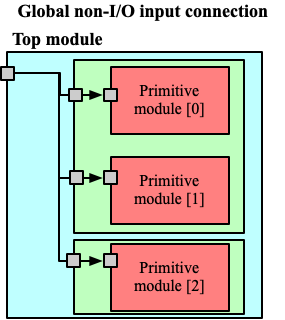
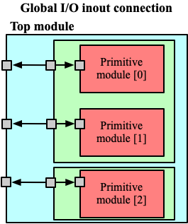
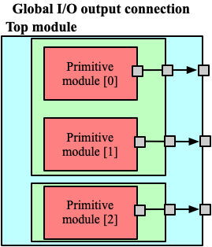

.. _circuit_library:

Circuit Library
---------------

Circuit design is a dominant factor in Power, Performance, Area (P.P.A.) of FPGA fabrics.
Upon practical applications, the hardware engineers may select various circuits to implement their FPGA fabrics.
For instance, a ultra-low-power FPGA may be built with ulta-low-power circuit cells while a high-performance FPGA may use absolutely different circuit cells.
OpenFPGA provide enriched XML syntax for users to highly customize their circuits in FPGA fabric.

In the XML file, users can define a library of circuits, each of which corresponds to a primitive module required in the FPGA architecture.
Users can specify if the Verilog/SPICE netlist of the module is either auto-generated by OpenFPGA or provided by themselves.
As such, OpenFPGA can support any circuit design, leading to high flexibility in building FPGA fabrics.

In principle, a circuit library consists of a number of ``<circuit_model>``, each of which correspond to a circuit design.
OpenFPGA supports a wide range of circuit designs.
The ``<circuit_model>`` could be as small as a cornerstone cell, such as inverter, buffer *etc*., or as large as a hardware IP, such as Block RAM.

.. code-block:: xml

  <circuit_library>
    <circuit_model type="<string>" name="<string>">
      <!-- Detailed circuit-level design parameters -->
    </circuit_model>
    <!-- More circuit models -->
  </circuit_library>

Currently, OpenFPGA supports the following categories of circuits:

  - inverters/buffers
  - pass-gate logic, including transmission gates and pass transistors
  - standard cell logic gates, including AND, OR and MUX2
  - metal wires
  - multiplexers
  - flip-flops
  - Look-Up Tables, including single-output and multi-output fracturable LUTs
  - Statis Random Access Memory (SRAM)
  - scan-chain flip-flops
  - I/O pad
  - hardware IPs 

Circuit Model
^^^^^^^^^^^^^

As OpenFPGA supports many types of circuit models and their circuit-level implementation could be really different, each type of circuit model has special syntax to customize their designs.
However, most circuit models share the common generality in XML language.
Here, we focus these common syntax and we will detail special syntax in :ref:`circuit_model_examples`

.. code-block:: xml

  <circuit_model type="<string>" name="<string>" prefix="<string>" is_default="<bool>" spice_netlist="<string>" verilog_netlist="<string>" dump_structural_verilog="<bool>">
    <design_technology type="<string>"/>
    <input_buffer exist="<string>" circuit_model_name="<string>"/>
    <output_buffer exist="<string>" circuit_model_name="<string>"/>
    <pass_gate_logic type="<string>" circuit_model_name="<string>"/>
    <port type="<string>" prefix="<string>" lib_name="<string>" size="<int>" default_val="<int>" circuit_model_name="<string>" mode_select="<bool>" is_global="<bool>" is_set="<bool>" is_reset="<bool>" is_config_enable="<bool>"/>
    <!-- more ports -->
  </circuit_model>

.. option:: <circuit_model type="<string>" name="<string>" prefix="<string>" is_default="<bool>"
  spice_netlist="<string>" verilog_netlist="<string>" dump_structural_verilog="<bool>">
  
  Specify the general attributes for a circuit model

  - ``type="inv_buf|pass_gate|gate|mux|wire|chan_wire|sram|lut|ff|ccff|hard_logic|iopad"`` Specify the type of circuit model. For the circuit models in the type of mux/wire/chan_wire/lut, FPGA-Verilog/SPICE can auto-generate Verilog/SPICE netlists. For the rest, FPGA-Verilog/SPICE requires a user-defined Verilog/SPICE netlist.

  - ``name="<string>"`` Specify the name of this circuit model. The name should be unique and will be used to create the Verilog/SPICE module in Verilog/SPICE netlists. Note that for a customized Verilog/SPICE netlist, the name defined here MUST be the name in the customized Verilog/SPICE netlist. FPGA-Verilog/SPICE will check if the given name is conflicted with any reserved words.

  - ``prefix="<string>"`` Specify the name of the ``<circuit_model>`` to shown in the auto-generated Verilog/SPICE netlists. The prefix can be the same as the name defined above. And again, the prefix should be unique

  - ``is_default="true|false"``  Specify this circuit model is the default one for those in the same types. If a primitive module in VPR architecture is not linked to any circuit model by users, FPGA-Verilog/SPICE will find the default circuit model defined in the same type.

  - ``spice_netlist="<string>"`` Specify the path and file name of a customized SPICE netlist. For some modules such as SRAMs, FFs, I/O pads, FPGA-SPICE does not support auto-generation of the transistor-level sub-circuits because their circuit design is highly dependent on the technology nodes. These circuit designs should be specified by users. For the other modules that can be auto-generated by FPGA-SPICE, the user can also define a custom netlist.

  - ``verilog_netlist="<string>"`` Specify the path and file name of a customized Verilog netlist. For some modules such as SRAMs, FFs, I/O pads, FPGA-Verilog does not support auto-generation of the transistor-level sub-circuits because their circuit design is highly dependent on the technology nodes. These circuit designs should be specified by users. For the other modules that can be auto-generated by FPGA-Verilog, the user can also define a custom netlist.

  - ``dump_structural_verilog="true|false"`` When the value of this keyword is set to be true, Verilog generator will output gate-level netlists of this module, instead of behavior-level. Gate-level netlists bring more opportunities in layout-level optimization while behavior-level is more suitable for high-speed formal verification and easier in debugging with HDL simulators.

.. warning:: ``prefix`` may be deprecated soon

.. warning:: Multiplexers cannot be user-defined.

.. warning:: For a circuit model type, only one circuit model is allowed to be set as default. If there is only one circuit model defined in a type, it will be considered as the default automatically.

.. note:: If ``<spice_netlist>`` or ``<verilog_netlist>`` are not specified, FPGA-Verilog/SPICE auto-generates the Verilog/SPICE netlists for multiplexers, wires, and LUTs.

.. note:: The user-defined netlists, such as LUTs, the decoding methodology should comply with the auto-generated LUTs!!!

Design Technology
^^^^^^^^^^^^^^^^^

.. option:: <design_technology type="string"/>

  Specify the design technology applied to a ``<circuit_model>``

    - ``type="cmos|rram"`` Specify the type of design technology of the ``<circuit_model>``. Currently, OpenFPGA supports CMOS and RRAM technology for circuit models.
      CMOS technology can be applied to any types of ``<circuit_model>``, while RRAM technology is only applicable to multiplexers and SRAMs 

.. note:: Each ``<circuit_model>`` may have different technologies

Device Technology
^^^^^^^^^^^^^^^^^

.. option:: <device_technology device_model_name="<string>"/>

   Specify the technology binding between a circuit model and a device model which is defined in the technology library (see details in :ref:`technology_library`).

     - ``device_model_name="<string>"`` Specify the name of device model that the circuit design will use. The device model must be a valid one in the technology library.

.. note:: Technology binding is only required for primitive circuit models, which are inverters, buffers, logic gates, pass gate logic, and is mandatory only when SPICE netlist generation is required.

Input and Output Buffers
^^^^^^^^^^^^^^^^^^^^^^^^

.. option:: <input_buffer exist="<string>" circuit_model_name="<string>"/>

  - ``exist="true|false"`` Define the existence of the input buffer. Note that the existence is valid for all the inputs.

  - ``circuit_model_name="<string>"`` Specify the name of circuit model which is used to implement input buffer, the type of specified circuit model should be ``inv_buf``.

.. option:: <output_buffer exist="<string>" circuit_model_name="<string>"/>

  - ``exist="true|false"`` Define the existence of the output buffer. Note that the existence is valid for all the outputs. Note that if users want only part of the inputs (or outputs) to be buffered, this is not supported here. A solution can be building a user-defined Verilog/SPICE netlist.

  - ``circuit_model_name="<string>"`` Specify the name of circuit model which is used to implement the output buffer, the type of specified circuit model should be ``inv_buf``.

.. note:: If users want only part of the inputs (or outputs) to be buffered, this is not supported here. A solution can be building a user-defined Verilog/SPICE netlist.

Pass Gate Logic
^^^^^^^^^^^^^^^

.. option:: <pass_gate_logic circuit_model_name="<string>"/>

  - ``circuit_model_name="<string>"`` Specify the name of the circuit model which is used to implement pass-gate logic, the type of specified circuit model should be ``pass_gate``.

.. note:: pass-gate logic are used in building multiplexers and LUTs.

.. _circuit_library_circuit_port:

Circuit Port
^^^^^^^^^^^^

A circuit model may consist of a number of ports. The port list is mandatory in any ``circuit_model`` and must be consistent to any user-defined netlists. 

.. option:: <port type="<string>" prefix="<string>" lib_name="<string>" size="<int>"
  default_val="<int>" circuit_model_name="<string>" mode_select="<bool>"
  is_global="<bool>" is_set="<bool>" is_reset="<bool>" 
  is_config_enable="<bool>" is_io="<bool>" is_data_io="<bool>"/>

  Define the attributes for a port of a circuit model.

  - ``type="input|output|sram|clock"`` Specify the type of the port, i.e., the directionality and usage. For programmable modules, such as multiplexers and LUTs, SRAM ports MUST be defined. For registers, such as FFs and memory banks, clock ports MUST be defined.

    .. note:: ``sram`` and ``clock`` ports are considered as inputs in terms of directionality

  - ``prefix="<string>"`` the name of the port to appear in the autogenerated netlists. Each port will be shown as ``<prefix>[i]`` in Verilog/SPICE netlists.

    .. note:: if the circuit model is binded to a ``pb_type`` in VPR architecture, ``prefix`` must match the port name defined in ``pb_type``

  - ``lib_name="<string>"`` the name of the port defined in standard cells or customized cells. If not specified, this attribute will be the same as ``prefix``.

    .. note:: if the circuit model comes from a standard cell library, using ``lib_name`` is recommended. This is because 
      - the port names defined in ``pb_type`` are very diffrerent from the standard cells
      - the port sequence is very different 

  - ``size="<int>"`` bandwidth of the port. MUST be larger than zero.

  - ``default_val="<int>"`` Specify default logic value for a port, which is used as the initial logic value of this port in testbench generation. Can be either 0 or 1. We assume each pin of this port has the same default value.

  - ``circuit_model_name="<string>"`` Specify the name of the circuit model which is connected to this port.

    .. note:: ``circuit_model_name`` is only valid when the type of this port is ``sram``.

  - ``is_io="true|false"`` Specify if this port should be treated as an I/O port of an FPGA fabric. When this is enabled, this port of each circuit model instanciated in FPGA will be added as an I/O of an FPGA.

    .. note:: global ``output`` ports must be ``io`` ports

  - ``is_data_io="true|false"`` Specify if this port should be treated as a mappable FPGA I/O port for users' implementation. When this is enabled, I/Os of user's implementation, e.g., ``.input`` and ``.output`` in ``.blif`` netlist, can be mapped to the port through VPR.

    .. note:: Any I/O model must have at least 1 port that is defined as data I/O!

  - ``mode_select="true|false"`` Specify if this port controls the mode switching in a configurable logic block. This is due to that a configurable logic block can operate in different modes, which is controlled by SRAM bits.

    .. note:: ``mode_select`` is only valid when the type of this port is ``sram``.

  - ``is_global="true|false"`` can be either ``true`` or ``false``. Specify if this port is a global port, which will be routed globally.

    .. note:: For input ports, when multiple global input ports are defined with the same name, by default, these global ports will be short-wired together. When ``io`` is turned on for this port, these global ports will be independent in the FPGA fabric.

    .. note:: For output ports, the global ports will be independent in the FPGA fabric 

  - ``is_set="true|false"`` Specify if this port controls a set signal. All the set ports are connected to global set voltage stimuli in testbenches.

  - ``is_reset="true|false"`` Specify if this port controls a reset signal. All the reset ports are connected to a global reset voltage stimuli in testbenches.

  - ``is_config_enable="true|false"`` Specify if this port controls a configuration-enable signal. Only valid when ``is_global`` is ``true``. This port is only enabled during FPGA configuration, and always disabled during FPGA operation. All the ``config_enable`` ports are connected to global configuration-enable voltage stimuli in testbenches. 

  .. note:: This attribute is used by testbench generators (see :ref:`fpga_verilog_testbench`) 

            - In full testbench, 
        
              - There is a ``config_done`` signal, which stay at logic ``0`` during bitstream loading phase, and is pulled up to logic ``1`` during operating phase
              - When ``default_value="0"``, the port will be wired to a ``config_done`` signal.
              - When ``default_value="1"``, the port will be wired to an inverted ``config_done`` signal.
              
            - In preconfigured wrapper, the port will be set to the inversion of ``default_value``, as the preconfigured testbenches consider operating phase only.

.. note:: ``is_set``, ``is_reset`` and ``is_config_enable`` are only valid when ``is_global`` is ``true``. 

.. note::  Different types of ``circuit_model`` have different XML syntax, with which users can highly customize their circuit topologies. See refer to examples of :ref:``circuit_model_example`` for more details.

.. note:: Note that we have a list of reserved port names, which indicate the usage of these ports when building FPGA fabrics. Please do not use ``mem_out``, ``mem_inv``, ``bl``, ``wl``, ``blb``, ``wlb``, ``wlr``, ``ccff_head`` and ``ccff_tail``.

FPGA I/O Port 
^^^^^^^^^^^^^

The ``circuit_model`` support not only highly customizable circuit-level modeling but also flexible I/O connection in the FPGA fabric.
Typically, circuit ports appear in the primitive modules of a FPGA fabric.
However, it is also very common that some circuit ports should be I/O of a FPGA fabric.
Using syntax ``is_global`` and ``is_io``, users can freely define how these ports are connected as FPGA I/Os.

In principle, when ``is_global`` is set ``true``, the port will appear as an FPGA I/O.
The syntax ``is_io`` is applicable when ``is_global`` is ``true``.
When ``is_io`` is ``true``, the port from different instances will be treated as independent I/Os.
When ``is_io`` is ``false``, the port from different instances will be treated as the same I/Os, which are short-wired.

To beef up, the following examples will explain how to use ``is_global`` and ``is_io`` to achieve different types of connections to FPGA I/Os.

.. option:: Global short-wired inputs

.. code-block:: xml

  <port type="input" is_global="true" is_io="false"/>

The global inputs are short wired across different instances. 
These inputs are widely seen in FPGAs, such as clock ports, which are shared between sequential elements. 

:numref:`fig_global_input_ports` shows an example on how the global inputs are wired inside FPGA fabric.

.. _fig_global_input_ports:

   Short-wired global inputs as an FPGA I/O

.. option:: Global short-wired inouts

.. code-block:: xml

  <port type="inout" is_global="true" is_io="false"/>

The global inouts are short wired across different instances. 

:numref:`fig_global_inout_ports` shows an example on how the global inouts are wired inside FPGA fabric.

.. _fig_global_inout_ports:

.. figure:: ./figures/global_inout_ports.png
   :scale: 100%
   :alt: classical inverter 1x symbol

   Short-wired global inouts as an FPGA I/O

.. option:: General-purpose inputs

.. code-block:: xml

  <port type="input" is_global="true" is_io="true"/>

The general-purpose inputs are independent wired from different instances to separated FPGA I/Os.
For example, power-gating signals can be applied to each tile of a FPGA.

:numref:`fig_gpin_ports` shows an example on how the general-purpose inputs are wired inside FPGA fabric.

.. _fig_gpin_ports:

.. figure:: ./figures/gpin_ports.png
   :scale: 100%
   :alt: classical inverter 1x symbol

   General-purpose inputs as separated FPGA I/Os

.. option:: General-purpose I/O

.. code-block:: xml

  <port type="inout" is_global="true" is_io="true"/>

The general-purpose I/O are independent wired from different instances to separated FPGA I/Os.
In practice, inout of GPIO cell is typically wired like this.

:numref:`fig_gpin_ports` shows an example on how the general-purpose inouts are wired inside FPGA fabric.

.. _fig_gpio_ports:

   General-purpose inouts as separated FPGA I/Os

.. option:: General-purpose outputs

.. code-block:: xml

  <port type="output" is_global="true" is_io="true"/>

The general-purpose outputs are independent wired from different instances to separated FPGA outputs.
In practice, these outputs are typically spypads to probe internal signals of a FPGA.

:numref:`fig_gpout_ports` shows an example on how the general-purpose outputs are wired inside FPGA fabric.

.. _fig_gpout_ports:

   General-purpose outputs as separated FPGA I/Os

.. warning:: The general-purpose inputs/inouts/outputs are not applicable to routing multiplexer outputs

