.. _circuit_model_examples:

Circuit model examples
----------------------
As circuit model in different types have various special syntax.
Here, we will provide detailed examples on each type of ``circuit_model``.
These examples may be considered as template for users to craft their own ``circuit_model``.

Inverters and Buffers
~~~~~~~~~~~~~~~~~~~~~

Template
````````

.. code-block:: xml

  <circuit_model type="inv_buf" name="<string>" prefix="<string>" netlist="<string>" is_default="<int>">
    <design_technology type="cmos" topology="<string>" size="<int>" num_level="<int>" f_per_stage="<float>"/>
    <port type="input" prefix="<string>" size="<int>"/>
    <port type="output" prefix="<string>" size="<int>"/>
  </circuit_model>

.. option:: <design_technology type="cmos" topology="<string>" size="<int>" num_level="<int>" f_per_stage="<float>"/>

  - ``topology="inverter|buffer"`` Specify the type of this component, can be either an inverter or a buffer.

  - ``size="<int>"`` Specify the driving strength of inverter/buffer. For a buffer, the size is the driving strength of the inverter at the second level. Note that we consider a two-level structure for a buffer here.

  - ``num_level="<int>"`` Define the number of levels of a tapered inverter/buffer. This is required when users need an inverter or a buffer consisting of >2 stages 

  - ``f_per_stage="<float>"`` Define the ratio of driving strength between the levels of a tapered inverter/buffer. Default value is 4.

.. _circuit_model_inverter_1x_example:

Inverter 1x Example
```````````````````

:numref:`fig_inv1` is the inverter symbol depicted in this example.

.. _fig_inv1:

.. figure:: ./figures/Inverter_1.png
   :scale: 100%
   :alt: classical inverter 1x symbol

   Classical inverter 1x symbol.

The XML code describing this inverter is:

.. code-block:: xml

  <circuit_model type="inv_buf" name="inv1x" prefix="inv1x">
    <design_technology type="cmos" topology="inverter" size="1"/>
    <port type="input" prefix="in" size="1"/>
    <port type="output" prefix="out" size="1"/>
  </circuit_model>

This example shows:

  - The topology chosen as inverter
  - Size of 1 for the output strength
  - The tapered parameter is not declared and is ``false`` by default

.. _circuit_model_power_gated_inverter_example:

Power-gated Inverter 1x example
```````````````````````````````

The XML code describing an inverter which can be power-gated by the control signals ``EN`` and ``ENB`` :

.. code-block:: xml

  <circuit_model type="inv_buf" name="INVTX1" prefix="INVTX1">
    <design_technology type="cmos" topology="inverter" size="3" power_gated="true"/>
    <port type="input" prefix="in" size="1" lib_name="I"/>
    <port type="input" prefix="EN" size="1" lib_name="EN" is_global="true" default_val="0" is_config_enable="true"/>
    <port type="input" prefix="ENB" size="1" lib_name="ENB" is_global="true" default_val="1" is_config_enable="true"/>
    <port type="output" prefix="out" size="1" lib_name="Z"/>
  </circuit_model>

.. note:: For power-gated inverters: all the control signals must be set as ``config_enable`` so that the testbench generation will generate testing waveforms. If the power-gated inverters are auto-generated, all the ``config_enable`` signals must be ``global`` signals as well. If the power-gated inverters come from user-defined netlists, restrictions on ``global`` signals are free.

.. _circuit_model_buffer_2x_example:

Buffer 2x example
`````````````````

:numref:`fig_buff` is the buffer symbol depicted in this example.

.. _fig_buff:

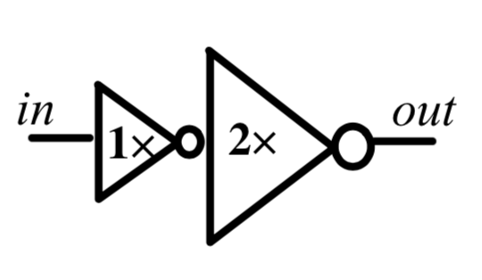

   Buffer made by two inverter, with an output strength of 2.

The XML code describing this buffer is:

.. code-block:: xml

  <circuit_model type="inv_buf" name="buf2" prefix="buf2">
    <design_technology type="cmos" topology="buffer" size="2"/>
    <port type="input" prefix="in" size="1"/>
    <port type="output" prefix="out" size="1"/>
  </circuit_model>

This example shows:
  - The topology chosen as buffer
  - Size of 2 for the output strength
  - The tapered parameter is not declared and is ``false`` by default

.. _circuit_model_power_gated_buffer_example:

Power-gated Buffer 4x example
`````````````````````````````

The XML code describing a buffer which can be power-gated by the control signals ``EN`` and ``ENB`` :

.. code-block:: xml

  <circuit_model type="inv_buf" name="buf_4x" prefix="buf_4x">
    <design_technology type="cmos" topology="buffer" size="4" power_gated="true"/>
    <port type="input" prefix="in" size="1" lib_name="I"/>
    <port type="input" prefix="EN" size="1" lib_name="EN" is_global="true" default_val="0" is_config_enable="true"/>
    <port type="input" prefix="ENB" size="1" lib_name="ENB" is_global="true" default_val="1" is_config_enable="true"/>
    <port type="output" prefix="out" size="1" lib_name="Z"/>
  </circuit_model>

.. note:: For power-gated buffers: all the control signals must be set as ``config_enable`` so that the testbench generation will generate testing waveforms. If the power-gated buffers are auto-generated, all the ``config_enable`` signals must be ``global`` signals as well. If the power-gated buffers come from user-defined netlists, restrictions on ``global`` signals are free.

.. _circuit_model_tapered_inv_16x_example:

Tapered inverter 16x example
````````````````````````````

:numref:`fig_invtap4` is the tapered inverter symbol depicted this example.

.. _fig_invtap4:

.. figure:: ./figures/Tapered_inverter.png
   :scale: 50%
   :alt: tapered inverter composed by 3 inverter for an output strength = 16

   Inverter with high output strength made by 3 stage of inverter.

The XML code describing this inverter is:

.. code-block:: xml

  <circuit_model type="inv_buf" name="tapdrive4" prefix="tapdrive4">
    <design_technology type="cmos" topology="inverter" size="1" num_level="3" f_per_stage="4"/>
    <port type="input" prefix="in" size="1"/>
    <port type="output" prefix="out" size="1"/>
  </circuit_model>


This example shows:
  - The topology chosen as inverter
  - Size of 1 for the first stage output strength
  - The number of stage is set to 3 by
  - f_per_stage is set to 4. As a result, 2nd stage output strength is 4x, and the 3rd stage output strength is 16x.

.. _circuit_model_tapered_buffer_64x_example:

Tapered buffer 64x example
``````````````````````````

The XML code describing a 4-stage buffer is:

.. code-block:: xml

  <circuit_model type="inv_buf" name="tapbuf_16x" prefix="tapbuf_16x">
    <design_technology type="cmos" topology="buffer" size="1" num_level="4" f_per_stage="4"/>
    <port type="input" prefix="in" size="1"/>
    <port type="output" prefix="out" size="1"/>
  </circuit_model>


This example shows:
  - The topology chosen as buffer
  - Size of 1 for the first stage output strength
  - The number of stage is set to 4 by
  - f_per_stage is set to 2. As a result, 2nd stage output strength is 4*, the 3rd stage output strength is 16*, and the 4th stage output strength is 64x.


Pass-gate Logic
~~~~~~~~~~~~~~~

Template
````````

.. code-block:: xml

  <circuit_model type="pass_gate" name="<string>" prefix="<string>" netlist="<string>" is_default="<int>">
    <design_technology type="cmos" topology="<string>" nmos_size="<float>" pmos_size="<float>"/>
    <input_buffer exist="false"/>
    <output_buffer exist="false"/>
    <port type="input" prefix="<string>" size="<int>"/>
    <port type="output" prefix="<string>" size="<int>"/>
  </circuit_model>

.. note:: The port sequence really matters! And all the input ports must have an input size of 1!

          - The first input must be the datapath input, e.g., ``in``.

          - The second input must be the select input, e.g., ``sel``.

          - The third input (if applicable) must be the inverted select input, e.g., ``selb``.

.. warning:: Please do **NOT** add input and output buffers to pass-gate logic.

.. option:: <design_technology type="cmos" topology="<string>" nmos_size="<float>" pmos_size="<float>"/>

  - ``topology="transmission_gate|pass_transistor"`` Specify the circuit topology for the pass-gate logic. A transmission gate consists of a *n*-type transistor and a *p*-type transistor. The pass transistor consists of only a  *n*-type transistor.

  - ``nmos_size="<float>"`` the size of *n*-type transistor in a transmission gate or pass_transistor, expressed in terms of the minimum width ``min_width`` defined in the transistor model in :ref:`technology_library`.

  - ``pmos_size="<float>"`` the size of *p*-type transistor in a transmission gate, expressed in terms of the minimum width ``min_width`` defined in the transistor model in :ref:`technology_library`.

.. note:: ``nmos_size`` and ``pmos_size`` are required for FPGA-SPICE

.. _circuit_model_tgate_example:

Transmission-gate Example
`````````````````````````

:numref:`fig_passgate` is the pass-gate symbol depicted in this example.

.. _fig_passgate:

.. figure:: ./figures/pass-gate.png
   :scale: 30%
   :alt: pmos and nmos transistortors forming a pass-gate

   Pass-gate made by a *p*-type and a *n*-type transistors.

The XML code describing this pass-gate is:

.. code-block:: xml

  <circuit_model type="pass_gate" name="tgate" prefix="tgate">
    <design_technology type="cmos" topology="transmission_gate" nmos_size="1" pmos_size="2"/>
    <port type="input" prefix="in" size="1"/>
    <port type="input" prefix="sram" size="1"/>
    <port type="input" prefix="sramb" size="1"/>
    <port type="output" prefix="out" size="1"/>
  </circuit_model>

This example shows:
  - A ``transmission_gate`` built with a *n*-type transistor in the size of 1 and a *p*-type transistor in the size of 2.
  - 3 inputs considered, 1 for datapath signal and 2 to turn on/off the transistors gates

.. _circuit_model_pass_transistor_example:

Pass-transistor Example
```````````````````````

:numref:`fig_passtran` is the pass-gate symbol depicted in this example.

.. _fig_passtran:

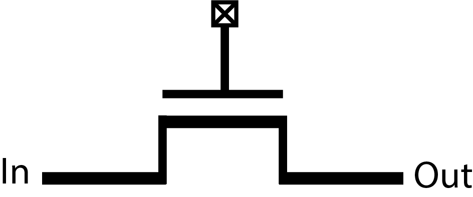

   Pass-gate made by a nmos transistor.

The XML code describing this pass-gate is:

.. code-block:: xml

  <circuit_model type="pass_gate" name="t_pass" prefix="t_pass">
    <design_technology type="cmos" topology="pass_transistor"/>
    <port type="input" prefix="in" size="1"/>
    <port type="input" prefix="sram" size="1"/>
    <port type="output" prefix="out" size="1"/>
  </circuit_model>

This example shows:
  - A ``pass_transistor`` build with a *n*-type transistor in the size of 1 
  - 2 inputs considered, 1 for datapath signal and 1 to turn on/off the transistor gate

SRAMs
~~~~~

Template
````````

.. code-block:: xml

  <circuit_model type="sram" name="<string>" prefix="<string>" verilog_netlist="<string>" spice_netlist="<string>"/>
    <design_technology type="cmos"/>
    <input_buffer exist="<string>" circuit_model_name="<string>"/>
    <output_buffer exist="<string>" circuit_model_name="<string>"/>
    <port type="input" prefix="<string>" size="<int>"/>
    <port type="output" prefix="<string>" size="<int>"/>
  </circuit_model>

.. note::  The circuit designs of SRAMs are highly dependent on the technology node and well optimized by engineers. Therefore, FPGA-Verilog/SPICE requires users to provide their customized SRAM Verilog/SPICE/Verilog netlists. A sample Verilog/SPICE netlist of SRAM can be found in the directory SpiceNetlists in the released package. FPGA-Verilog/SPICE assumes that all the LUTs and MUXes employ the SRAM circuit design. Therefore, currently only one SRAM type is allowed to be defined.

.. note:: The information of input and output buffer should be clearly specified according to the customized Verilog/SPICE netlist! The existence of input/output buffers will influence the decision in creating testbenches, which may leads to larger errors in power analysis.

.. _circuit_model_sram_blwl_example:

SRAM with BL/WL
```````````````
.. _fig_sram_blwl:

.. figure:: ./figures/sram_blwl.png
   :scale: 100%

   An example of a SRAM with Bit-Line (BL) and Word-Line (WL) control signals

The following XML codes describes the SRAM cell shown in :numref:`fig_sram_blwl`.

.. code-block:: xml

  <circuit_model type="sram" name="sram_blwl" prefix="sram_blwl" verilog_netlist="sram.v" spice_netlist="sram.sp"/>
    <design_technology type="cmos"/>
    <input_buffer exist="false"/>
    <output_buffer exist="false"/>
    <port type="bl" prefix="bl" size="1"/>
    <port type="blb" prefix="blb" size="1"/>
    <port type="wl" prefix="wl" size="1"/>
    <port type="output" prefix="out" size="1"/>
    <port type="output" prefix="outb" size="1"/>
  </circuit_model>

.. note:: OpenFPGA always assume that a ``WL`` port should be the write/read enable signal, while a ``BL`` port is the data input.

.. note:: When the ``memory_bank`` type of configuration procotol is specified, SRAM modules should have a BL and a WL.

.. _circuit_model_config_latch_example:

Configurable Latch
``````````````````

.. _fig_config_latch:


   An example of a SRAM-based configurable latch with Bit-Line (BL) and Word-Line (WL) control signals

The following XML codes describes the configurable latch shown in :numref:`fig_config_latch`.

.. code-block:: xml

  <circuit_model type="sram" name="config_latch" prefix="config_latch" verilog_netlist="sram.v" spice_netlist="sram.sp"/>
    <design_technology type="cmos"/>
    <input_buffer exist="false"/>
    <output_buffer exist="false"/>
    <port type="clock" prefix="clk" size="1"/>
    <port type="bl" prefix="bl" size="1"/>
    <port type="wl" prefix="wl" size="1"/>
    <port type="output" prefix="out" size="1"/>
    <port type="output" prefix="outb" size="1"/>
  </circuit_model>

.. note:: OpenFPGA always assume that a ``WL`` port should be the write/read enable signal, while a ``BL`` port is the data input.

.. note:: When the ``frame_based`` type of configuration procotol is specified, the configurable latch or a SRAM with ``BL`` and ``WL`` should be specified.

Logic gates
~~~~~~~~~~~

The circuit model in the type of ``gate`` aims to support direct mapping to standard cells or customized cells provided by technology vendors or users. 

Template
````````

.. code-block:: xml

  <circuit_model type="gate" name="<string>" prefix="<string>" spice_netlist="<string>" verilog_netlist="<string>"/>
    <design_technology type="cmos" topology="<string>"/>
    <input_buffer exist="<string>" circuit_model_name="<string>"/>
    <output_buffer exist="<string>" circuit_model_name="<string>"/>
    <port type="input" prefix="<string>" lib_name="<string>" size="<int>"/>
    <port type="output" prefix="<string>" lib_name="<string>" size="<int>"/>
  </circuit_model>

.. option:: <design_technology type="cmos" topology="<string>"/>
  
  - ``topology="AND|OR|MUX2"`` Specify the logic functionality of a gate. As for standard cells, the size of each port is limited to 1. Currently, only 2-input and single-output logic gates are supported.

.. note:: The port sequence really matters for MUX2 logic gates! 

          - The first two inputs must be the datapath inputs, e.g., ``in0`` and ``in1``.

          - The third input must be the select input, e.g., ``sel``.

.. _circuit_model_and2_example:

2-input AND Gate
````````````````

.. code-block:: xml

    <circuit_model type="gate" name="AND2" prefix="AND2" is_default="true">
      <design_technology type="cmos" topology="AND"/>
      <input_buffer exist="false"/>
      <output_buffer exist="false"/>
      <port type="input" prefix="a" size="1"/>
      <port type="input" prefix="b" size="1"/>
      <port type="output" prefix="out" size="1"/>
      <delay_matrix type="rise" in_port="a b" out_port="out">
        10e-12 8e-12
      </delay_matrix>
      <delay_matrix type="fall" in_port="a b" out_port="out">
        10e-12 7e-12
      </delay_matrix>
    </circuit_model>

This example shows:
  - A 2-input AND gate without any input and output buffers
  - Propagation delay from input ``a`` to ``out`` is 10ps in rising edge and and 8ps in falling edge
  - Propagation delay from input ``b`` to ``out`` is 10ps in rising edge and 7ps in falling edge

.. _circuit_model_or2_example:

2-input OR Gate
```````````````

.. code-block:: xml

    <circuit_model type="gate" name="OR2" prefix="OR2" is_default="true">
      <design_technology type="cmos" topology="OR"/>
      <input_buffer exist="false"/>
      <output_buffer exist="false"/>
      <port type="input" prefix="a" size="1"/>
      <port type="input" prefix="b" size="1"/>
      <port type="output" prefix="out" size="1"/>
      <delay_matrix type="rise" in_port="a b" out_port="out">
        10e-12 8e-12
      </delay_matrix>
      <delay_matrix type="fall" in_port="a b" out_port="out">
        10e-12 7e-12
      </delay_matrix>
    </circuit_model>

This example shows:
  - A 2-input OR gate without any input and output buffers
  - Propagation delay from input ``a`` to ``out`` is 10ps in rising edge and and 8ps in falling edge
  - Propagation delay from input ``b`` to ``out`` is 10ps in rising edge and 7ps in falling edge

.. _circuit_model_mux2_gate_example:

MUX2 Gate
`````````

.. code-block:: xml

    <circuit_model type="gate" name="MUX2" prefix="MUX2" is_default="true" verilog_netlist="sc_mux.v">
      <design_technology type="cmos" topology="MUX2"/>
      <input_buffer exist="false"/>
      <output_buffer exist="false"/>
      <port type="input" prefix="in0" lib_name="B" size="1"/>
      <port type="input" prefix="in1" lib_name="A" size="1"/>
      <port type="input" prefix="sel" lib_name="S" size="1"/>
      <port type="output" prefix="out" lib_name="Y" size="1"/>
    </circuit_model>

This example shows:
  - A 2-input MUX gate with two inputs ``in0`` and ``in1``, a select port ``sel`` and an output port ``out``
  - The Verilog of MUX2 gate is provided by the user in the netlist ``sc_mux.v``
  - The use of ``lib_name`` to bind to a Verilog module with different port names.
  - When binding to the Verilog module, the inputs will be swapped. In other words, ``in0`` of the circuit model will be wired to the input ``B`` of the MUX2 cell, while ``in1`` of the circuit model will be wired to the input ``A`` of the MUX2 cell.

.. note:: OpenFPGA requires a fixed truth table for the ``MUX2`` gate. When the select signal sel is enabled, the first input, i.e., ``in0``, will be propagated to the output, i.e., ``out``. If your standard cell provider does not offer the exact truth table, you can simply swap the inputs as shown in the example.

Multiplexers
~~~~~~~~~~~~

Template
````````

.. code-block:: xml

  <circuit_model type="mux" name="<string>" prefix="<string>">
    <design_technology type="<string>" structure="<string>" num_level="<int>" add_const_input="<bool>" const_input_val="<int>" local_encoder="<bool>"/>
    <input_buffer exist="<string>" circuit_model_name="<string>"/>
    <output_buffer exist="<string>" circuit_model_name="<string>"/>
    <pass_gate_logic type="<string>" circuit_model_name="<string>"/>
    <port type="input" prefix="<string>" size="<int>"/>
    <port type="output" prefix="<string>" size="<int>"/>
    <port type="sram" prefix="<string>" size="<int>"/>
  </circuit_model>

.. note:: user-defined Verilog/SPICE netlists are not currently supported for multiplexers.

.. option:: <design_technology type="<string>" structure="<string>" num_level="<int>" add_const_input="<bool>" const_input_val="<int>" local_encoder="<bool>"/>

  - ``structure="tree|multi-level|one-level"`` Specify the multiplexer structure for a multiplexer. The structure option is only valid for SRAM-based multiplexers. For RRAM-based multiplexers, currently we only support the one-level structure

  - ``num_level="<int>"`` Specify the number of levels when ``multi-level`` structure is selected.
    
  - ``add_const_input="true|false"`` Specify if an extra input should be added to the multiplexer circuits. For example, an 4-input multiplexer will be turned to a 5-input multiplexer. The extra input will be wired to a constant value, which can be specified through the XML syntax ``const_input_val``.

    .. note::  Adding an extra constant input will help reducing the leakage power of FPGA and parasitic signal activities, with a limited area overhead.

  - ``const_input_val="0|1"`` Specify the constant value, to which the extra input will be connected. By default it is 0. This syntax is only valid when the ``add_const_input`` is set to true. 
  
  - ``local_encoder="true|false"``. Specify if a local encoder should be added to the multiplexer circuits. The local encoder will interface the SRAM inputs of multiplexing structure and SRAMs. It can encode the one-hot codes (that drive the select port of multiplexing structure) to a binary code. For example, 8-bit ``00000001`` will be encoded to 3-bit ``000``. This will help reduce the number of SRAM cells used in FPGAs as well as configuration time (especially for scan-chain configuration protocols). But it may cost an area overhead.  

    .. note:: Local encoders are only applicable for one-level and multi-level multiplexers. Tree-like multiplexers are already encoded in their nature.

.. note:: A multiplexer should have only three types of ports, ``input``, ``output`` and ``sram``, which are all mandatory. 

.. note:: For tree-like multiplexers, they can be built with standard cell MUX2. To enable this, users should define a ``circuit_model``, which describes a 2-input multiplexer (See details and examples in how to define a logic gate using ``circuit_model``. In this case, the ``circuit_model_name`` in the ``pass_gate_logic`` should be the name of MUX2 ``circuit_model``.

.. note:: When multiplexers are not provided by users, the size of ports do not have to be consistent with actual numbers in the architecture.

.. _circuit_model_mux_1level_example:

One-level Multiplexer
`````````````````````

:numref:`fig_mux1` illustrates an example of multiplexer modelling, which consists of input/output buffers and a transmission-gate-based tree structure.

.. _fig_mux1:

.. figure:: ./figures/mux1lvl.png
   :scale: 60%
   :alt: Detailed one level Multiplexer

   An example of a one level multiplexer with transistor-level design parameters

The code describing this Multiplexer is:

.. code-block:: xml

  <circuit_model type="mux" name="mux_1level" prefix="mux_1level">
    <design_technology type="cmos" structure="one-level"/>
    <input_buffer exist="on" circuit_model_name="inv1x"/> 
    <output_buffer exist="on" circuit_model_name="tapbuf4"/> 
    <pass_gate_logic circuit_model_name="tgate"/>
    <port type="input" prefix="in" size="4"/>
    <port type="output" prefix="out" size="1"/>
    <port type="sram" prefix="sram" size="4"/> 
  </circuit_model>

This example shows:
  - A one-level 4-input CMOS multiplexer 
  - All the inputs will be buffered using the circuit model ``inv1x``
  - All the outputs will be buffered using the circuit model ``tapbuf4``
  - The multiplexer will be built by transmission gate using the circuit model ``tgate``
  - The multiplexer will have 4 inputs and 4 SRAMs to control which datapath to propagate

.. _circuit_model_mux_tree_example:

Tree-like Multiplexer
`````````````````````

:numref:`fig_mux` illustrates an example of multiplexer modelling, which consists of input/output buffers and a transmission-gate-based tree structure.

.. _fig_mux:

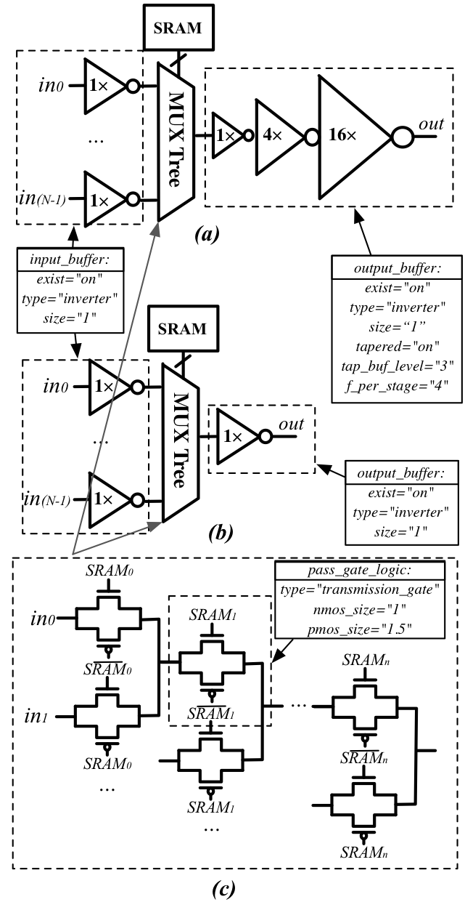

   An example of a tree-like multiplexer with transistor-level design parameters

If we arbitrarily fix the number of Mux entries at 4, the following code could illustrate (a):

.. code-block:: xml

  <circuit_model type="mux" name="mux_tree" prefix="mux_tree">
    <design_technology type="cmos" structure="tree"/>
    <input_buffer exist="on" circuit_model_name="inv1x"/>
    <output_buffer exist="on" circuit_model_name="tapdrive4"/>
    <pass_gate_logic circuit_model_name="tgate"/>
    <port type="input" prefix="in" size="4"/>
    <port type="output" prefix="out" size="1"/>
    <port type="sram" prefix="sram" size="3"/>
  </circuit_model>

This example shows:
  - A tree-like 4-input CMOS multiplexer 
  - All the inputs will be buffered using the circuit model ``inv1x``
  - All the outputs will be buffered using the circuit model ``tapbuf4``
  - The multiplexer will be built by transmission gate using the circuit model ``tgate``
  - The multiplexer will have 4 inputs and 3 SRAMs to control which datapath to propagate

.. _circuit_model_mux_stdcell_example:

Standard Cell Multiplexer
`````````````````````````
.. code-block:: xml

  <circuit_model type="mux" name="mux_stdcell" prefix="mux_stdcell">
    <design_technology type="cmos" structure="tree"/>
    <input_buffer exist="on" circuit_model_name="inv1x"/>
    <output_buffer exist="on" circuit_model_name="tapdrive4"/>
    <pass_gate_logic circuit_model_name="MUX2"/>
    <port type="input" prefix="in" size="4"/>
    <port type="output" prefix="out" size="1"/>
    <port type="sram" prefix="sram" size="3"/>
  </circuit_model>

This example shows:
  - A tree-like 4-input CMOS multiplexer built by the standard cell ``MUX2``
  - All the inputs will be buffered using the circuit model ``inv1x``
  - All the outputs will be buffered using the circuit model ``tapbuf4``
  - The multiplexer will have 4 inputs and 3 SRAMs to control which datapath to propagate

.. _circuit_model_mux_multilevel_example:

Multi-level Multiplexer
```````````````````````
.. code-block:: xml

  <circuit_model type="mux" name="mux_2level" prefix="mux_stdcell">
    <design_technology type="cmos" structure="multi_level" num_level="2"/>
    <input_buffer exist="on" circuit_model_name="inv1x"/>
    <output_buffer exist="on" circuit_model_name="tapdrive4"/>
    <pass_gate_logic circuit_model_name="TGATE"/>
    <port type="input" prefix="in" size="16"/>
    <port type="output" prefix="out" size="1"/>
    <port type="sram" prefix="sram" size="8"/>
  </circuit_model>

This example shows:
  - A two-level 16-input CMOS multiplexer built by the transmission gate ``TGATE``
  - All the inputs will be buffered using the circuit model ``inv1x``
  - All the outputs will be buffered using the circuit model ``tapbuf4``
  - The multiplexer will have 16 inputs and 8 SRAMs to control which datapath to propagate

.. _circuit_model_mux_local_encoder_example:

Multiplexer with Local Encoder
``````````````````````````````
.. code-block:: xml

  <circuit_model type="mux" name="mux_2level" prefix="mux_stdcell">
    <design_technology type="cmos" structure="multi_level" num_level="2" local_encoder="true"/>
    <input_buffer exist="on" circuit_model_name="inv1x"/>
    <output_buffer exist="on" circuit_model_name="tapdrive4"/>
    <pass_gate_logic circuit_model_name="TGATE"/>
    <port type="input" prefix="in" size="16"/>
    <port type="output" prefix="out" size="1"/>
    <port type="sram" prefix="sram" size="4"/>
  </circuit_model>

This example shows:
  - A two-level 16-input CMOS multiplexer built by the transmission gate ``TGATE``
  - All the inputs will be buffered using the circuit model ``inv1x``
  - All the outputs will be buffered using the circuit model ``tapbuf4``
  - The multiplexer will have 16 inputs and 4 SRAMs to control which datapath to propagate
  - Two local encoders are generated between the SRAMs and multiplexing structure to reduce the number of configurable memories required.

.. _circuit_model_mux_const_input_example:

Multiplexer with Constant Input
```````````````````````````````
.. code-block:: xml

  <circuit_model type="mux" name="mux_2level" prefix="mux_stdcell">
    <design_technology type="cmos" structure="multi_level" num_level="2" add_const_input="true" const_input_val="1"/>
    <input_buffer exist="on" circuit_model_name="inv1x"/>
    <output_buffer exist="on" circuit_model_name="tapdrive4"/>
    <pass_gate_logic circuit_model_name="TGATE"/>
    <port type="input" prefix="in" size="14"/>
    <port type="output" prefix="out" size="1"/>
    <port type="sram" prefix="sram" size="8"/>
  </circuit_model>

This example shows:
  - A two-level 16-input CMOS multiplexer built by the transmission gate ``TGATE``
  - All the inputs will be buffered using the circuit model ``inv1x``
  - All the outputs will be buffered using the circuit model ``tapbuf4``
  - The multiplexer will have 15 inputs and 8 SRAMs to control which datapath to propagate
  - An constant input toggled at logic '1' is added in addition to the 14 regular inputs

Look-Up Tables
~~~~~~~~~~~~~~

Template
````````

.. code-block:: xml

  <circuit_model type="lut" name="<string>" prefix="<string>" spice_netlist="<string>" verilog_netlist="<string>"/>
    <design_technology type="cmos" fracturable_lut="<bool>"/>
    <input_buffer exist="<string>" circuit_model_name="<string>"/>
    <output_buffer exist="<string>" circuit_model_name="<string>"/>
    <lut_input_buffer exist="<string>" circuit_model_name="<string>"/>
    <lut_input_inverter exist="<string>" circuit_model_name="<string>"/>
    <lut_intermediate_buffer exist="<string>" circuit_model_name="<string>" location_map="<string>"/>
    <pass_gate_logic type="<string>" circuit_model_name="<string>"/>
    <port type="input" prefix="<string>" size="<int>" tri_state_map="<string>" circuit_model_name="<string>" is_harden_lut_port="<bool>"/>
    <port type="output" prefix="<string>" size="<int>" lut_frac_level="<int>" lut_output_mask="<int>" is_harden_lut_port="<bool>"/>
    <port type="sram" prefix="<string>" size="<int>" mode_select="<bool>" circuit_model_name="<string>" default_val="<int>"/>
  </circuit_model>

.. note:: The Verilog/SPICE netlists of LUT can be auto-generated or customized.
  The auto-generated LUTs are based on a tree-like multiplexer, whose gates of the transistors are used as the inputs of LUTs and the drains/sources of the transistors are used for configurable memories (SRAMs).
  The LUT provided in customized Verilog/SPICE netlist should have the same decoding methodology as the traditional LUT.

.. option:: <lut_input_buffer exist="<string>" circuit_model_name="<string>"/>

  Define transistor-level description for the buffer for the inputs of a LUT (gates of the internal multiplexer).

  - ``exist="true|false"`` Specify if the input buffer should exist for LUT inputs

  - ``circuit_model_name="<string>"`` Specify the ``circuit_model`` that will be used to build the input buffers

.. note:: In the context of LUT, ``input_buffer`` corresponds to the buffer for the datapath inputs of multiplexers inside a LUT. ``lut_input_buffer`` corresponds to the buffer at the inputs of a LUT

.. option:: <lut_input_inverter exist="<string>" circuit_model_name="<string>"/>

  Define transistor-level description for the inverter for the inputs of a LUT (gates of the internal multiplexer).

  - ``exist="true|false"`` Specify if the input buffer should exist for LUT inputs

  - ``circuit_model_name="<string>"`` Specify the ``circuit_model`` that will be used to build the input inverters

.. option:: <lut_intermediate_buffer exist="<string>" circuit_model_name="<string>" location_map="<string>"/>

  Define transistor-level description for the buffer locating at intermediate stages of internal multiplexer of a LUT. 

  - ``exist="true|false"`` Specify if the input buffer should exist at intermediate stages

  - ``circuit_model_name="<string>"`` Specify the ``circuit_model`` that will be used to build these buffers

  - ``location_map="[1|-]"`` Customize the location of buffers in intermediate stages. Users can define an integer array consisting of '1' and '-'. Take the example in :numref:`fig_lut_intermediate_buffer_example`, ``-1-`` indicates buffer inseration to the second stage of the LUT multiplexer tree, considering a 3-input LUT. 

.. _fig_lut_intermediate_buffer_example:

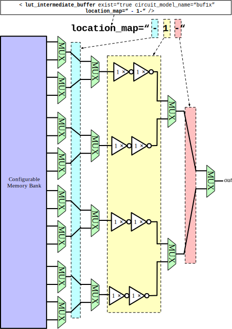

   An example of adding intermediate buffers to a 3-input Look-Up Table (LUT).

.. note:: For a LUT, three types of ports (``input``, ``output`` and ``sram``) should be defined. If the user provides an customized Verilog/SPICE netlist, the bandwidth of ports should be defined to the same as the Verilog/SPICE netlist. To support customizable LUTs, each type of port contain special keywords. 

.. option:: <port type="input" prefix="<string>" size="<int>" tri_state_map="<string>" circuit_model_name="<string>" is_harden_lut_port="<bool>"/>

  - ``tri_state_map="[-|1]"`` Customize which inputs are fixed to constant values when the LUT is in fracturable modes. For example, ``tri_state_map="----11"`` indicates that the last two inputs will be fixed to be logic '1' when a 6-input LUT is in fracturable modes. 

  - ``circuit_model_name="<string>"`` Specify the circuit model to build logic gates in order to tri-state the inputs in fracturable LUT modes. It is required to use an ``AND`` gate to force logic '0' or an ``OR`` gate to force logic '1' for the input ports.

  - ``is_harden_lut_port="[true|false]"`` Specify if the input drives a harden logic inside a LUT. A harden input is supposed **NOT** to drive any multiplexer input (the internal multiplexer of LUT). As a result, such inputs are not considered to implement any truth table mapped to the LUT. If enabled, the input will **NOT** be considered for wiring to internal multiplexers as well as bitstream generation. By default, an input port is treated **NOT** to be a harden LUT port.

.. option:: <port type="output" prefix="<string>" size="<int>" lut_frac_level="<int>" lut_output_mask="<int>" is_harden_lut_port="<bool>"/>

  - ``lut_frac_level="<int>"`` Specify the level in LUT multiplexer tree where the output port are wired to. For example, ``lut_frac_level="4"`` in a fracturable LUT6 means that the output are potentially wired to the 4th stage of a LUT multiplexer and it is an output of a LUT4. 
  
  - ``lut_output_mask="<int>"`` Describe which fracturable outputs are used. For instance, in a 6-LUT, there are potentially four LUT4 outputs can be wired out. ``lut_output_mask="0,2"`` indicates that only the first and the thrid LUT4 outputs will be used in fracturable mode.

  - ``is_harden_lut_port="[true|false]"`` Specify if the output is driven by a harden logic inside a LUT. A harden input is supposed **NOT** to be driven by any multiplexer output (the internal multiplexer of LUT). As a result, such outputs are not considered to implement any truth table mapped to the LUT. If enabled, the output will **NOT** be considered for wiring to internal multiplexers as well as bitstream generation. By default, an output port is treated **NOT** to be a harden LUT port.

.. note:: The size of the output port should be consistent to the length of ``lut_output_mask``. 

.. option:: <port type="sram" prefix="<string>" size="<int>" mode_select="<bool>" circuit_model_name="<string>" default_val="<int>"/>

  - ``mode_select="true|false"`` Specify if this port is used to switch the LUT between different operating modes, the SRAM bits of a fracturable LUT consists of two parts: configuration memory and mode selecting.

  - ``circuit_model_name="<string>"`` Specify the circuit model to be drive the SRAM port. Typically, the circuit model should be in the type of ``ccff`` or ``sram``.

  - ``default_val="0|1"`` Specify the default value for the SRAM port. The default value will be used in generating testbenches for unused LUTs

.. note:: The size of a mode-selection SRAM port should be consistent to the number of '1s' or '0s' in the ``tri_state_map``.

.. _circuit_model_single_output_lut_example:

Single-Output LUT
`````````````````

:numref:`fig_single_lut3_example` illustrates an example of LUT modeling, which consists of input/output buffers and a transmission-gate-based tree structure.

.. _fig_single_lut3_example:

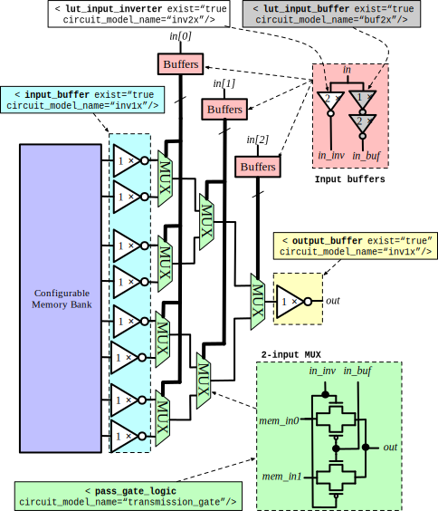

   An example of a single-output 3-input LUT.

The code describing this LUT is:

.. code-block:: xml

  <circuit_model type="lut" name="lut3" prefix="lut3">
    <input_buffer exist="on" circuit_model="inv1x"/>
    <output_buffer exist="on" circuit_model_name="inv1x"/>
    <lut_input_buffer exist="on" circuit_model_name="buf2"/>
    <lut_input_inverter exist="on" circuit_model_name="inv1x"/>
    <pass_gate_logic circuit_model_name="tgate"/>
    <port type="input" prefix="in" size="3"/>
    <port type="output" prefix="out" size="1"/>
    <port type="sram" prefix="sram" size="8"/>
  </circuit_model>

This example shows:
  - A 3-input LUT which is configurable by 8 SRAM cells.
  - The multiplexer inside LUT will be built with transmission gate using circuit model ``inv1x``
  - There are no internal buffered inserted to any intermediate stage of a LUT

.. _circuit_model_frac_lut_example:

Standard Fracturable LUT
`````````````````````````

:numref:`fig_frac_lut3_example` illustrates a typical example of 3-input fracturable LUT modeling, which consists of input/output buffers and a transmission-gate-based tree structure.

.. _fig_frac_lut3_example:

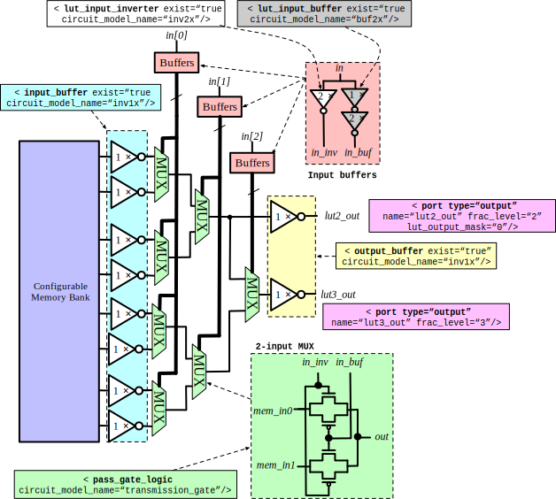

   An example of a fracturable 3-input LUT.

The code describing this LUT is:

.. code-block:: xml

  <circuit_model type="lut" name="frac_lut3" prefix="frac_lut3" dump_structural_verilog="true">
    <design_technology type="cmos" fracturable_lut="true"/>
    <input_buffer exist="true" circuit_model_name="inv1x"/>
    <output_buffer exist="true" circuit_model_name="inv1x"/>
    <lut_input_inverter exist="true" circuit_model_name="inv1x"/>
    <lut_input_buffer exist="true" circuit_model_name="buf4"/>
    <pass_gate_logic circuit_model_name="tgate"/>
    <port type="input" prefix="in" size="3" tri_state_map="--1" circuit_model_name="OR2"/>
    <port type="output" prefix="lut2_out" size="1" lut_frac_level="3" lut_output_mask="0"/>
    <port type="output" prefix="lut3_out" size="1" lut_output_mask="0"/>
    <port type="sram" prefix="sram" size="8"/>
    <port type="sram" prefix="mode" size="1" mode_select="true" circuit_model_name="ccff" default_val="0"/>
  </circuit_model>

This example shows:
  - Fracturable 3-input LUT which is configurable by 9 SRAM cells.
  - There is a SRAM cell to switch the operating mode of this LUT, configured by a configuration-chain flip-flop ``ccff``
  - The last input ``in[2]`` of LUT will be tri-stated in dual-LUT2 mode.
  - An 2-input OR gate will be wired to the last input ``in[2]`` to tri-state the input. The mode-select SRAM will be wired to an input of the OR gate. 
    It means that when the mode-selection bit is '0', the LUT will operate in dual-LUT3 mode.
  - There will be two outputs wired to the 2th stage of routing multiplexer (the outputs of dual 2-input LUTs) 
  - By default, the mode-selection configuration bit will be '0', indicating that by default the LUT will operate in dual-LUT2 mode.

:numref:`fig_std_frac_lut` illustrates the detailed schematic of a standard fracturable 6-input LUT, where the 5th and 6th inputs can be pull up/down to a fixed logic value to enable LUT4 and LUT5 outputs.

.. _fig_std_frac_lut:

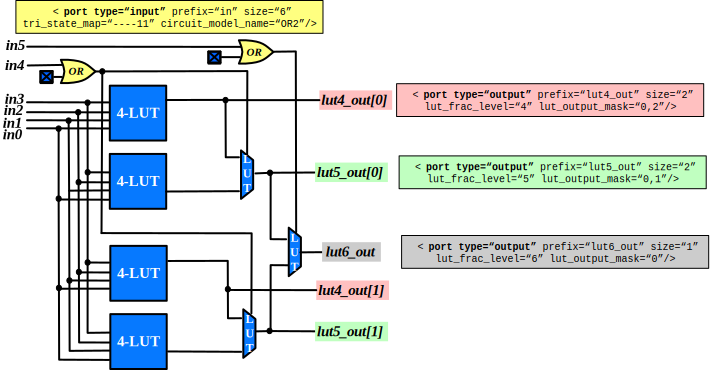

   Detailed schematic of a standard fracturable 6-input LUT.

The code describing this LUT is:

.. code-block:: xml

  <circuit_model type="lut" name="frac_lut6" prefix="frac_lut6" dump_structural_verilog="true">
    <design_technology type="cmos" fracturable_lut="true"/>
    <input_buffer exist="true" circuit_model_name="inv1x"/>
    <output_buffer exist="true" circuit_model_name="inv1x"/>
    <lut_input_inverter exist="true" circuit_model_name="inv1x"/>
    <lut_input_buffer exist="true" circuit_model_name="buf4"/>
    <pass_gate_logic circuit_model_name="tgate"/>
    <port type="input" prefix="in" size="6" tri_state_map="----11" circuit_model_name="OR2"/>
    <port type="output" prefix="lut4_out" size="2" lut_frac_level="4" lut_output_mask="0,2"/>
    <port type="output" prefix="lut5_out" size="2" lut_frac_level="5" lut_output_mask="0,1"/>
    <port type="output" prefix="lut6_out" size="1" lut_output_mask="0"/>
    <port type="sram" prefix="sram" size="64"/>
    <port type="sram" prefix="mode" size="2" mode_select="true" circuit_model_name="ccff" default_val="1"/>
  </circuit_model>

This example shows:
  - Fracturable 6-input LUT which is configurable by 66 SRAM cells.
  - There are two SRAM cells to switch the operating mode of this LUT, configured by two configuration-chain flip-flops ``ccff``
  - The inputs ``in[4]`` and ``in[5]`` of LUT will be tri-stated in dual-LUT4 and dual-LUT5 modes respectively.
  - An 2-input OR gate will be wired to the inputs ``in[4]`` and ``in[5]`` to tri-state them. The mode-select SRAM will be wired to an input of the OR gate. 
  - There will be two outputs wired to the 4th stage of routing multiplexer (the outputs of dual 4-input LUTs) 
  - There will be two outputs wired to the 5th stage of routing multiplexer (the outputs of dual 5-input LUTs) 
  - By default, the mode-selection configuration bit will be '11', indicating that by default the LUT will operate in dual-LUT4 mode.

Native Fracturable LUT
``````````````````````

:numref:`fig_native_frac_lut` illustrates the detailed schematic of a native fracturable 6-input LUT, where LUT4, LUT5 and LUT6 outputs are always active and there are no tri-state buffers.

.. _fig_native_frac_lut:

.. figure:: ./figures/native_frac_lut.svg
   :scale: 80%
   :alt: detailed lut composition

   Detailed schematic of a native fracturable 6-input LUT.

The code describing this LUT is:

.. code-block:: xml

  <circuit_model type="lut" name="frac_lut6" prefix="frac_lut6" dump_structural_verilog="true">
    <design_technology type="cmos" fracturable_lut="true"/>
    <input_buffer exist="true" circuit_model_name="inv1x"/>
    <output_buffer exist="true" circuit_model_name="inv1x"/>
    <lut_input_inverter exist="true" circuit_model_name="inv1x"/>
    <lut_input_buffer exist="true" circuit_model_name="buf4"/>
    <pass_gate_logic circuit_model_name="tgate"/>
    <port type="input" prefix="in" size="6"/>
    <port type="output" prefix="lut4_out" size="2" lut_frac_level="4" lut_output_mask="0,2"/>
    <port type="output" prefix="lut5_out" size="2" lut_frac_level="5" lut_output_mask="0,1"/>
    <port type="output" prefix="lut6_out" size="1" lut_output_mask="0"/>
    <port type="sram" prefix="sram" size="64"/>
  </circuit_model>

This example shows:
  - Fracturable 6-input LUT which is configurable by 64 SRAM cells.
  - There will be two outputs wired to the 4th stage of routing multiplexer (the outputs of dual 4-input LUTs) 
  - There will be two outputs wired to the 5th stage of routing multiplexer (the outputs of dual 5-input LUTs) 


.. _circuit_model_lut_harden_logic_example:

LUT with Harden Logic
`````````````````````
:numref:`fig_lut_arith` illustrates the detailed schematic of a fracturable 4-input LUT coupled with carry logic gates. For fracturable LUT schematic, please refer to :numref:`fig_std_frac_lut`.
This feature allows users to fully customize their LUT circuit implementation while being compatible with OpenFPGA's bitstream generator when mapping truth tables to the LUTs. 

.. warning:: OpenFPGA does **NOT** support netlist autogeneration for the LUT with harden logic. Users should build their own netlist and use ``verilog_netlist`` syntax of :ref:`circuit_library` to include it.

.. _fig_lut_arith:

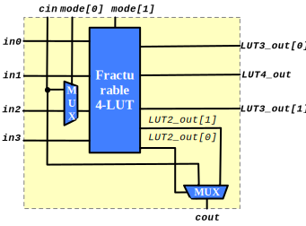

   Detailed schematic of a fracturable 4-input LUT with embedded carry logic.

The code describing this LUT is:

.. code-block:: xml

  <circuit_model type="lut" name="frac_lut4_arith" prefix="frac_lut4_arith" dump_structural_verilog="true" verilog_netlist="${OPENFPGA_PATH}/openfpga_flow/openfpga_cell_library/verilog/frac_lut4_arith.v">
    <design_technology type="cmos" fracturable_lut="true"/>
    <input_buffer exist="false"/>
    <output_buffer exist="true" circuit_model_name="sky130_fd_sc_hd__buf_2"/>
    <lut_input_inverter exist="true" circuit_model_name="sky130_fd_sc_hd__inv_1"/>
    <lut_input_buffer exist="true" circuit_model_name="sky130_fd_sc_hd__buf_2"/>
    <lut_intermediate_buffer exist="true" circuit_model_name="sky130_fd_sc_hd__buf_2" location_map="-1-"/>
    <pass_gate_logic circuit_model_name="sky130_fd_sc_hd__mux2_1"/>
    <port type="input" prefix="in" size="4" tri_state_map="---1" circuit_model_name="sky130_fd_sc_hd__or2_1"/>
    <port type="input" prefix="cin" size="1" is_harden_lut_port="true"/>
    <port type="output" prefix="lut3_out" size="2" lut_frac_level="3" lut_output_mask="0,1"/>
    <port type="output" prefix="lut4_out" size="1" lut_output_mask="0"/>
    <port type="output" prefix="cout" size="1" is_harden_lut_port="true"/>
    <port type="sram" prefix="sram" size="16"/>
    <port type="sram" prefix="mode" size="2" mode_select="true" circuit_model_name="DFFRQ" default_val="1"/>
  </circuit_model>

This example shows:
  - Fracturable 4-input LUT which is configurable by 16 SRAM cells.
  - There are two output wired to the 3th stage of routing multiplexer (the outputs of dual 3-input LUTs) 
  - There are two outputs wired to the 2th stage of routing multiplexer (the outputs of 2-input LUTs in the in the lower part of SRAM cells). Note that the two outputs drive the embedded carry logic 
  - There is a harden carry logic, i.e., a 2-input MUX, to implement high-performance carry function.
  - There is a mode-switch multiplexer at ``cin`` port, which is used to switch between arithemetic mode and regular LUT mode.

.. note:: If the embedded harden logic are driven partially by LUT outputs, users may use the :ref:`file_formats_bitstream_setting` to gaurantee correct bitstream generation for the LUTs.


Flip-Flops
~~~~~~~~~~

Template
````````

.. code-block:: xml

  <circuit_model type="ccff|ff" name="<string>" prefix="<string>" spice_netlist="<string>" verilog_netlist="<string>"/>
    <design_technology type="cmos"/>
    <input_buffer exist="<string>" circuit_model_name="<string>"/>
    <output_buffer exist="<string>" circuit_model_name="<string>"/>
    <port type="input" prefix="<string>" size="<int>"/>
    <port type="output" prefix="<string>" size="<int>"/>
    <port type="clock" prefix="<string>" size="<int>"/>
  </circuit_model>

.. note:: The circuit designs of flip-flops are highly dependent on the technology node and well optimized by engineers. Therefore, FPGA-Verilog/SPICE requires users to provide their customized FF Verilog/SPICE/Verilog netlists. A sample Verilog/SPICE netlist of FF can be found in the directory SpiceNetlists in the released package.
  
  The information of input and output buffer should be clearly specified according to the customized SPICE netlist! The existence of input/output buffers will influence the decision in creating SPICE testbenches, which may leads to larger errors in power analysis.

.. note:: FPGA-Verilog/SPICE currently support only one clock domain in the FPGA. Therefore there should be only one clock port to be defined and the size of the clock port should be 1.

.. option:: <circuit_model type="ccff|ff" name="<string>" prefix="<string>" spice_netlist="<string>" verilog_netlist="<string>"/>

  - ``type="ccff|ff"`` Specify the type of a flip-flop. ``ff`` is a regular flip-flop while ``ccff`` denotes a configuration-chain flip-flop

.. note:: A flip-flop should at least have three types of ports, ``input``, ``output`` and ``clock``.

.. note:: If the user provides a customized Verilog/SPICE netlist, the bandwidth of ports should be defined to the same as the Verilog/SPICE netlist.

.. note:: In a valid FPGA architecture, users should provide at least either a ``ccff`` or ``sram`` circuit model, so that the configurations can loaded to core logic. 

.. _circuit_model_dff_example:

D-type Flip-Flop
````````````````

:numref:`fig_ff` illustrates an example of regular flip-flop.

.. _fig_ff:

.. figure:: ./figures/FF.png
   :scale: 50%
   :alt: FF symbol

   An example of classical Flip-Flop.

The code describing this FF is:

.. code-block:: xml

  <circuit_model type="ff" name="dff" prefix="dff" verilog_netlist="ff.v" spice_netlist="ff.sp">
    <port type="input" prefix="D" lib_name="D" size="1"/>
    <port type="input" prefix="Set" lib_name="S" size="1" is_global="true"/>
    <port type="input" prefix="Reset" lib_name="R" size="1" is_global="true"/>
    <port type="output" prefix="Q" lib_name="Q" size="1"/>
    <port type="clock" prefix="clk" lib_name="CK" size="1" is_global="true"/>
  </circuit_model>

This example shows:
  - A regular flip-flop which is defined in a Verilog netlist ``ff.v`` and a SPICE netlist ``ff.sp``
  - The flip-flop has ``set`` and ``reset`` functionalities
  - The flip-flop port names defined differently in standard cell library and VPR architecture. The ``lib_name`` capture the port name defined in standard cells, while ``prefix`` capture the port name defined in ``pb_type`` of VPR architecture file

.. _circuit_model_ccff_example:

Regular Configuration-chain Flip-flop
`````````````````````````````````````

:numref:`fig_ccff_config_chain` illustrates an example of standard flip-flops used to build a configuration chain.

.. _fig_ccff_config_chain:

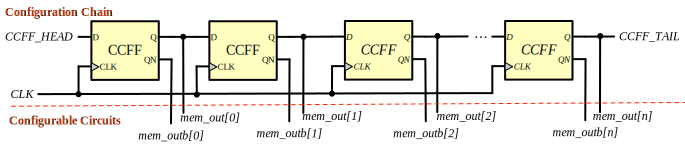

   An example of a Flip-Flop organized in a chain.

The code describing this FF is:

.. code-block:: xml

  <circuit_model type="ccff" name="ccff" prefix="ccff" verilog_netlist="ccff.v" spice_netlist="ccff.sp">
    <port type="input" prefix="D" size="1"/>
    <port type="output" prefix="Q" size="1"/>
    <port type="output" prefix="QN" size="1"/>
    <port type="clock" prefix="CK" size="1" is_global="true" is_prog="true" is_clock="true"/>
  </circuit_model>

This example shows:
  - A configuration-chain flip-flop which is defined in a Verilog netlist ``ccff.v`` and a SPICE netlist ``ccff.sp``
  - The flip-flop has a global clock port, ``CK``, which will be wired a global programming clock 

.. note::
  The output ports of the configuration flip-flop must follow a fixed sequence in definition:
    - The first output port **MUST** be the data output port, e.g., ``Q``.
    - The second output port **MUST** be the **inverted** data output port, e.g., ``QN``.

.. _circuit_model_ccff_enable_example:

Configuration-chain Flip-flop with Configure Enable Signals
```````````````````````````````````````````````````````````

Configuration chain could be built with flip-flops with outputs that are enabled by specific signals.
Consider the example in :numref:`fig_ccff_config_chain_config_enable`, the flip-flop has 

- a configure enable signal ``CFG_EN`` to release the data output ``Q`` and ``QN``
- a pair of data outputs ``Q`` and ``QN`` which are controlled by the configure enable signal ``CFG_EN``
- a regular data output ``SCAN_Q`` which outputs registered data

.. _fig_ccff_config_chain_config_enable:

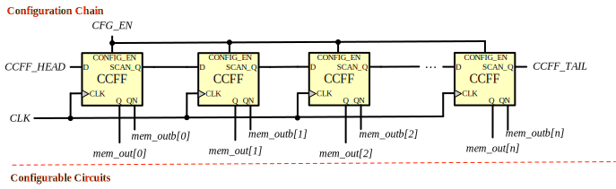

   An example of a Flip-Flop with config enable feature organized in a chain.

The code describing this FF is:

.. code-block:: xml

  <circuit_model type="ccff" name="ccff" prefix="ccff" verilog_netlist="ccff.v" spice_netlist="ccff.sp">
    <port type="input" prefix="CFG_EN" size="1" is_global="true" is_config_enable="true"/>
    <port type="input" prefix="D" size="1"/>
    <port type="output" prefix="SCAN_Q" size="1"/>
    <port type="output" prefix="QN" size="1"/>
    <port type="output" prefix="Q" size="1"/>
    <port type="clock" prefix="CK" size="1" is_global="true" is_prog="true" is_clock="true"/>
  </circuit_model>

.. note::
  The output ports of the configuration flip-flop must follow a fixed sequence in definition:
    - The first output port **MUST** be the regular data output port, e.g., ``SCAN_Q``.
    - The second output port **MUST** be the **inverted** data output port which is activated by the configure enable signal, e.g., ``QN``.
    - The second output port **MUST** be the data output port which is activated by the configure enable signal, e.g., ``Q``.


.. _circuit_model_ccff_scanable_example:

Configuration-chain Flip-flop with Scan Input
`````````````````````````````````````````````

Configuration chain could be built with flip-flops with a scan chain input .
Consider the example in :numref:`fig_ccff_config_chain_scan_capable`, the flip-flop has 

- an additional input ``SI`` to enable scan-chain capabaility
- a configure enable signal ``CFG_EN`` to release the data output ``Q`` and ``QN``
- a pair of data outputs ``Q`` and ``QN`` which are controlled by the configure enable signal ``CFG_EN``
- a regular data output ``SCAN_Q`` which outputs registered data

.. _fig_ccff_config_chain_scan_capable:

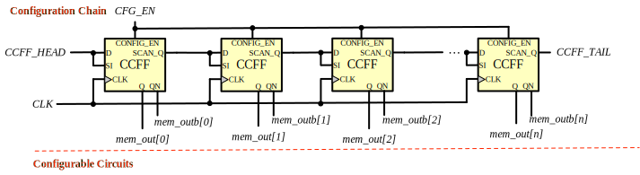

   An example of a Flip-Flop with scan input organized in a chain.

The code describing this FF is:

.. code-block:: xml

  <circuit_model type="ccff" name="ccff" prefix="ccff" verilog_netlist="ccff.v" spice_netlist="ccff.sp">
    <port type="input" prefix="CFG_EN" size="1" is_global="true" is_config_enable="true"/>
    <port type="input" prefix="D" size="1"/>
    <port type="input" prefix="SI" size="1"/>
    <port type="output" prefix="SCAN_Q" size="1"/>
    <port type="output" prefix="QN" size="1"/>
    <port type="output" prefix="Q" size="1"/>
    <port type="clock" prefix="CK" size="1" is_global="true" is_prog="true" is_clock="true"/>
  </circuit_model>

.. note::
  The input ports of the configuration flip-flop must follow a fixed sequence in definition:
    - The first input port **MUST** be the regular data input port, e.g., ``D``.
    - The second input port **MUST** be the scan input port, e.g., ``SI``.

Hard Logics
~~~~~~~~~~~

Template
````````

.. code-block:: xml

  <circuit_model type="hardlogic" name="<string>" prefix="<string>" verilog_netlist="<string>" spice_netlist="<string>"/>
    <design_technology type="cmos"/>
    <input_buffer exist="<string>" circuit_model_name="<string>"/>
    <output_buffer exist="<string>" circuit_model_name="<string>"/>
    <port type="input" prefix="<string>" size="<int>"/>
    <port type="output" prefix="<string>" size="<int>"/>
  </circuit_model>

.. note:: Hard logics are defined for non-configurable resources in FPGA architectures, such as adders, multipliers and RAM blocks.
  Their circuit designs are highly dependent on the technology node and well optimized by engineers.
  As more functional units are included in FPGA architecture, it is impossible to auto-generate these functional units.
  Therefore, FPGA-Verilog/SPICE requires users to provide their customized Verilog/SPICE netlists.

.. note:: Examples can be found in hard_logic_example_link_

.. _hard_logic_example_link: https://github.com/LNIS-Projects/OpenFPGA/tree/master/openfpga_flow/VerilogNetlists

.. note::  The information of input and output buffer should be clearly specified according to the customized Verilog/SPICE netlist! The existence of input/output buffers will influence the decision in creating SPICE testbenches, which may leads to larger errors in power analysis.

.. _circuit_model_full_adder_example:

Full Adder
``````````

.. code-block:: xml

  <circuit_model type="hard_logic" name="adder" prefix="adder" spice_netlist="adder.sp" verilog_netlist="adder.v">
    <design_technology type="cmos"/>
    <input_buffer exist="true" circuit_model_name="inv1x"/>
    <output_buffer exist="true" circuit_model_name="inv1x"/>
    <port type="input" prefix="a" size="1"/>
    <port type="input" prefix="b" size="1"/>
    <port type="input" prefix="cin" size="1"/>
    <port type="output" prefix="cout" size="1"/>
    <port type="output" prefix="sumout" size="1"/>
  </circuit_model>

Routing Wire Segments
~~~~~~~~~~~~~~~~~~~~~

FPGA architecture requires two type of  wire segments:

  - ``wire``, which targets the local wires inside the logic blocks. The wire has one input and one output, directly connecting the output of a driver and the input of the downstream unit, respectively
  - ``chan_wire``, especially targeting the channel wires. The channel wires have one input and two outputs, one of which is connected to the inputs of Connection Boxes while the other is connected to the inputs of Switch Boxes. Two outputs are created because from the view of layout, the inputs of Connection Boxes are typically connected to the middle point of channel wires, which has less parasitic resistances and capacitances than connected to the ending point.

Template
````````

.. code-block:: xml

  <circuit_model type="wire|cham_wire" name="<string>" prefix="<string>" spice_netlist="<string>" verilog_netlist="<string>"/>
    <design_technology type="cmos"/>
    <input_buffer exist="<string>" circuit_model_name="<string>"/>
    <output_buffer exist="<string>" circuit_model_name="<string>"/>
    <port type="input" prefix="<string>" size="<int>"/>
    <port type="output" prefix="<string>" size="<int>"/>
    <wire_param model_type="<string>" R="<float>" C="<float>" num_level="<int>"/>
  </circuit_model>

.. note:: FPGA-Verilog/SPICE can auto-generate the Verilog/SPICE model for wires while also allows users to provide their customized Verilog/SPICE netlists.

.. note:: The information of input and output buffer should be clearly specified according to the customized netlist! The existence of input/output buffers will influence the decision in creating testbenches, which may leads to larger errors in power analysis.

.. option:: <wire_param model_type="<string>" R="<float>" C="<float>" num_level="<int>"/>

  - ``model_type="pi|T"`` Specify the type of RC models for this wire segement. Currently, OpenFPGA supports the :math:`\pi`-type and T-type multi-level RC models.
  - ``R="<float>"`` Specify the total resistance of the wire
  - ``C="<float>"`` Specify the total capacitance of the wire.
  - ``num_level="<int>"`` Specify the number of levels of the RC wire model.

.. note:: wire parameters are essential for FPGA-SPICE to accurately model wire parasitics

Routing Track Wire Example
``````````````````````````

:numref:`fig_wire` depicts the modeling for a length-2 channel wire.

.. _fig_wire:

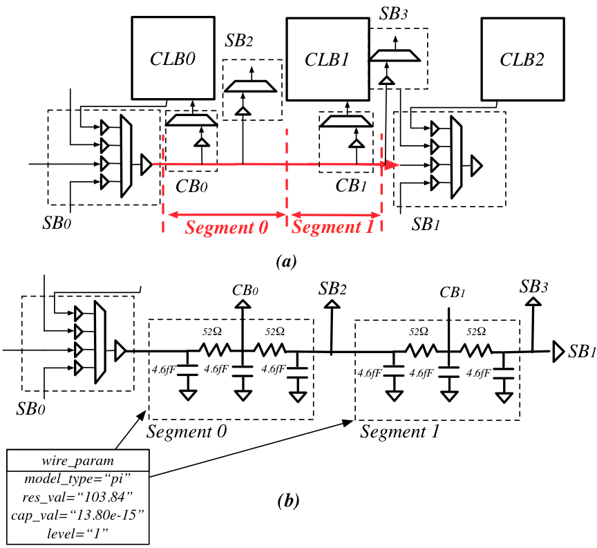

   An example of a length-2 channel wire modeling

The code describing this wire is:

.. code-block:: xml

  <circuit_model type="chan_wire" name="segment0" prefix="chan_wire"/>
    <design_technology type="cmos"/>
    <port type="input" prefix="mux_out" size="1"/>
    <port type="output" prefix="cb_sb" size="1"/>
    <wire_param model_type="pi" res_val="103.84" cap_val="13.80e-15" level="1"/>
  </circuit_model>

This example shows
  - A routing track wire has 1 input and output 
  - The routing wire will be modelled as a 1-level :math:`\pi`-type RC wire model with a total resistance of :math:`103.84\Omega` and a total capacitance of :math:`13.89fF`

I/O pads
~~~~~~~~

Template
````````

.. code-block:: xml

  <circuit_model type="iopad" name="<string>" prefix="<string>" spice_netlist="<string>" verilog_netlist="<string>"/>
    <design_technology type="cmos"/>
    <input_buffer exist="<string>" circuit_model_name="<string>"/>
    <output_buffer exist="<string>" circuit_model_name="<string>"/>
    <port type="input" prefix="<string>" size="<int>"/>
    <port type="output" prefix="<string>" size="<int>"/>
    <port type="sram" prefix="<string>" size="<int>" mode_select="<bool>" circuit_model_name="<string>" default_val="<int>"/>
  </circuit_model>

.. note::  The circuit designs of I/O pads are highly dependent on the technology node and well optimized by engineers.
  Therefore, FPGA-Verilog/SPICE requires users to provide their customized Verilog/SPICE/Verilog netlists. A sample Verilog/SPICE netlist of an I/O pad can be found in the directory SpiceNetlists in the released package.

.. note:: The information of input and output buffer should be clearly specified according to the customized netlist! The existence of input/output buffers will influence the decision in creating testbenches, which may leads to larger errors in power analysis.

.. _circuit_model_gpio_example:

General Purpose I/O
```````````````````

:numref:`fig_iopad` depicts a general purpose I/O pad.

.. _fig_iopad:

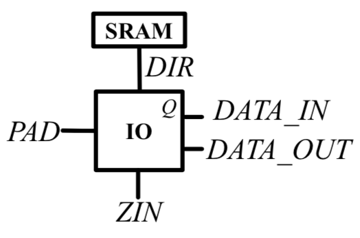

   An example of an IO-Pad

The code describing this I/O-Pad is:

.. code-block:: xml

  <circuit_model type="iopad" name="iopad" prefix="iopad" spice_netlist="io.sp" verilog_netlist="io.v">
    <design_technology type="cmos"/>
    <input_buffer exist="true" circuit_model_name="INVTX1"/>
    <output_buffer exist="true" circuit_model_name="INVTX1"/>
    <pass_gate_logic circuit_model_name="TGATE"/>
    <port type="inout" prefix="pad" size="1" is_global="true" is_io="true" is_data_io="true"/>
    <port type="sram" prefix="en" size="1" mode_select="true" circuit_model_name="ccff" default_val="1"/>
    <port type="input" prefix="outpad" size="1"/>
    <port type="output" prefix="inpad" size="1"/>
  </circuit_model>

This example shows
  - A general purpose I/O cell defined in Verilog netlist ``io.sp`` and SPICE netlist ``io.sp`` 
  - The I/O cell has an ``inout`` port as the bi-directional port
  - The directionality of I/O can be controlled by a configuration-chain flip-flop defined in circuit model ``ccff``
  - If unused, the I/O cell will be configured to ``1``
