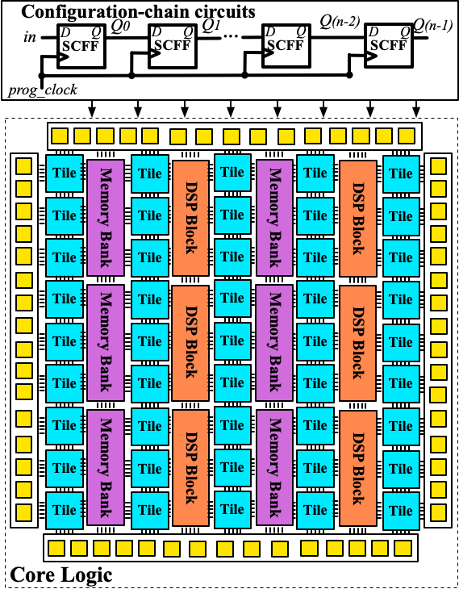
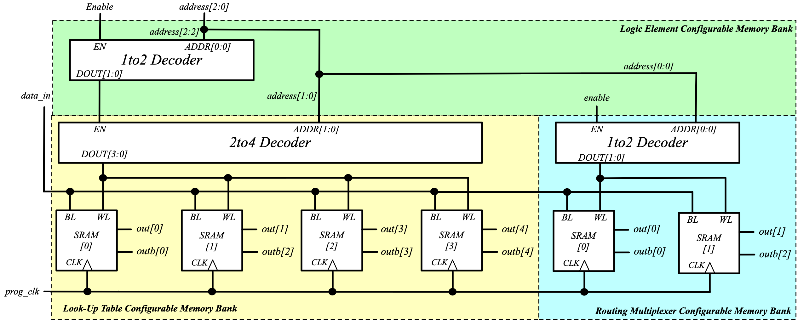
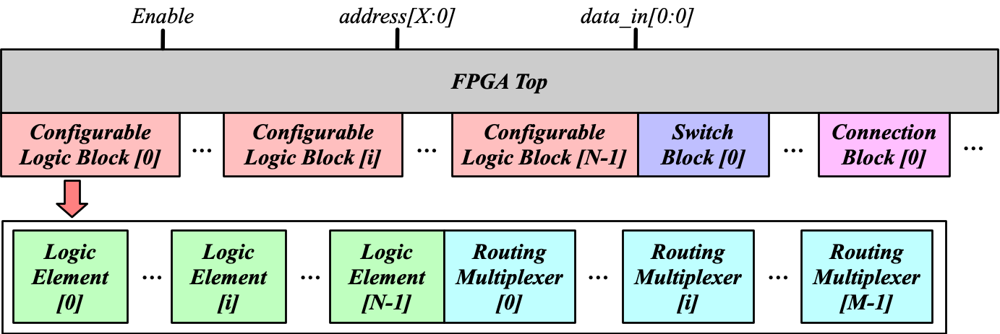
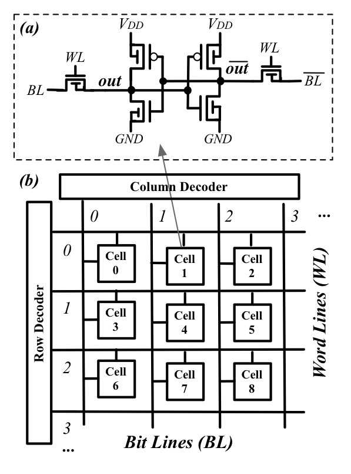
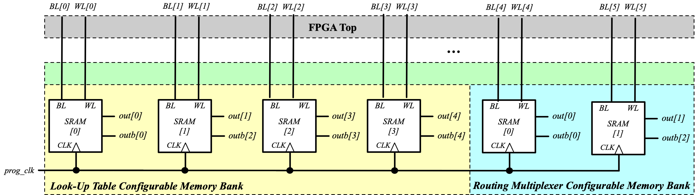

.. _config_protocol:

Configuration Protocol
----------------------

Configuration protocol is the circuitry designed to program an FPGA.
As an interface, configuration protocol could be really different in FPGAs, depending on the application context.
OpenFPGA supports versatile configuration protocol, providing different trade-offs between speed and area. 

Template
~~~~~~~~

.. code-block:: xml

  <configuration_protocol>
    <organization type="<string>" circuit_model_name="<string>"/>
  </configuration_protocol>

.. option:: type="scan_chain|memory_bank|standalone"

  Specify the type of configuration circuits.

  OpenFPGA supports different types of configuration protocols to program FPGA fabrics:
    - ``scan_chain``: configurable memories are connected in a chain. Bitstream is loaded serially to program a FPGA
    - ``frame_based``: configurable memories are organized by frames. Each module of a FPGA fabric, e.g., Configurable Logic Block (CLB), Switch Block (SB) and Connection Block (CB), is considered as a frame of configurable memories. Inside each frame, all the memory banks are accessed through an address decoder. Users can write each memory cell with a specific address. Note that the frame-based memory organization is applid hierarchically. Each frame may consists of a number of sub frames, each of which follows the similar organization.
    - ``memory_bank``: configurable memories are organized in an array, where each element can be accessed by an unique address to the BL/WL decoders
    - ``standalone``: configurable memories are directly accessed through ports of FPGA fabrics. In other words, there are no protocol to control the memories. This allows full customization on the configuration protocol for hardware engineers.

  .. note:: Avoid to use ``standalone`` when designing an FPGA chip. It will causes a huge number of I/Os required, far beyond any package size. It is well applicable to eFPGAs, where designers do need customized protocols between FPGA and processors. 

.. warning:: Currently FPGA-SPICE only supports standalone memory organization.

.. warning:: Currently RRAM-based FPGA only supports memory-bank organization for Verilog Generator.

.. option:: circuit_model_name="<string>"

  Specify the name of circuit model to be used as configurable memory.

  - ``scan_chain`` requires a circuit model type of ``ccff``
  - ``frame_based`` requires a circuit model type of ``sram``
  - ``memory_bank`` requires a circuit model type of ``sram``
  - ``standalone`` requires a circuit model type of ``sram``

Configuration Chain Example
~~~~~~~~~~~~~~~~~~~~~~~~~~~
The following XML code describes a scan-chain circuitry to configure the core logic of FPGA, as illustrated in :numref:`fig_ccff_fpga`.
It will use the circuit model defined in :numref:`fig_ccff`.

.. code-block:: xml

  <configuration_protocol>
    <organization type="scan_chain" circuit_model_name="ccff"/>
  </configuration_protocol>

.. _fig_ccff_fpga:

 
   Example of a configuration chain to program core logic of a FPGA 

Frame-based Example
~~~~~~~~~~~~~~~~~~~
The following XML code describes frame-based memory banks to configure the core logic of FPGA.
It will use the circuit model defined in :numref:`fig_config_latch`.

.. code-block:: xml

  <configuration_protocol>
    <organization type="frame_based" circuit_model_name="config_latch"/>
  </configuration_protocol>

Through frame-based configuration protocol, each memory cell can be accessed with an unique address given to decoders.
:numref:`fig_frame_config_protocol_example` illustrates an example about how the configurable memories are organizaed inside a Logic Element (LE) shown in :numref:`fig_k4n4_arch`.
The decoder inside the LE will enable the decoders of the Look-Up Table (LUT) and the routing multiplexer, based on the given address at ``address[2:2]``.
When the decoder of sub block, e.g., the LUT, is enabled, each memory cells can be accessed throught the ``address[1:0]`` and the data to write is provided at ``data_in``.

.. _fig_frame_config_protocol_example:

 
   Example of a frame-based memory organization inside a Logic Element

:numref:`fig_frame_config_protocol` shows a hierarchical view on how the frame-based decoders across a FPGA fabric. 

.. _fig_frame_config_protocol:

 
   Frame-based memory organization in a hierarchical view

.. note:: Frame-based decoders does require a memory cell to have 

  -  two outputs (one regular and another inverted)
  -  a Bit-Line input to load the data
  -  a Word-Line input to enable data write 

Memory bank Example
~~~~~~~~~~~~~~~~~~~
The following XML code describes a memory-bank circuitry to configure the core logic of FPGA, as illustrated in :numref:`fig_sram`.
It will use the circuit model defined in :numref:`fig_sram_blwl`.

.. code-block:: xml

  <configuration_protocol>
    <organization type="memory_bank" circuit_model_name="sram_blwl"/>
  </configuration_protocol>

.. _fig_sram:

 
   Example of a memory organization using memory decoders 

.. warning:: THIS IS STILL UNDER CONSTRUCTION

Standalone SRAM Example
~~~~~~~~~~~~~~~~~~~~~~~
In the standalone configuration protocol, every memory cell of the core logic of a FPGA fabric can be directly accessed at the top-level module, as illustrated in :numref:`fig_vanilla_config_protocol`.

.. _fig_vanilla_config_protocol:

 
   Vanilla (standalone) memory organization in a hierarchical view

The following XML code shows an example where we use the circuit model defined in :numref:`fig_sram_blwl`.

.. code-block:: xml

  <configuration_protocol>
    <organization type="standalone" circuit_model_name="sram_blwl"/>
  </configuration_protocol>

.. note:: The standalone protocol does require a memory cell to have 

  -  two outputs (one regular and another inverted)
  -  a Bit-Line input to load the data
  -  a Word-Line input to enable data write 

.. warning:: This is a vanilla configuration method, which allow users to build their own configuration protocol on top of it. 

