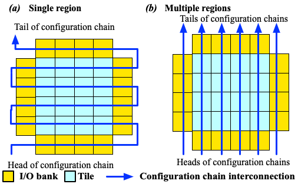
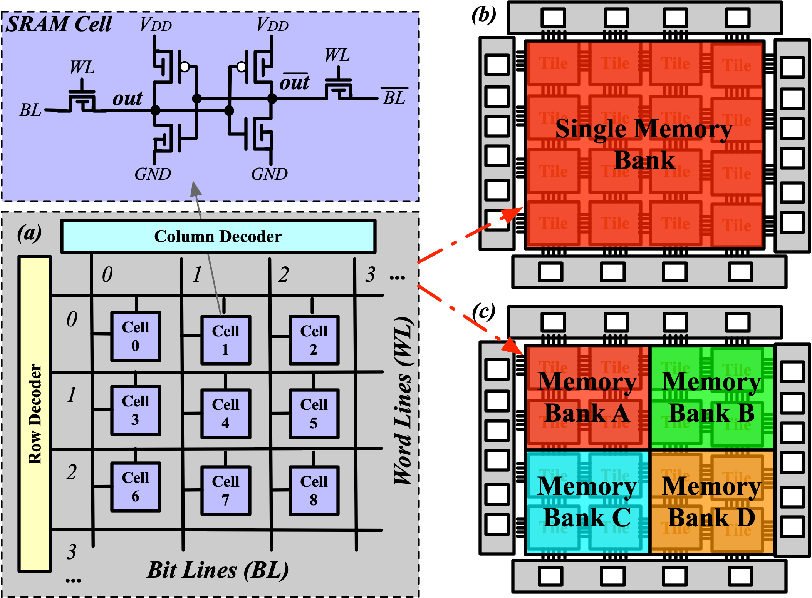
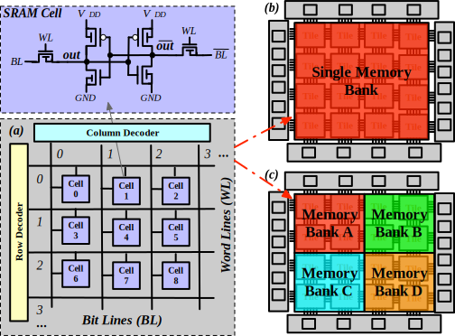
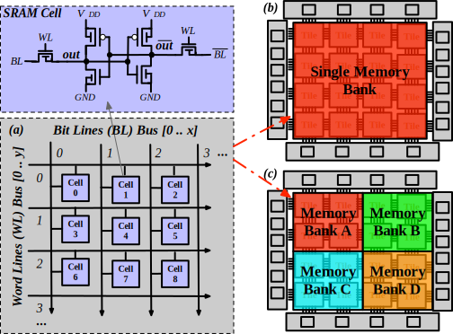
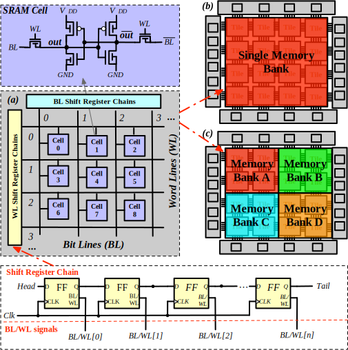

.. _config_protocol:

Configuration Protocol
----------------------

Configuration protocol is the circuitry designed to program an FPGA.
As an interface, configuration protocol could be really different in FPGAs, depending on the application context.
OpenFPGA supports versatile configuration protocol, providing different trade-offs between speed and area. 

Under configuration protocol, if the configuration is QL Memory Bank with flatten BL/WL protocol, there might be 
optional configuration setting call <ql_memory_bank_config_setting>.
In QL Memory Bank configuration protocol, configuration bits are organized as BitLine (BL) x WordLine (WL)
By default, OpenFPGA will keep BL and WL in square shape if possible where BL might be one bit longer than WL in some cases
  For example: 
    - If the configuration bits of a PB is 9 bits, then BL=3 and WL=3
    - If the configuration bits of a PB is 11 bits, then BL=4 and WL=3 (where there is one extra bit as phantom bit)
    - If the configuration bits of a PB is 14 bits, then BL=4 and WL=4 (where there is two extra bits as phantom bits)
    
This QL Memory Bank configuration setting allow OpenFPGA to use a fixed WL size, instead of default approach

Template
~~~~~~~~

.. code-block:: xml

  <configuration_protocol>
    <organization type="<string>" circuit_model_name="<string>" num_regions="<int>"/>
    <ql_memory_bank_config_setting>
      <pb_type name="<string>" num_wl="<int>"/>
    </ql_memory_bank_config_setting>
  </configuration_protocol>

.. option:: type="scan_chain|memory_bank|standalone|frame_based|ql_memory_bank"

  Specify the type of configuration circuits.

  OpenFPGA supports different types of configuration protocols to program FPGA fabrics:
    - ``scan_chain``: configurable memories are connected in a chain. Bitstream is loaded serially to program a FPGA
    - ``frame_based``: configurable memories are organized by frames. Each module of a FPGA fabric, e.g., Configurable Logic Block (CLB), Switch Block (SB) and Connection Block (CB), is considered as a frame of configurable memories. Inside each frame, all the memory banks are accessed through an address decoder. Users can write each memory cell with a specific address. Note that the frame-based memory organization is applid hierarchically. Each frame may consists of a number of sub frames, each of which follows the similar organization.
    - ``memory_bank``: configurable memories are organized in an array, where each element can be accessed by an unique address to the BL/WL decoders
    - ``ql_memory_bank``: configurable memories are organized in an array, where each element can be accessed by an unique address to the BL/WL decoders. This is a physical design friendly memory bank organization, where BL/WLs are efficiently shared by programmable blocks per column and row
    - ``standalone``: configurable memories are directly accessed through ports of FPGA fabrics. In other words, there are no protocol to control the memories. This allows full customization on the configuration protocol for hardware engineers.

  .. note:: Avoid to use ``standalone`` when designing an FPGA chip. It will causes a huge number of I/Os required, far beyond any package size. It is well applicable to eFPGAs, where designers do need customized protocols between FPGA and processors. 

.. warning:: Currently FPGA-SPICE only supports standalone memory organization.

.. warning:: Currently RRAM-based FPGA only supports memory-bank organization for Verilog Generator.

.. option:: circuit_model_name="<string>"

  Specify the name of circuit model to be used as configurable memory.

  - ``scan_chain`` requires a circuit model type of ``ccff``
  - ``frame_based`` requires a circuit model type of ``sram``
  - ``memory_bank`` requires a circuit model type of ``sram``
  - ``ql_memory_bank`` requires a circuit model type of ``sram``
  - ``standalone`` requires a circuit model type of ``sram``

.. option:: num_regions="<int>"

  Specify the number of configuration regions to be used across the fabrics. By default, it will be only 1 configuration region. Each configuration region contains independent configuration protocols, but the whole fabric should employ the same type of configuration protocols. For example, an FPGA fabric consists of 4 configuration regions, each of which includes a configuration chain. The more configuration chain to be used, the fast configuration runtime will be, but at the cost of more I/Os in the FPGA fabrics. The organization of each configurable region can be customized through the fabric key (see details in :ref:`fabric_key`).

  .. warning:: Currently, multiple configuration regions is not applicable to 

    - ``standalone`` configuration protocol.
    - ``ql_memory_bank`` configuration protocol when BL/WL protocol ``flatten`` is selected

  .. note:: For ``ql_memory_bank`` configuration protocol when BL/WL protocol ``shift_register`` is selected, different configuration regions **cannot** share any WLs on the same row! In such case, the default fabric key may not work. Strongly recommend to craft your own fabric key based on your configuration region plannning!

.. option:: name="<string>" 

  Specify the name of PB type, for example: clb, dsp, bram and etc

.. option:: num_wl="<int>"

  Fix the size of WL
  
  For example: 
    Considered that the configuration bits of a PB is 400 bits.
    
    If num_wl is not defined, then 
     - BL will be 20 [=ceiling(square_root(400))]
     - WL will be 20 [=ceiling(400/20)]
    
    If num_wl is defined as 10, then 
     - WL will be fixed as 10
     - BL will be 40 [=ceiling(400/10)]

    If num_wl is defined as 32, then 
     - WL will be fixed as 32
     - BL will be 13 [=ceiling(400/32)]
     - There will be 16 bits [=(32x13)-400] as phantom bits. 

Configuration Chain Example
~~~~~~~~~~~~~~~~~~~~~~~~~~~
The following XML code describes a scan-chain circuitry to configure the core logic of FPGA, as illustrated in :numref:`fig_ccff_fpga`.
It will use the circuit model defined in :numref:`fig_ccff_config_chain`.

.. code-block:: xml

  <configuration_protocol>
    <organization type="scan_chain" circuit_model_name="ccff" num_regions="<int>">
      <programming_clock port="<string>" ccff_head_indices="<string>"/>
    </organization>
  </configuration_protocol>

.. _fig_ccff_fpga:

.. figure:: figures/ccff_fpga.png
   :width: 100%
   :alt: map to buried treasure
 
   Example of a configuration chain to program core logic of a FPGA 

.. _fig_multi_region_config_chains:

 
   Examples of single- and multiple- region configuration chains

Note that for each configuration chain, its programming clock can be separated or grouped by using the syntax ``programming_clock``.

.. note:: Only applicable to multi-head configuration chains (number of regions is greater than 1). If not specified, all the chains share the same clock.

.. option:: port="<string>"

  Define the port name of a programming clock. This should be a valid global clock port defined in the circuit models whose type is ``ccff``. See details in :ref:`circuit_model_ccff_example`. 

.. option:: ccff_head_indices="<string>"

  Define the indices of the configuration chains which will be controlled by the programming clock defined using XML syntax ``port``. The indices should consist of valid indices  within the range of number of regions.

In the following example, a 6-head configuration protocol (corresponding to :numref:`fig_multi_region_config_chains`) is defined where the first three chains share a common clock ``CK[0]``, where the forth chain is driven by an individual clock ``CK[1]`` and the other two chains are driven by a common clock ``CK[2]``.

.. code-block:: xml

  <circuit_model type="ccff" name="ccff" prefix="ccff" verilog_netlist="ccff.v" spice_netlist="ccff.sp">
    <port type="input" prefix="D" size="1"/>
    <port type="output" prefix="Q" size="1"/>
    <port type="output" prefix="QN" size="1"/>
    <port type="clock" prefix="CK" size="1" is_global="true" is_prog="true" is_clock="true"/>
  </circuit_model>
  <configuration_protocol>
    <organization type="scan_chain" circuit_model_name="ccff" num_regions="6">
      <programming_clock port="CK[0]" ccff_head_indices="0,1,2"/>
      <programming_clock port="CK[1]" ccff_head_indices="3"/>
      <programming_clock port="CK[2]" ccff_head_indices="4,5"/>
    </organization>
  </configuration_protocol>

Frame-based Example
~~~~~~~~~~~~~~~~~~~
The following XML code describes frame-based memory banks to configure the core logic of FPGA.
It will use the circuit model defined in :numref:`fig_config_latch`.

.. code-block:: xml

  <configuration_protocol>
    <organization type="frame_based" circuit_model_name="config_latch"/>
  </configuration_protocol>

Through frame-based configuration protocol, each memory cell can be accessed with an unique address given to decoders.
:numref:`fig_frame_config_protocol_example` illustrates an example about how the configurable memories are organizaed inside a Logic Element (LE) shown in :numref:`fig_k4n4_arch`.
The decoder inside the LE will enable the decoders of the Look-Up Table (LUT) and the routing multiplexer, based on the given address at ``address[2:2]``.
When the decoder of sub block, e.g., the LUT, is enabled, each memory cells can be accessed throught the ``address[1:0]`` and the data to write is provided at ``data_in``.

.. _fig_frame_config_protocol_example:

.. figure:: figures/frame_config_protocol_example.png
   :width: 100%
   :alt: map to buried treasure
 
   Example of a frame-based memory organization inside a Logic Element

:numref:`fig_frame_config_protocol` shows a hierarchical view on how the frame-based decoders across a FPGA fabric. 

.. _fig_frame_config_protocol:

.. figure:: figures/frame_config_protocol.png
   :width: 100%
   :alt: map to buried treasure
 
   Frame-based memory organization in a hierarchical view

.. note:: Frame-based decoders does require a memory cell to have 

  -  two outputs (one regular and another inverted)
  -  a Bit-Line input to load the data
  -  a Word-Line input to enable data write 

.. warning:: Please do NOT add inverted Bit-Line and Word-Line inputs. It is not supported yet!

When multiple configuration region is applied, the configuration frames will be grouped into different configuration regions. Each region has a separated data input bus and dedicated address decoders. As such, the configuration frame groups can be programmed in parallel.

Memory bank Example
~~~~~~~~~~~~~~~~~~~
The following XML code describes a memory-bank circuitry to configure the core logic of FPGA, as illustrated in :numref:`fig_memory_bank`.
It will use the circuit model defined in :numref:`fig_sram_blwl`.
Users can customized the number of memory banks to be used across the fabrics. By default, it will be only 1 memory bank. :numref:`fig_memory_bank` shows an example where 4 memory banks are defined. The more memory bank to be used, the fast configuration runtime will be, but at the cost of more I/Os in the FPGA fabrics. The organization of each configurable region can be customized through the fabric key (see details in :ref:`fabric_key`).

.. code-block:: xml

  <configuration_protocol>
    <organization type="memory_bank" circuit_model_name="sram_blwl"/>
  </configuration_protocol>

.. _fig_memory_bank:

 
   Example of (a) a memory organization using memory decoders; (b) single memory bank across the fabric; and (c) multiple memory banks across the fabric.

.. note:: Memory-bank decoders does require a memory cell to have 

  -  two outputs (one regular and another inverted)
  -  a Bit-Line input to load the data
  -  a Word-Line input to enable data write 

.. warning:: Please do NOT add inverted Bit-Line and Word-Line inputs. It is not supported yet!

QuickLogic Memory bank Example
~~~~~~~~~~~~~~~~~~~~~~~~~~~~~~
The following XML code describes a physical design friendly memory-bank circuitry to configure the core logic of FPGA, as illustrated in :numref:`fig_memory_bank`.
It will use the circuit model defined in :numref:`fig_sram_blwl`.

The BL and WL protocols can be customized through the XML syntax ``bl`` and ``wl``.

.. note:: If not specified, the BL/WL protocols will use decoders.

.. code-block:: xml

  <configuration_protocol>
    <organization type="ql_memory_bank" circuit_model_name="sram_blwl">
      <bl protocol="<string>" num_banks="<int>"/>
      <wl protocol="<string>" num_banks="<int>"/>
    </organization>
  </configuration_protocol>

.. option:: protocol="decoder|flatten|shift_register"

  - ``decoder``: BLs or WLs are controlled by decoders with address lines. For BLs, the decoder includes an enable signal as well as a data input signal. This is the default option if not specified. See an illustrative example in :numref:`fig_memory_bank_decoder_based`. 
  - ``flatten``: BLs or WLs are directly available at the FPGA fabric. In this way, all the configurable memorys on the same WL can be written through the BL signals in one clock cycle. See an illustrative example in :numref:`fig_memory_bank_flatten`. 
  - ``shift_register``: BLs or WLs are controlled by shift register chains. The BL/WLs are programming each time the shift register chains are fully loaded. See an illustrative example in :numref:`fig_memory_bank_shift_register`. 

.. _fig_memory_bank_decoder_based:

 
   Example of (a) a memory organization using address decoders; (b) single memory bank across the fabric; and (c) multiple memory banks across the fabric.

.. _fig_memory_bank_flatten:

 
   Example of (a) a memory organization with direct access to BL/WL signals; (b) single memory bank across the fabric; and (c) multiple memory banks across the fabric.

.. _fig_memory_bank_shift_register:

 
   Example of (a) a memory organization using shift register chains to control BL/WLs; (b) single memory bank across the fabric; and (c) multiple memory banks across the fabric.

.. option:: num_banks="<int>"

  Specify the number of shift register banks (i.e., independent shift register chains) to be used in each configuration region. When enabled, the length of each shift register chain will be sized by OpenFPGA automatically based on the number of BL/WLs in each configuration region. OpenFPGA will try to create similar sizes for the shift register chains, in order to minimize the number of HDL modules. If not specified, the default number of banks will be ``1``.

   
  .. note:: This is available applicable to shift-register-based BL/WL protocols

  .. note:: More customization on the shift register chains can be enabled through :ref:`fabric_key`

.. note:: The flip-flop for WL shift register requires an enable signal to gate WL signals when loading WL shift registers

.. note:: Memory-bank decoders does require a memory cell to have 

  -  two outputs (one regular and another inverted)
  -  a Bit-Line input to load the data
  -  a Word-Line input to enable data write 
  -  (optional) a Word-Line read input to enabe data readback

.. warning:: Please do NOT add inverted Bit-Line and Word-Line inputs. It is not supported yet!

Standalone SRAM Example
~~~~~~~~~~~~~~~~~~~~~~~
In the standalone configuration protocol, every memory cell of the core logic of a FPGA fabric can be directly accessed at the top-level module, as illustrated in :numref:`fig_vanilla_config_protocol`.

.. _fig_vanilla_config_protocol:

.. figure:: figures/vanilla_config_protocol.png
   :width: 100%
   :alt: map to buried treasure
 
   Vanilla (standalone) memory organization in a hierarchical view

The following XML code shows an example where we use the circuit model defined in :numref:`fig_sram_blwl`.

.. code-block:: xml

  <configuration_protocol>
    <organization type="standalone" circuit_model_name="sram_blwl"/>
  </configuration_protocol>

.. note:: The standalone protocol does require a memory cell to have 

  -  two outputs (one regular and another inverted)
  -  a Bit-Line input to load the data
  -  a Word-Line input to enable data write 

.. warning:: Please do NOT add inverted Bit-Line and Word-Line inputs. It is not supported yet!

.. warning:: This is a vanilla configuration method, which allow users to build their own configuration protocol on top of it. 

