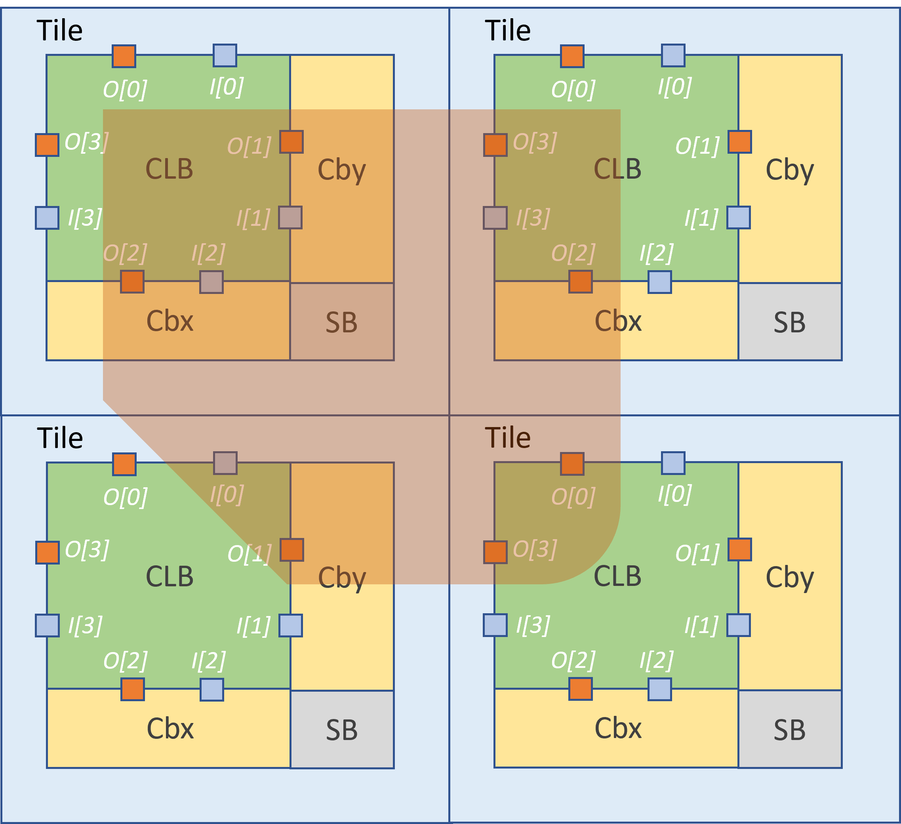
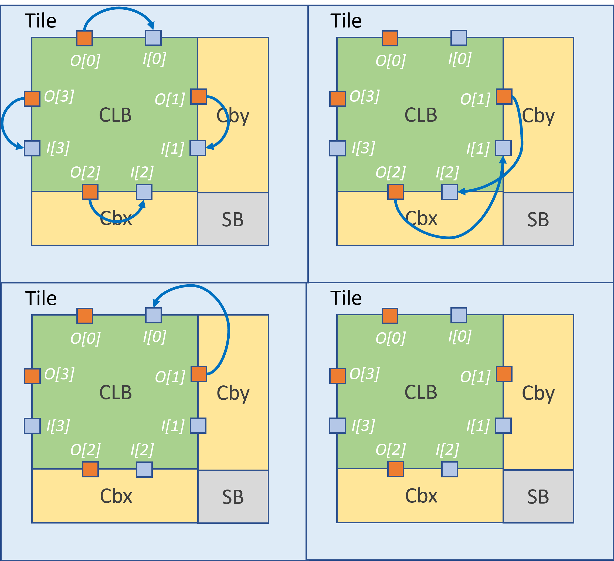
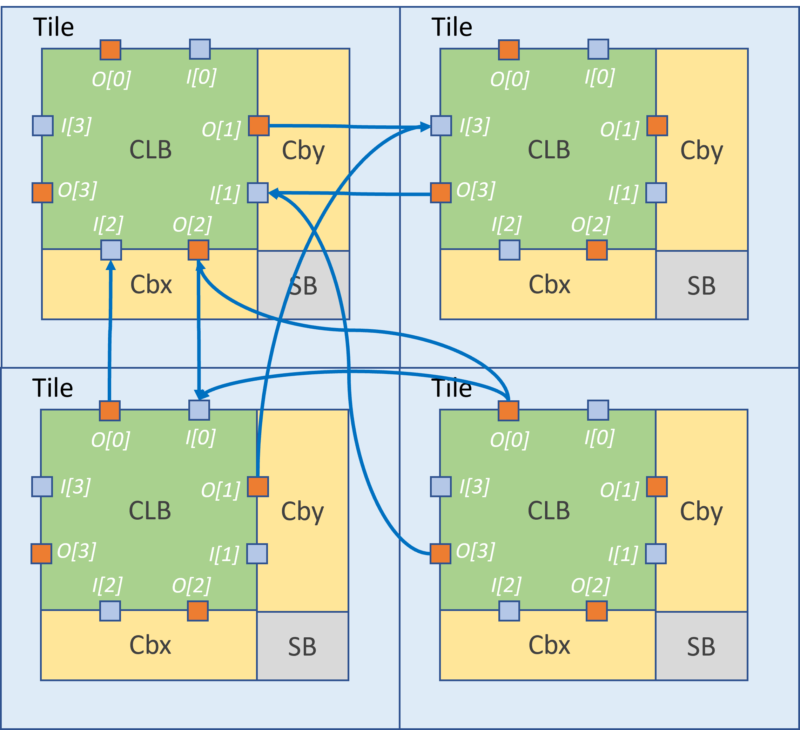
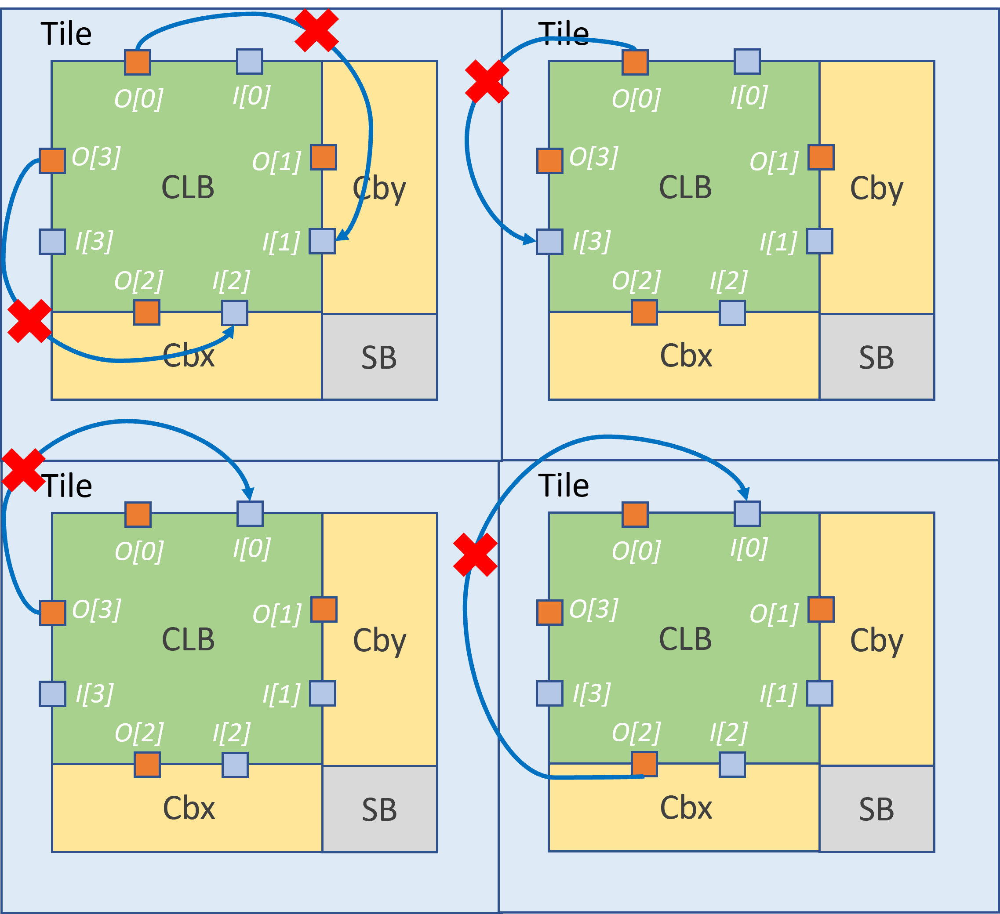

.. _direct_interconnect:

Direct Interconnect
-------------------

This section introduces extensions on the architecture description file about direct connections between programmable blocks.

Syntax
~~~~~~

The original direct connections in the directlist section are documented here_. Its description is given below:

.. _here: http://docs.verilogtorouting.org/en/latest/arch/reference/?highlight=directlist#direct-inter-block-connections

.. code-block:: xml

  <directlist>
    <direct name="string" from_pin="string" to_pin="string" x_offset="int" y_offset="int" z_offset="int" switch_name="string"/>
  </directlist>

.. note:: These options are required

In the OpenFPGA architecture file, you may define additional attributes for each VPR's direct connection:

.. code-block:: xml

  <direct_connection>
    <direct name="string" circuit_model_name="string" interconnection_type="string" x_dir="string" y_dir="string"/>
  </directlist>

.. note:: these options are optional. However, if ``interconnection_type`` is set to ``inter_column`` or ``inter_row``, then ``x_dir`` and ``y_dir`` are required.

.. option:: interconnection_type="<string>"

  Available types are ``inner_column_or_row`` | ``part_of_cb`` | ``inter_column`` | ``inter_row``

  - ``inner_column_or_row`` indicates the direct connections are between tiles in the same column or row. This is the default value.
  - ``part_of_cb`` indicates the direct connections will drive routing multiplexers in connection blocks. Therefore, it is no longer a strict point-to-point direct connection.
  - ``inter_column`` indicates the direct connections are between tiles in two columns
  - ``inter_row`` indicates the direct connections are between tiles in two rows

.. note:: The following syntax is only applicable to ``inter_column`` and ``inter_row``

.. option:: x_dir="<string>"

  Available directionalities are ``positive`` | ``negative``, specifies if the next cell to connect has a bigger or lower ``x`` value.
  Considering a coordinate system where (0,0) is the origin at the bottom left and ``x`` and ``y`` are positives: 

    - x_dir="positive": 

        - interconnection_type="inter_column": a column will be connected to a column on the ``right``, if it exists.

        - interconnection_type="inter_row": the most on the ``right`` cell from a row connection will connect the most on the ``left`` cell of next row, if it exists.

    - x_dir="negative": 

        - interconnection_type="inter_column": a column will be connected to a column on the ``left``, if it exists.

        - interconnection_type="inter_row": the most on the ``left`` cell from a row connection will connect the most on the ``right`` cell of next row, if it exists.

.. option:: y_dir="<string>"

  Available directionalities are ``positive`` | ``negative``, specifies if the next cell to connect has a bigger or lower x value.
  Considering a coordinate system where (0,0) is the origin at the bottom left and `x` and `y` are positives:

    - y_dir="positive": 

        - interconnection_type="inter_column": the ``bottom`` cell of a column will be connected to the next column ``top`` cell, if it exists.

        - interconnection_type="inter_row": a row will be connected on an ``above`` row, if it exists.

    - y_dir="negative": 

        - interconnection_type="inter_column": the ``top`` cell of a column will be connected to the next column ``bottom`` cell, if it exists.

        - interconnection_type="inter_row": a row will be connected on a row ``below``, if it exists.

Enhanced Connection Block
~~~~~~~~~~~~~~~~~~~~~~~~~

The direct connection can also drive routing multiplexers of connection blocks. When such connection occures in a connection block, it is called enhanced connection block.
:numref:`fig_ecb` illustrates the difference between a regular connection block and an enhanced connection block.

.. _fig_ecb:

.. figure:: ./figures/ecb.png

    Enhanced connection block vs. Regular connection block

In such scenario, the type ``part_of_cb`` is required.

.. warning:: Restrictions may be applied when building the direct connections as part of a connection block. 

Direct connections can be inside a tile or across two tiles. Currently, across more than two tiles are not supported!
:numref:`fig_ecb_allowed_direct_connection` illustrates the region (in red) where any input pin is allowed to be driven by any output pin.

.. _fig_ecb_allowed_direct_connection:

    Allowed connections inside a tile for enhanced connection block (see the highlighted region)

:numref:`fig_ecb_allowed_direct_connection_inner_tile_example` shows a few feedback connections which can be built inside connection blocks. Note that feedback connections are fully allowed between any pins on the same side of a programmable block.

.. _fig_ecb_allowed_direct_connection_inner_tile_example:

    Example of feedback connections inside a tile for enhanced connection block

For instance, VPR architecture defines feedback connections like:

.. code-block:: xml

  <directlist>
    <!-- Add 2 inputs to the routing multiplexers inside a connection block which drives pin 'clb.I_top[0]' -->
    <direct name="feedback" from_pin="clb.O_top[0:0]" to_pin="clb.I_top[0:0]" x_offset="0" y_offset="0" z_offset="0"/>
    <direct name="feedback" from_pin="clb.O_top[1:1]" to_pin="clb.I_top[0:0]" x_offset="0" y_offset="0" z_offset="0"/>
  </directlist>

:numref:`fig_ecb_allowed_direct_connection_inter_tile_example` shows a few inter-tile connections which can be built inside connection blocks. Note that inter-tile connections are subjected to the restrictions depicted in :numref:`fig_ecb_allowed_direct_connection`

.. _fig_ecb_allowed_direct_connection_inter_tile_example:

    Example of connections across two tiles for enhanced connection block

:numref:`fig_ecb_forbid_direct_connection_example` illustrates some inner-tile and inter-tile connections which are not allowed. Note that feedback connections across different sides are restricted! 

.. _fig_ecb_forbid_direct_connection_example:

    Restrictions on building direct connections as part of a connection block

Inter-tile Connections
~~~~~~~~~~~~~~~~~~~~~~

For this example, we will study a scan-chain implementation. The description could be:

In VPR architecture:

.. code-block:: xml

  <directlist>
    <direct name="scff_chain" from_pin="clb.sc_out" to_pin="clb.sc_in" x_offset="0" y_offset="-1" z_offset="0"/>
  </directlist>

In OpenFPGA architecture:

.. code-block:: xml

  <direct_connection>
    <direct name="scff_chain" interconnection_type="column" x_dir="positive" y_dir="positive"/>
  </direct_connection>

:numref:`fig_p2p_exple` is the graphical representation of the above scan-chain description on a 4x4 FPGA.

.. _fig_p2p_exple:

.. figure:: ./figures/point2point_example.png

    An example of scan-chain implementation

In this figure, the red arrows represent the initial direct connection. The green arrows represent the point to point connection to connect all the columns of CLB.

A point to point connection can be applied in different ways than showed in the example section. To help the designer implement his point to point connection, a truth table with our new parameters id provided below.

:numref:`fig_p2p_trtable` provides all possible variable combination and the connection it will generate.

.. _fig_p2p_trtable:

.. figure:: ./figures/point2point_truthtable.png

    Point to point truth table
