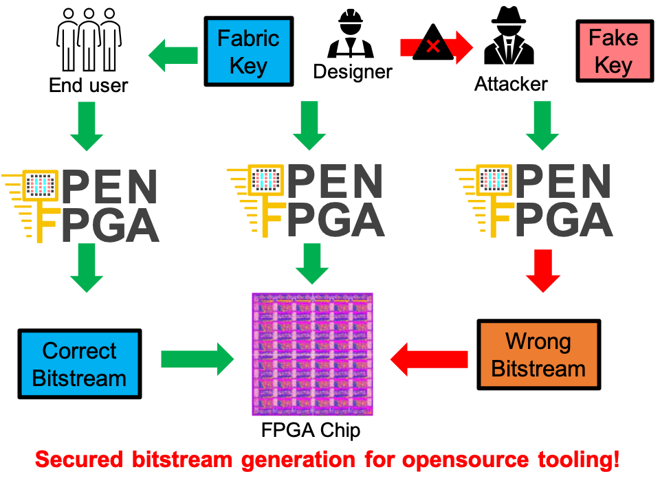

.. _fabric_key:

Fabric Key
~~~~~~~~~~

Fabric key is a secure key for users to generate bitstream for a specific FPGA fabric. 
With this key, OpenFPGA can generate correct bitstreams for the FPGA.
Using a wrong key, OpenFPGA may error out or generate wrong bitstreams.
The fabric key support allows users to build secured/classified FPGA chips even with an open-source tool.


 
   The use of fabric key to secure the FPGA chip design

.. note:: Users are the only owner of the key. OpenFPGA will not store or replicate the key.

Key Generation
``````````````
A fabric key can be achieved in the following ways:

- OpenFPGA can auto-generate a fabric key using random algorithms (see detail in :ref:`cmd_build_fabric`)

- Users can craft a fabric key based on auto-generated file by following the file format description.

File Format
```````````

A fabric key follows an XML format. As shown in the following XML code, the key file includes the organization of configurable blocks in the top-level FPGA fabric. 

Configurable Region
^^^^^^^^^^^^^^^^^^^

The top-level FPGA fabric can consist of several configurable regions, where a region may contain one or multiple configurable blocks. Each configurable region can be configured independently and in parrallel.

.. option:: <region id="<int>"/>

  - ``id`` indicates the unique id of a configurable region in the fabric.

  .. warning:: The id must start from zero!

  .. note:: The number of regions defined in the fabric key must be consistent with the number of regions defined in the configuration protocol of architecture description. (See details in :ref:`config_protocol`).

The following example shows how to define multiple configuration regions in the fabric key.

.. code-block:: xml

  <fabric_key>
    <region id="0">
      <key id="0" name="grid_io_bottom" value="0" alias="grid_io_bottom_1__0_"/>
      <key id="1" name="grid_io_right" value="0" alias="grid_io_right_2__1_"/>
      <key id="2" name="sb_1__1_" value="0" alias="sb_1__1_"/>
    </region>
    <region id="1">
      <key id="3" name="cbx_1__1_" value="0" alias="cbx_1__1_"/>
      <key id="4" name="grid_io_top" value="0" alias="grid_io_top_1__2_"/>
      <key id="5" name="sb_0__1_" value="0" alias="sb_0__1_"/>
    </region>
    <region id="2">
      <key id="6" name="sb_0__0_" value="0" alias="sb_0__0_"/>
      <key id="7" name="cby_0__1_" value="0" alias="cby_0__1_"/>
      <key id="8" name="grid_io_left" value="0" alias="grid_io_left_0__1_"/>
    </region>
    <region id="3">
      <key id="9" name="sb_1__0_" value="0" alias="sb_1__0_"/>
      <key id="10" name="cbx_1__0_" value="0" alias="cbx_1__0_"/>
      <key id="11" name="cby_1__1_" value="0" alias="cby_1__1_"/>
      <key id="12" name="grid_clb" value="0" alias="grid_clb_1__1_"/>
    </region>
  </fabric_key>


Configurable Block
^^^^^^^^^^^^^^^^^^^

Each configurable block is defined as a key. There are two ways to define a key, either with alias or with name and value. 

.. option:: <key id="<int>" alias="<string>" name="<string>" value="<int>"/>

  - ``id`` indicates the sequence of the configurable memory block in the top-level FPGA fabric.

  - ``name`` indicates the module name of the configurable memory block. This property becomes optional when ``alias`` is defined.

  - ``value`` indicates the instance id of the configurable memory block in the top-level FPGA fabric. This property becomes optional when ``alias`` is defined.

  - ``alias`` indicates the instance name of the configurable memory block in the top-level FPGA fabric. If a valid alias is specified, the ``name`` and ``value`` are not required.

.. warning:: For fast loading of fabric key, strongly recommend to use pairs ``name`` and ``alias`` or ``name`` and ``value`` in the fabric key file. Using only ``alias`` may cause long parsing time for fabric key. 

The following is an example of a fabric key generate by OpenFPGA for a 2 :math:`\times` 2 FPGA.
This key contains only ``alias`` which is easy to craft.

.. code-block:: xml

  <fabric_key>
    <region id="0">
      <key id="0" alias="sb_2__2_"/>
      <key id="1" alias="grid_clb_2_2"/>
      <key id="2" alias="sb_0__1_"/>
      <key id="3" alias="cby_0__1_"/>
      <key id="4" alias="grid_clb_2_1"/>
      <key id="5" alias="grid_io_left_0_1"/>
      <key id="6" alias="sb_1__0_"/>
      <key id="7" alias="sb_1__1_"/>
      <key id="8" alias="cbx_2__1_"/>
      <key id="9" alias="cby_1__2_"/>
      <key id="10" alias="grid_io_right_3_2"/>
      <key id="11" alias="cbx_2__0_"/>
      <key id="12" alias="cby_1__1_"/>
      <key id="13" alias="grid_io_right_3_1"/>
      <key id="14" alias="grid_io_bottom_1_0"/>
      <key id="15" alias="cby_2__1_"/>
      <key id="16" alias="sb_2__1_"/>
      <key id="17" alias="cbx_1__0_"/>
      <key id="18" alias="grid_clb_1_2"/>
      <key id="19" alias="cbx_1__2_"/>
      <key id="20" alias="cbx_2__2_"/>
      <key id="21" alias="sb_2__0_"/>
      <key id="22" alias="sb_1__2_"/>
      <key id="23" alias="cby_0__2_"/>
      <key id="24" alias="sb_0__0_"/>
      <key id="25" alias="grid_clb_1_1"/>
      <key id="26" alias="cby_2__2_"/>
      <key id="27" alias="grid_io_top_2_3"/>
      <key id="28" alias="sb_0__2_"/>
      <key id="29" alias="grid_io_bottom_2_0"/>
      <key id="30" alias="cbx_1__1_"/>
      <key id="31" alias="grid_io_top_1_3"/>
      <key id="32" alias="grid_io_left_0_2"/>
    </region>
  </fabric_key>

The following shows another example of a fabric key generate by OpenFPGA for a 2 :math:`\times` 2 FPGA.
This key contains only ``name`` and ``value`` which is fast to parse.

.. code-block:: xml

  <fabric_key>
    <region id="0">
      <key id="0" name="sb_2__2_" value="0"/>
      <key id="1" name="grid_clb" value="3"/>
      <key id="2" name="sb_0__1_" value="0"/>
      <key id="3" name="cby_0__1_" value="0"/>
      <key id="4" name="grid_clb" value="2"/>
      <key id="5" name="grid_io_left" value="0"/>
      <key id="6" name="sb_1__0_" value="0"/>
      <key id="7" name="sb_1__1_" value="0"/>
      <key id="8" name="cbx_1__1_" value="1"/>
      <key id="9" name="cby_1__1_" value="1"/>
      <key id="10" name="grid_io_right" value="1"/>
      <key id="11" name="cbx_1__0_" value="1"/>
      <key id="12" name="cby_1__1_" value="0"/>
      <key id="13" name="grid_io_right" value="0"/>
      <key id="14" name="grid_io_bottom" value="0"/>
      <key id="15" name="cby_2__1_" value="0"/>
      <key id="16" name="sb_2__1_" value="0"/>
      <key id="17" name="cbx_1__0_" value="0"/>
      <key id="18" name="grid_clb" value="1"/>
      <key id="19" name="cbx_1__2_" value="0"/>
      <key id="20" name="cbx_1__2_" value="1"/>
      <key id="21" name="sb_2__0_" value="0"/>
      <key id="22" name="sb_1__2_" value="0"/>
      <key id="23" name="cby_0__1_" value="1"/>
      <key id="24" name="sb_0__0_" value="0"/>
      <key id="25" name="grid_clb" value="0"/>
      <key id="26" name="cby_2__1_" value="1"/>
      <key id="27" name="grid_io_top" value="1"/>
      <key id="28" name="sb_0__2_" value="0"/>
      <key id="29" name="grid_io_bottom" value="1"/>
      <key id="30" name="cbx_1__1_" value="0"/>
      <key id="31" name="grid_io_top" value="0"/>
      <key id="32" name="grid_io_left" value="1"/>
    </region>
  </fabric_key>


