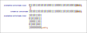

.. _file_formats_bitstream_remap:

Bitstream Remap (.xml)
------------------------

This format is used to remap individual bitstream bits after place and route, currently the feature is only supported for CCFF style configration bitstreams.
It allows converting a sequence of bits to another sequence with remapped location,
or converting to a 2D matrix representation with remapped bit indices.

.. note::
  The bitstream remapping process operates on a region-by-region basis. Bits located in different regions cannot be remapped across region boundaries. Each region maintains its own independent bit mapping configuration, ensuring that cross-region bit remapping is not supported in the current implementation.

An example bitstream remap XML file:

.. code-block:: xml
  <bitstream_remap>
  <regions>
    <region id="0" total_cbits="100" width="1">
      <tile id="0" name="section1" />
      <tile id="1" name="section2" />
      ...
    </region>
    <region id="1" ...>
      ...
    </region>
  </regions>
  <tile_bitmaps>
    <tile_bitmap name="section1" cbits="120" length="120" width="1">
      <bit index="0">0</bit>
      <bit index="1">1</bit>
      ...
    </tile_bitmap>
    <tile_bitmap name="section2" cbits="120" length="120" width="1">
      <bit index="0">0</bit>
      <bit index="1">1</bit>
      ...
    </tile_bitmap>
  </tile_bitmaps>

Assertions:
- Check if configration bitstream is in CCFF style, if not, report error and skip remapping.