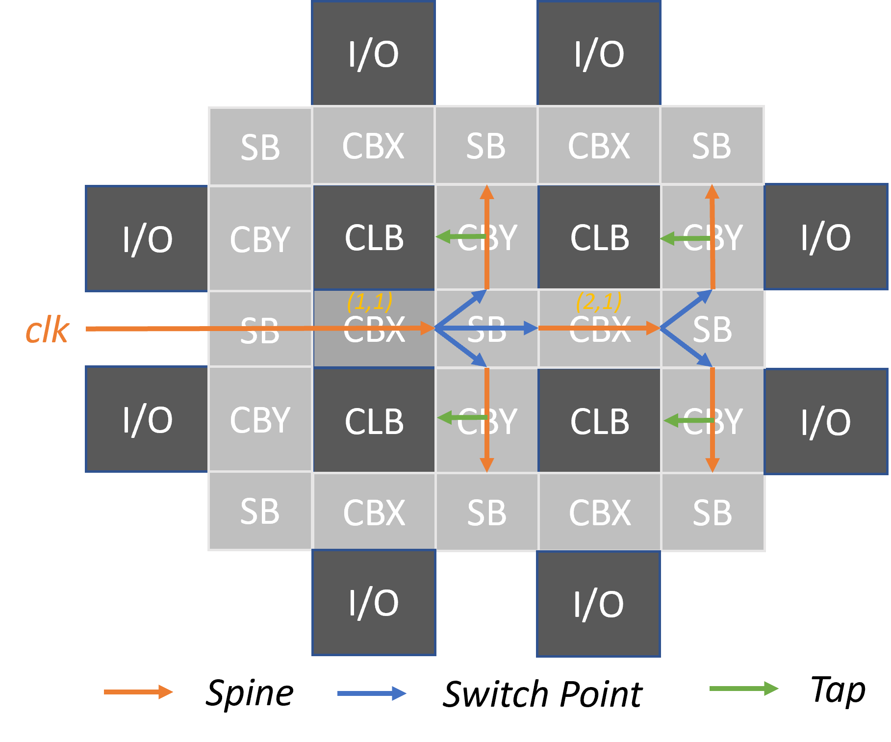
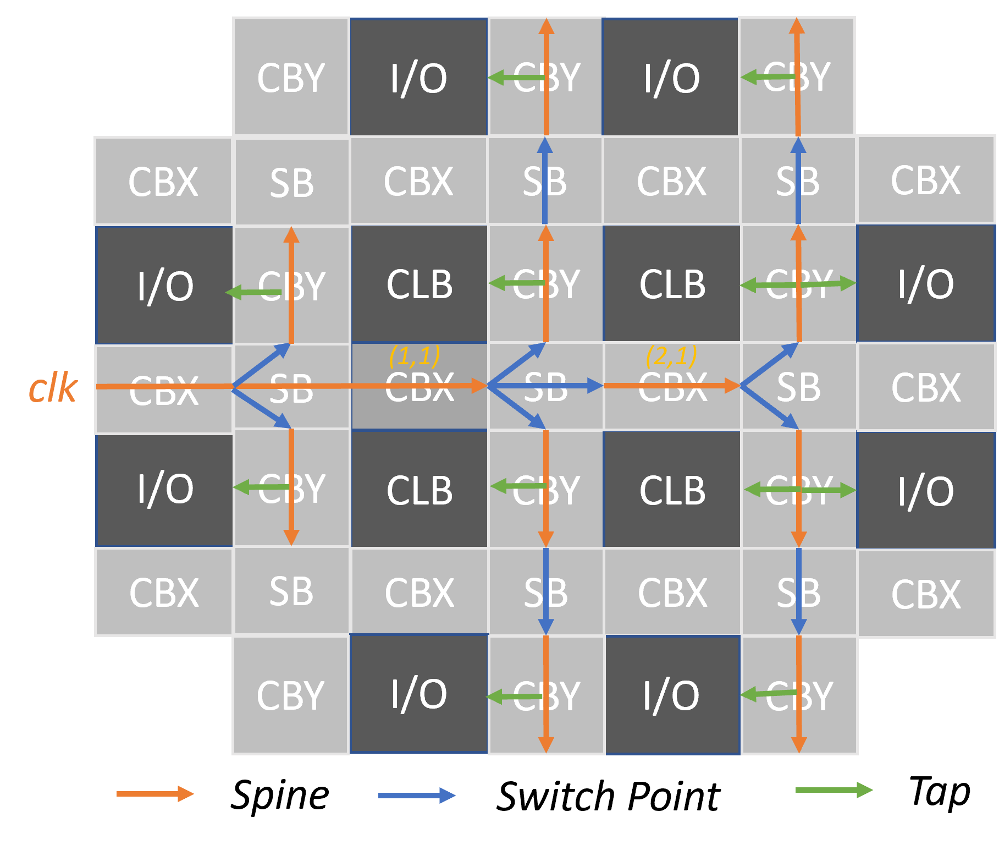

.. _file_formats_clock_network:

Clock Network (.xml)
--------------------

The XML-based clock network description language is used to describe 

- One or more programmable clock networks constaining programmable switches for routing clock signals
- The routing for clock signals on the programmable clock network

Using the clock network description language, users can define multiple clock networks, each of which consists:

- A number of clock spines which can propagate clock signals from one point to another. See details in :ref:`file_formats_clock_network_clock_spine`.
- A number of switch points which interconnects clock spines using programmable routing switches. See details in :ref:`file_formats_clock_network_switch_point`.
- A number of tap points which connect the clock spines to programmable blocks, e.g., CLBs. See details in :ref:`file_formats_clock_network_tap_point`.

The entry point of a clock tree must be at a valid connection block.

.. note:: Please note that the levels of a clock network will be automatically inferred from the clock spines and switch points. Clock network will be **only** built based on the width and the number of levels, as well as the tap points.

.. note:: The switch points and clock spines will be used to route a clock network. The switch points will not impact the physical clock network but only impact the configuration of the programmable routing switches in the physical clock network.

.. warning:: Clock network is a feature for power-users. It requires additional EDA support to leverage the best performance of the clock network, as timing analysis and convergence is more challenging.

.. code-block:: xml

  <clock_networks default_segment="<string>" default_tap_switch="<string>" default_driver_switch="<string>"> 
    <clock_network name="<string>" global_port="<int>"> 
      <spine name="<string>" start_x="<int>" start_y="<int>" end_x="<int>" end_y="<int>"> 
        <intermediate_driver x="<int>" y="<int>">
          <tap from_pin="<string>" to_pin="<string>"/>
        </intermediate_driver> 
        <switch_point tap="<string>" x="<int>" y="<int>"> 
          <internal_driver from_pin="<string>" to_pin="<string>"/>
        </switch_point>
      </spine>  
      <taps>
        <all from_pin="<string>" to_pin="<string>"/>
        <region from_pin="<string>" to_pin="<string>" start_x="<int>" start_y="<int>" end_x="<int>" end_y="<int>" repeat_x="<int>" repeat_y="<int>"/>
        <single from_pin="<string>" to_pin="<string>" x="<int>" y="<int>"/>
      </taps>
    </clock_network>  
  </clock_networks> 

.. _fig_prog_clock_network_example_2x2:

   An example of programmable clock network considering a 2x2 FPGA fabric

Note that when the ``perimeter_cb`` is enabled for routing architecture (See details in :ref:`addon_vpr_syntax`), clock entry point can be indeed at the fringe of FPGA fabrics. See example in :numref:`prog_clock_network_example_2x2_perimeter_cb`. 

.. _fig_prog_clock_network_example_2x2_perimeter_cb:

   An example of programmable clock network considering a 2x2 FPGA fabric with perimeter cb

General Settings
^^^^^^^^^^^^^^^^

The following syntax are applicable to the XML definition under the root node ``clock_networks``

.. option:: default_segment="<string>"

  Define the default routing segment to be used when building the routing tracks for the clock network. The routing segments are used to build the spines of clock networks as shown in :numref:`fig_prog_clock_network_example_2x2`. Must be a valid routing segment defined in the VPR architecture file.  For example, 

  .. code-block:: xml

   default_segment="L1"

where the segment is defined in the VPR architecture file:

.. code-block:: xml

  <segmentlist>
    <segment name="L1" freq="1" length="1" type="undir"/>
  </segmentlist>

.. note:: Currently, clock network requires only length-1 wire segment to be used!

.. option:: default_tap_switch="<string>"

  Define the default routing switch to be used when interconnects the routing tracks to the input pins of programmable blocks in the clock network. The tap switches are used to build the taps of clock networks as shown in :numref:`fig_prog_clock_network_example_2x2`. Must be a valid routing switch defined in the VPR architecture file. See the example in the ``default_driver_switch``. 

.. option:: default_driver_switch="<string>"

  .. note:: For internal drivers, suggest to use the same driver switch for the output pins of a programmable block as defined in VPR architecture.

  Define the default routing switch to be used when interconnects the routing tracks in the clock network. The driver switches are used to build the switch points of clock networks as shown in :numref:`fig_prog_clock_network_example_2x2`. Must be a valid routing switch defined in the VPR architecture file. For example, 

  .. code-block:: xml

    default_tap_switch="cb_mux" default_driver_switch="sb_clk_mux"

where the switch is defined in the VPR architecture file:

.. code-block:: xml

  <switchlist>
    <switch type="mux" name="cb_mux" R="551" Cin=".77e-15" Cout="4e-15" Tdel="58e-12" mux_trans_size="2.630740" buf_size="27.645901"/>
    <switch type="mux" name="sb_clk_mux" R="55" Cin=".7e-15" Cout="4e-15" Tdel="58e-12" mux_trans_size="2.630740" buf_size="27.645901"/>
  </switchlist>

.. note:: Currently, clock network only supports the default types of routing switch, which means all the programmable routing switch in the clock network will be in the same type and circuit design topology.

Clock Network Settings
^^^^^^^^^^^^^^^^^^^^^^

The following syntax are applicable to the XML definition tagged by ``clock_network``.
Note that a number of clock networks can be defined under the root node ``clock_networks``.

.. option:: name="<string>"

  The unique name of the clock network. It will be used to link the clock network to a specific global port in :ref:`annotate_vpr_arch_physical_tile_annotation`. For example, 
  
  .. code-block:: xml

    name="clk_tree_0"

where the clock network is used to drive the global clock pin ``clk0`` in OpenFPGA's architecture description file:

.. code-block:: xml

  <tile_annotations>
    <global_port name="clk0" is_clock="true" clock_arch_tree_name="clk_tree_0" default_val="0">
      <tile name="clb" port="clk[0:0]"/>
    </global_port>
  </tile_annotations>

.. option:: global_port="<string>"

  .. note:: When programmable clock network is specified for a global port in OpenFPGA architecure description file, the width of clock tree will be the final size of the global port. 

  Define the source port of the clock network. For example, ``clk[0:7]``. Note that the global port name should match 

  - the ``from_pin`` when defining the tap points (See details in :ref:`file_formats_clock_network_clock_tap_point`). 
  - the ``name`` of global port definition in OpenFPGA architecture description file

.. _file_formats_clock_network_clock_spine:

Clock Spine Settings
^^^^^^^^^^^^^^^^^^^^

The following syntax are applicable to the XML definition tagged by ``spine``.
Note that a number of clock spines can be defined under the node ``clock_network``.

.. note:: Use coordinates of connection blocks to define the starting and ending points of clock spines.

.. option:: name="<string>"

  The unique name of the clock spine. It will be used to build switch points between other clock spines.

.. option:: start_x="<int>"

  The coordinate X of the starting point of the clock spine.

.. option:: start_y="<int>"

  The coordinate Y of the starting point of the clock spine.

.. option:: end_x="<int>"

  The coordinate X of the ending point of the clock spine.

.. option:: end_y="<int>"

  The coordinate Y of the ending point of the clock spine.

For example, 

.. code-block:: xml

  <spine name="spine0" start_x="1" start_y="1" end_x="2" end_y="1"/>

where a horizental clock spine ``spine0`` is defined which spans from (1, 1) to (2, 1), as highlighted in orange in the :numref:`fig_prog_clock_network_example_2x2`

.. note:: We only support clock spines in horizental and vertical directions. Diagonal clock spine is not supported!

.. _file_formats_clock_network_intermediate_driver:

Intermediate Driver
^^^^^^^^^^^^^^^^^^^

The following syntax are applicable to the XML definition tagged by ``intermediate_driver``
Note that a number of intermediate drivers can be defined under each clock spine ``spine``.

.. option:: x="<int>"

  The coordinate X where the intermediate driver should occur on the spine. Must be a valid coordinate within the range of the current clock spine and the clock spine to be tapped.

.. option:: y="<int>"

  The coordinate Y where the intermediate driver should occur on the spine. Must be a valid coordinate within the range of the current clock spine and the clock spine to be tapped.

.. note:: The intermeidate driver is different than the internal driver (see details in :ref:`file_formats_clock_network_switch_point`). Intermediate driver may occur in any mid points of a spine, while internal driver occurs **ONLY** on the switch points between spines.

Under each intermediate driver, a number of tap points can be specified.
For each tap point, outputs of neighbouring programmable blocks are allowed to drive the spine through syntax ``tap``.

.. option:: from_pin="<string>"

  Define the pin of a programmable block as an internal driver to a clock network. The pin must be a valid pin defined in the VPR architecture description file.

.. option:: to_pin="<string>"

  Define the source pin of a clock network. The pin must be a valid pin of the global ports defined in the tile_annotation part of OpenFPGA architecture description file.

For example, 

.. code-block:: xml

  <clock_network name="clk_tree_0" global_port="clk[0:1]">
    <!-- Some clock spines -->
    <spine name="spine0" start_x="1" start_y="1" end_x="2" end_y="1">
      <intermediate_driver x="1" y="1">
        <tap from_pin="clb.O[0:1]" to_pin="clk[0:0]"/>
      </intermediate_driver>
    <spine>
  </clock_network>

where clock spine ``spine0`` will be driven by other programmable blocks at (1, 1), as highlighted in purple in the :numref:`fig_prog_clock_network_example_2x2_perimeter_cb`

To be specific, the clock routing can be driven at (x=1,y=1) by the output pins ``O[0:3]`` of tile ``clb`` in a VPR architecture description file:

.. code-block:: xml

  <tile name="clb">
   <sub_tile name="clb">
     <output name="O" num_pins="8"/>
   </sub_tile>
  </tile>

.. _file_formats_clock_network_switch_point:

Switch Point Settings
^^^^^^^^^^^^^^^^^^^^^

The following syntax are applicable to the XML definition tagged by ``switch_point``.
Note that a number of switch points can be defined under each clock spine ``spine``.

.. note:: Use the coordinate of switch block to define switching points!

.. option:: tap="<string>"

  Define which clock spine will be tapped from the current clock spine.

.. option:: x="<int>"

  The coordinate X of the switch point. Must be a valid coordinate within the range of the current clock spine and the clock spine to be tapped.

.. option:: y="<int>"

  The coordinate Y of the switch point. Must be a valid coordinate within the range of the current clock spine and the clock spine to be tapped.

For example, 

.. code-block:: xml

  <spine name="spine0" start_x="1" start_y="1" end_x="2" end_y="1">
    <switch_point tap="spine1" x="1" y="1"/>
  <spine>

where clock spine ``spine0`` will drive another clock spine ``spine1`` at (1, 1), as highlighted in blue in the :numref:`fig_prog_clock_network_example_2x2`

For each switch point, outputs of neighbouring programmable blocks are allowed to drive the spine at next level, through syntax ``internal_driver``.

.. option:: from_pin="<string>"

  Define the pin of a programmable block as an internal driver to a clock network. The pin must be a valid pin defined in the VPR architecture description file.

.. option:: to_pin="<string>"

  Define the source pin of a clock network. The pin must be a valid pin of the global ports defined in the tile_annotation part of OpenFPGA architecture description file.

For example, 

.. code-block:: xml

  <clock_network name="clk_tree_0" global_port="clk[0:1]">
    <!-- Some clock spines -->
    <spine name="spine0" start_x="1" start_y="1" end_x="2" end_y="1">
      <switch_point tap="spine1" x="1" y="1">
        <internal_driver from_pin="clb.O[0:1]" to_pin="clk[0:0]"/>
      </switch_point>
    <spine>
  </clock_network>

where the clock routing can be driven at (x=1,y=1) by the output pins ``O[0:3]`` of tile ``clb`` in a VPR architecture description file:

.. code-block:: xml

  <tile name="clb">
   <sub_tile name="clb">
     <output name="O" num_pins="8"/>
   </sub_tile>
  </tile>

.. _file_formats_clock_network_tap_point:

Tap Point Settings
^^^^^^^^^^^^^^^^^^

The following syntax are applicable to the XML definition tagged by ``all``, ``region`` and ``single``.
Note that a number of tap points can be defined under the node ``taps``.

.. option:: from_pin="<string>"

  Define the source pin of a programmable block to be tapped by a clock network. The pin must be a valid pin of the global ports defined in the tile_annotation part of OpenFPGA architecture description file.

.. option:: to_pin="<string>"

  Define the destination pin of a programmable block to be tapped by a clock network. The pin must be a valid pin defined in the VPR architecture description file.

.. note:: Only the leaf clock spine (not switch points to drive other clock spine) can tap pins of programmable blocks.

.. note:: Each coordinate must be a valid integer within the device height and width that are defined in VPR architecture!!!

.. warning:: The following syntax are only applicable to ``single`` tap mode.

.. option:: x="<int>"

  Define the x coordinate of the tap point, which is applied to the destination pin ``to_pin``

.. option:: y="<int>"

  Define the y coordinate of the tap point, which is applied to the destination pin ``to_pin``

.. warning:: The following syntax are only applicable to ``region`` tap mode.

.. option:: start_x="<int>"

  Define the starting x coordinate of the tap region, which is applied to the destination pin ``to_pin``

.. option:: start_y="<int>"

  Define the starting y coordinate of the tap region, which is applied to the destination pin ``to_pin``

.. option:: end_x="<int>"

  Define the ending x coordinate of the tap region, which is applied to the destination pin ``to_pin``

.. option:: end_y="<int>"

  Define the ending y coordinate of the tap region, which is applied to the destination pin ``to_pin``

.. option:: repeat_x="<int>"

  Define the repeating factor on x coordinate of the tap region, which is applied to the destination pin ``to_pin``

.. option:: repeat_y="<int>"

  Define the repeating factor on y coordinate of the tap region, which is applied to the destination pin ``to_pin``

For example,

.. code-block:: xml

  <clock_network name="clk_tree_0" global_port="clk[0:1]">
    <!-- Some clock spines -->
    <taps>
      <all from_pin="clk[0:0]" to_pin="clb[0:0].clk[0:0]"/>
      <region from_pin="clk[1:1]" to_pin="clb[1:1].clk[1:1]" start_x="1" start_y="1" end_x="4" end_y="4" repeat_x="2" repeat_y="2"/>
      <single from_pin="clk[1:1]" to_pin="clb[2:2].clk[1:1]" x="2" y="2"/>
    </taps>
  </clock_network>

where all the clock spines of the clock network ``clk_tree_0`` tap the clock pins ``clk`` of tile ``clb`` in a VPR architecture description file:

.. note:: Use the name of ``tile`` in the ``to_pin`` when there are a number of subtiles in your tile! Use the absolute index for the subtile in the tile.

.. code-block:: xml

  <tile name="clb">
   <!-- subtile index ranges [0:0] -->
   <sub_tile name="clbM" capacity="1">
     <clock name="clk" num_pins="2"/>
   </sub_tile>
   <!-- subtile index ranges [1:2] -->
   <sub_tile name="clbA" capacity="2">
     <clock name="clk" num_pins="2"/>
   </sub_tile>
  </tile>

