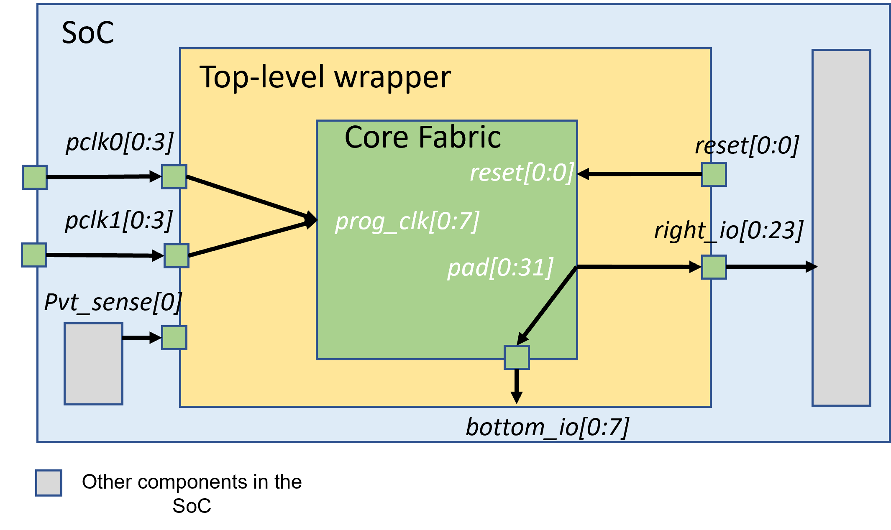

.. _file_formats_io_naming_file:

Fabric I/O Naming (.xml)
------------------------

The XML-based description language is used to describe

- I/O names for an FPGA fabric when creating a top-level wrapper
- I/O connections between the fabric and top-level wrappers

Using the description language, users can customize the I/O names for each pin/port of an FPGA fabric, including dummy pins (not from an FPGA fabric but required for system integration).

Under the root node ``<ports>``, naming rules can be defined line-by-line through syntax ``<port>``.

.. code-block:: xml

  <ports> 
    <port top_name="<string>" core_name="<string>" is_dummy="<bool>" direction="<string>"/> 
  </ports> 

.. note:: If you do not need to rename a port of an FPGA fabric, there is no need to define it explicitly in the naming rules. OpenFPGA can infer it.

Please be aware of the following restrictions:

.. note:: Please note that when naming rules should be applied to a port at its full size. For example, given a port of ``in[0:31]``, naming rules should cover all the 32 bits.

.. note:: Please note that we currently only supports port splitting at the top-level wrapper. For example, there is a port ``a[0:9]`` from the FPGA fabric, it can be split to ``a0[0:4]`` and ``a1[0:4]`` at the top-level wrapper.

.. warning:: Port grouping is **NOT** supported yet. For example, there are ports ``b[0:7]`` and ``c[0:7]`` from the FPGA fabric, it can **NOT** be grouped to a port ``bnc[0:15]`` at the top-level wrapper.

Syntax
``````

Detailed syntax are presented as follows.

.. option:: top_name="<string>"

  Define the port name and width which will appear in the top-level wrapper. For example, 

  .. code-block:: xml

   top_name="a[0:2]"

.. option:: core_name="<string>"

  Define the port name and width which exists in the current FPGA fabric. For example, 

  .. note:: You can find the available ports in the current top-level module of FPGA netlists. See details in :ref:`fabric_netlists`. 

  .. code-block:: xml

    core_name="gfpga_pad_GPIO_PAD[0:2]"

.. option:: is_dummy="<bool>"

  Define if the port is a dummy one in the top-level wrapper, which does not connect to any pin/port of the current FPGA fabric. For example, 

  .. note:: When a dummy port is defined. ``core_name`` is not required.

  .. code-block:: xml

   is_dummy="true"

.. option:: direction="<string>"

  Direction can be ``input`` | ``output`` | ``inout``. Only applicable to dummy ports. For example, 

  .. code-block:: xml

   direction="input"

Example
```````

:numref:`fig_fpga_core_wrapper` shows an example of a top-level wrapper with naming rules, which is built on top of an existing FPGA core fabric.
There is a dummy input port at the top-level wrapper. 

.. _fig_fpga_core_wrapper:



   Example of a top-level wrapper: how it interfaces between SoC and an existing FPGA core fabric

The I/O naming in the :numref:`fig_fpga_core_wrapper` can be described in the following XML:

.. code-block:: xml

  <ports> 
    <port top_name="pclk0[0:3]" core_name="prog_clk[0:3]"/> 
    <port top_name="pclk1[0:3]" core_name="prog_clk[4:7]"/> 
    <port top_name="right_io[0:23]" core_name="pad[0:23]"/> 
    <port top_name="bottom_io[0:7]" core_name="pad[24:31]"/> 
    <port top_name="pvt_sense[0:0]" is_dummy="true" direction="input"/>
  </ports> 

Note that since port ``reset[0:0]`` require no name changes, it is not required to be defined in the XML.
