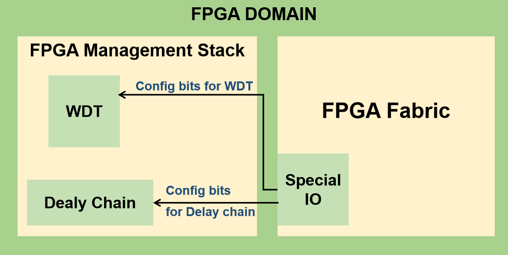

.. _file_format_pcf_custom_command_config_file:

PCF Custom Command Configuration File (.xml)
--------------------------------------------

.. note:: This file defines custom PCF commands that can be used in :ref:`file_format_pin_constraints_file`.  
   It specifies how user-facing commands are translated into FPGA configuration bits. See details in :ref:`openfpga_setup_commands_pcf2bitstream_setting`.

PCF is the unified file used by users to manipulate FPGA I/Os. Custom commands in PCF provide a simple and straightforward way for users to configure FPGA I/Os into their desired operating modes without understanding the underlying bitstream-level details. The custom command configuration file encapsulates the mapping from these high-level commands to the corresponding bit-level configuration details.

The following diagram illustrates how the PCF custom commands configure FPGA modules
through the management stack and special I/O interface:

As shown in the figure:

- **FPGA Management Stack** contains functional modules such as the Delay Chain and WDT.
  Each module receives configuration bits from the PCF parser based on the user-specified
  commands.
- **Special I/O** interfaces transfer configuration bits from the management stack to
  the corresponding hardware blocks in the **FPGA Fabric**.
- Users interact only with high-level commands in the PCF file. For example, to configure
  a programmable delay chain in an I/O, the user simply specifies:

::

  set_delay_chain -pad pad_io[0] -delay 0.2

  The parser converts this value to the corresponding bit pattern and programs the
  Delay Chain via the Special I/O.

An example of a PCF custom command configuration file is shown below:

.. code-block:: xml

  <pcf_config>
    <command name="set_delay_chain" type="delay_chain">
      <option name="pad" type="pin"/>
      <pb_type name="gp_inpad.inpad"/>
      <option name="delay" type="mode" offset="0">
        <mode name="0.1ns">00001</mode>
        <mode name="0.2ns">00010</mode>
        <mode name="0.3ns">00100</mode>
      </option>
    </command>

    <command name="set_watch_dog" type="peripheral">
      <option name="pad" type="pin"/>
      <pb_type name="gp_outpad.outpad"/>
      <option name="mode" type="decimal" num_bits="3" max="6" little_endian="false" offset="0"/>
    </command>
  </pcf_config>

.. option:: command name="<string>"

  The name of the custom command as used in the PCF file.

.. option:: type="<string>"

  The category of the custom command used internally by the parser.

.. option:: option name="<string>" type="<pin|mode|decimal>" [additional attributes]

  Defines a configurable parameter for the custom command.

  - **pin**:  
    Specifies an I/O pad. Users provide a valid pad name from the pin table :ref:`file_format_pin_table_file`.  
    The parser validates the name.

  - **mode**:  
    Users select a predefined mode by name (e.g., NORMAL, LOW_SPEED, HIGH_SPEED).  
    Each mode has an explicit bit pattern defined in the configuration file.

  - **decimal**:
    Users specify a numeric value (for example, a delay parameter). The parser converts this value into the corresponding bit pattern or mode bits.

    .. note::
      The following options are required when the type is set to ``decimal``:

      - **num_bits**: Number of bits used to encode the numeric value.
      - **max**: Maximum allowable value in decimal format. This value must be representable by ``num_bits``.
      - **little_endian**: Specifies the bit ordering used during encoding.
      - **offset**: Bit offset applied when overwriting the target bitstream. The encoded
        value is written starting at this bit position, and occupies ``num_bits`` consecutive
        bits.

    **Example**

    If ``num_bits`` is set to 4, the maximum representable value is 15 (binary ``1111``).
    Therefore, ``max`` should not exceed 15.

    If ``offset`` is set to 8, the 4-bit encoded value overwrites bit positions
    ``[8 : 11]`` in the target bitstream (inclusive).

    When a user provides a value greater than ``max``, the parser reports an error and
    aborts bitstream generation, preventing bits overflow.

.. option:: pb_type name="<string>"

  Specifies the programmable block associated with this command, whose configuration bits will be modified.

.. option:: mode name="<string>" value="<bit pattern>"

  Used only under a mode-type option. Defines the mapping between a mode name and its explicit bit pattern.
