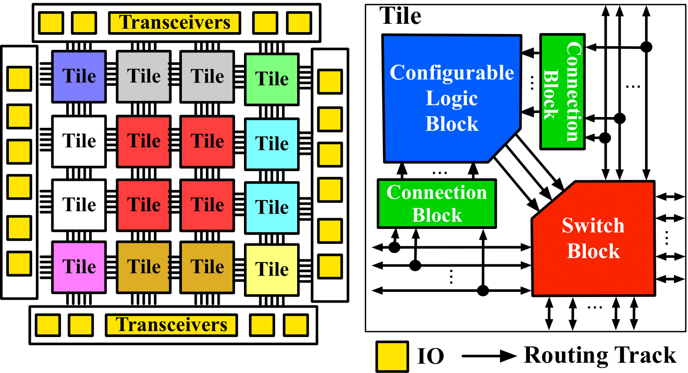
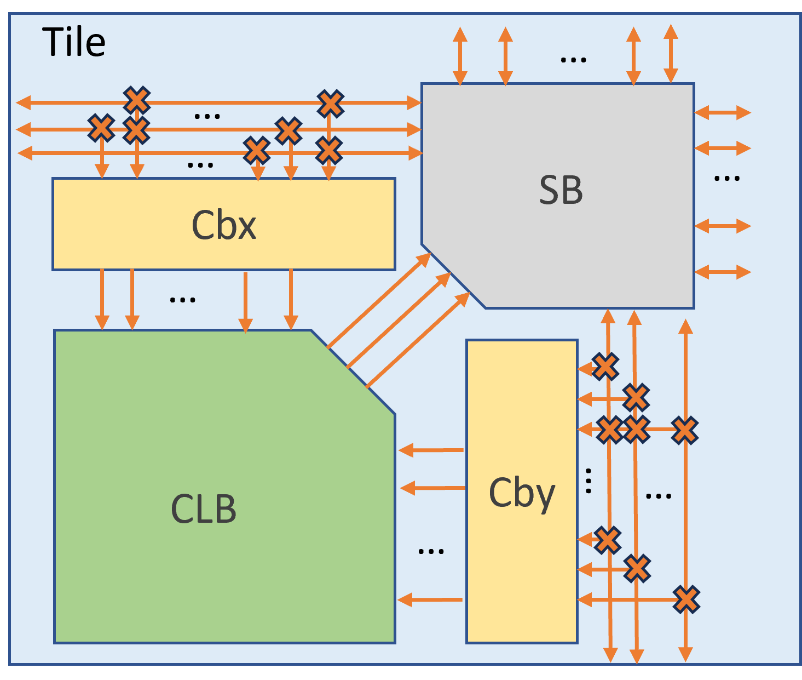

.. _file_formats_tile_config_file:

Tile Organization (.xml)
------------------------

The XML-based description language is used to describe how each tile is composed.
For example, what programmable blocks, connection blocks and switch blocks should be included.

Using the description language, users can customize the tiles of an FPGA fabric, as detailed as each component in each tile.

Under the root node ``<tiles>``, the detailes of tile organization can be described.

.. code-block:: xml

  <tiles style="<string>"/> 
  </tiles> 

Syntax
``````

Detailed syntax are presented as follows.

.. option:: style="<string>"

  Specify the style of tile organization. Can be [``top_left`` | ``top_right`` | ``bottom_left`` | ``bottom_right`` | ``custom``]
  
  .. warning:: Currently, only ``top_left`` and ``bottom_left`` are supported!

  The ``top_left`` is a shortcut to define the organization for all the tiles. :numref:`fig_tile_style_top_left` shows an example of tiles in the top-left sytle, where the programmable block locates in the top-left corner of all the tiles, surrounded by two connection blocks and one switch blocks.

  The ``bottom_left`` is a shortcut to define the organization for all the tiles. :numref:`fig_tile_style_bottom_left` shows an example of tiles in the bottom-left sytle, where the programmable block locates in the bottom-left corner of all the tiles, surrounded by two connection blocks and one switch blocks.

.. _fig_tile_style_top_left:



   An example of top-left style of a tile in FPGA fabric

  
.. _fig_tile_style_bottom_left:



   An example of bottom-left style of a tile in FPGA fabric


