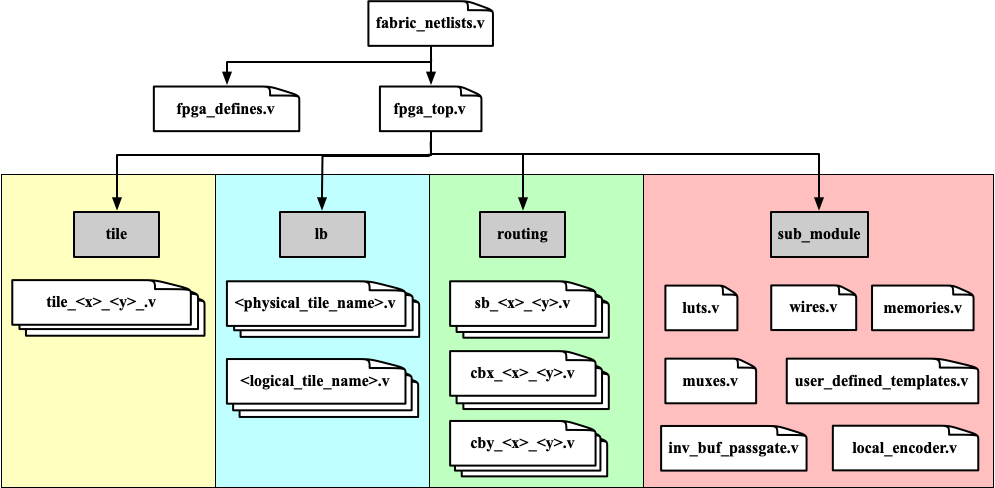
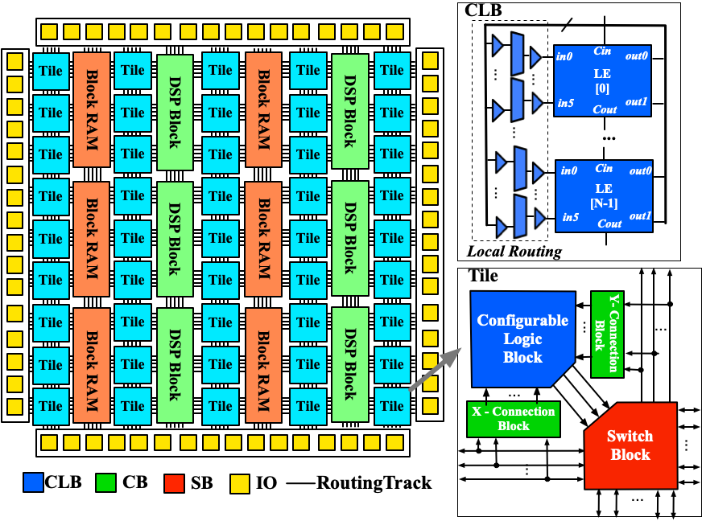

.. _fabric_netlists:

Fabric Netlists
---------------

In this part, we will introduce the hierarchy, dependency and functionality of each Verilog netlist, which are generated to model the FPGA fabric.

.. note:: These netlists are automatically generated by the OpenFPGA command ``write_fabric_verilog``. See :ref:`openfpga_verilog_commands` for its detailed usage. 

All the generated Verilog netlists are located in the directory as you specify in the OpenFPGA command ``write_fabric_verilog``.
Inside the directory, the Verilog netlists are organized as illustrated in :numref:`fig_fabric_netlist_hierarchy`.

.. _fig_fabric_netlist_hierarchy:



   Hierarchy of Verilog netlists modeling a FPGA fabric

.. _fig_generic_fabric:



   An illustrative FPGA fabric modelled by the Verilog netlists

Top-level Netlists
~~~~~~~~~~~~~~~~~~

.. option:: fabric_netlists.v

   This file includes all the related Verilog netlists that are used by the ``fpga_top.v``.
   This file is created to simplify the netlist addition for HDL simulator and backend tools.
   This is the only file you need to add to a simulator or backend project.

   .. note:: User-defined (external) Verilog netlists are included in this file.

.. option:: fpga_top.v

   This netlist contains the top-level module of the fpga fabric, corresponding to the fabric shown in :numref:`fig_generic_fabric`.

.. option:: fpga_defines.v

   This file includes pre-processing flags required by the ``fpga_top.v``, to smooth HDL simulation.
   It will include the folliwng pre-procesing flags:
   
   - ```define ENABLE_TIMING`` When enabled, all the delay values defined in primitive Verilog modules will be considered in compilation. This flag is added when ``--include_timing`` option is enabled when calling the ``write_fabric_verilog`` command. 

   .. note:: We strongly recommend users to turn on this flag as it can help simulators to converge quickly.

Logic Blocks
~~~~~~~~~~~~
This sub-directory contains all the Verilog modules modeling configurable logic blocks, heterogeneous blocks as well as I/O blocks.
Take the example in :numref:`fig_generic_fabric`, the modules are CLBs, DSP blocks, I/Os and Block RAMs.

.. option:: <physical_tile_name>.v

   For each ``<physical_tile>`` defined in the VPR architecture description, a Verilog netlist will be generated to model its internal structure.

   .. note:: For I/O blocks, separated ``<physical_tile_name>.v`` will be generated for each side of a FPGA fabric.

.. option:: <logical_tile_name>.v

   For each root ``pb_type`` defined in the ``<complexblock>`` of VPR architecture description, a Verilog netlist will be generated to model its internal structure.

Routing Blocks
~~~~~~~~~~~~~~
This sub-directory contains all the Verilog modules modeling Switch Blocks (SBs) and Connection Blocks (CBs).
Take the example in :numref:`fig_generic_fabric`, the modules are the Switch Blocks, X- and Y- Connection Blocks of a tile.

.. option:: sb_<x>_<y>.v

  For each unique Switch Block (SB) created by VPR routing resource graph generator, a Verilog netlist will be generated. The ``<x>`` and ``<y>`` denote the coordinate of the Switch Block in the FPGA fabric.

.. option:: cbx_<x>_<y>.v

  For each unique X-direction Connection Block (CBX) created by VPR routing resource graph generator, a Verilog netlist will be generated. The ``<x>`` and ``<y>`` denote the coordinate of the Connection Block in the FPGA fabric.

.. option:: cby_<x>_<y>.v

  For each unique Y-direction Connection Block (CBY) created by VPR routing resource graph generator, a Verilog netlist will be generated. The ``<x>`` and ``<y>`` denote the coordinate of the Connection Block in the FPGA fabric.

Primitive Modules
~~~~~~~~~~~~~~~~~
This sub-directory contains all the primitive Verilog modules, which are used to build the logic blocks and routing blocks.

.. option:: luts.v

  Verilog modules for all the Look-Up Tables (LUTs), which are defined as ``<circuit_model name="lut">`` of OpenFPGA architecture description. See details in :ref:`circuit_library`.

.. option:: wires.v

  Verilog modules for all the routing wires, which are defined as ``<circuit_model name="wire|chan_wire">`` of OpenFPGA architecture description. See details in :ref:`circuit_library`.

.. option:: memories.v

  Verilog modules for all the configurable memories, which are defined as ``<circuit_model name="ccff|sram">`` of OpenFPGA architecture description. See details in :ref:`circuit_library`.

.. option:: muxes.v

  Verilog modules for all the routing multiplexers, which are defined as ``<circuit_model name="mux">`` of OpenFPGA architecture description. See details in :ref:`circuit_library`.

  .. note:: multiplexers used in Look-Up Tables are also defined in this netlist.

.. option:: inv_buf_passgate.v

  Verilog modules for all the inverters, buffers and pass-gate logics, which are defined as ``<circuit_model name="inv_buf|pass_gate">`` of OpenFPGA architecture description. See details in :ref:`circuit_library`.

.. option:: local_encoder.v

  Verilog modules for all the encoders and decoders, which are created when routing multiplexers are defined to include local encoders. See details in :ref:`circuit_model_examples`.

.. option:: user_defined_templates.v

  This is a template netlist, which users can refer to when writing up their user-defined Verilog modules.
  The user-defined Verilog modules are those ``<circuit_model>`` in the OpenFPGA architecture description with a specific ``verilog_netlist`` path.
  It contains Verilog modules with ports declaration (compatible to other netlists that are auto-generated by OpenFPGA) but without any functionality.
  This file is created only when the option ``--print_user_defined_template`` is enabled when calling the ``write_fabric_verilog`` command. 

  .. warning:: Do not include this netlist in simulation without any modification to its content!
