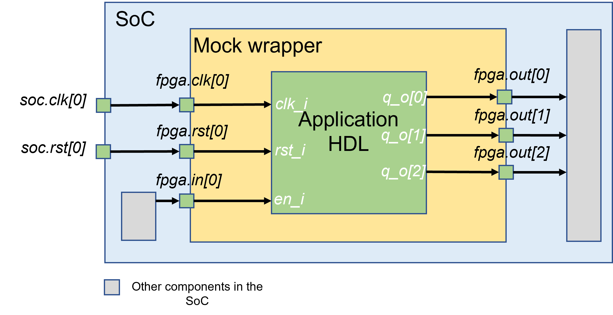

.. _fpga_verilog_mock_fpga_wrapper:

Mock FPGA Wrapper
-----------------

OpenFPGA can generates HDL netlists that model a complete eFPGA fabric (see details in :ref:`fabric_netlists`).
Through bitstream forcing, users can verify the eFPGAs that are mapped by various applications in the context of SoC (see details in :numref:`fig_preconfig_module`).
However, the complete eFPGA fabric is very costly in design verification runtime.
To reduce runtime, a mock eFPGA wrapper is required to bridge the application HDL and other components in the SoC.
As illustrated in :numref:`fig_mock_fpga_wrapper`, a 3-bit counter application is mapped to an FPGA, while a mock wrapper is interfacing the signals between the counter module and the SoC.
The mock wrapper consists of the same ports as the FPGA fabric, which is generated by the OpenFPGA command ``write_fabric_verilog``. See :ref:`openfpga_verilog_commands` for its detailed usage. 
The only difference lies in that the mock wrapper contains an instance of the application HDL design which is implemented on the FPGA, while the FPGA fabric contains a complete structure of programmable resources.

.. note:: The mock wrapper is useful for connectivity checks on FPGA datapaths. It does not cover any configuration protocols (see details in :ref:`config_protocol`)

.. _fig_mock_fpga_wrapper:

   Principles of a mock FPGA wrapper: ease SoC-level design verification

