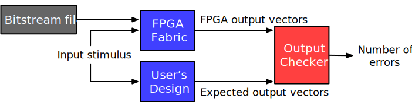
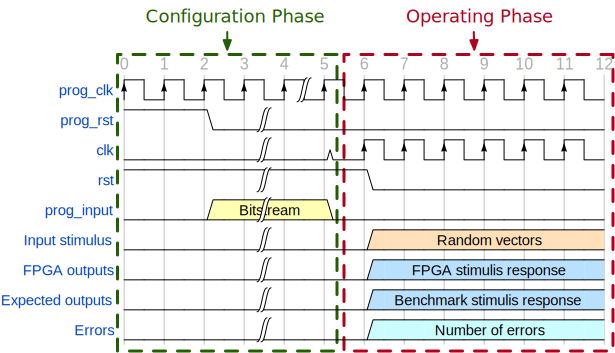
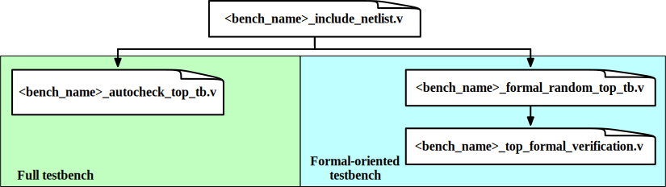

.. _fpga_verilog_testbench:

Testbench
---------

In this part, we will introduce the hierarchy, dependency and functionality of each Verilog testbench, which are generated to verify a FPGA fabric implemented with an application.

+-----------------+---------+----------------+---------------+
| Testbench Type  | Runtime | Test Vector    | Test Coverage |
+=================+=========+================+===============+
| Full            | Long    | Random Stimuli | Full fabric   |
+-----------------+---------+----------------+---------------+
| Formal-oriented | Short   | Random Stimuli | Programmable  |
|                 |         |                | fabric only   |
|                 |         | Formal Method  |               |
+-----------------+---------+----------------+---------------+

OpenFPGA can auto-generate two types of Verilog testbenches to validate the correctness of the fabric: full and formal-oriented.
Both testbenches share the same organization, as depicted in :numref:`fig_verilog_testbench_organization`.
To enable self-testing, the FPGA and user's RTL design (simulate using an HDL simulator) are driven by the same input stimuli, and any mismatch on their outputs will raise an error flag.

.. _fig_verilog_testbench_organization:

   Principles of Verilog testbenches: (1) using common input stimuli; (2) applying bitstream; (3) checking output vectors.

.. _fig_verilog_full_testbench_waveform:

   Illustration on the waveforms in full testbench

Full Testbench
~~~~~~~~~~~~~~
Full testbench aims at simulating an entire FPGA operating period, consisting of two phases: 

  - the **Configuration Phase**, where the synthesized design bitstream is loaded to the programmable fabric, as highlighted by the green rectangle of :numref:`fig_verilog_full_testbench_waveform`;

  - the **Operating Phase**, where random input vectors are auto-generated to drive both Devices Under Test (DUTs), as highlighted by the red rectangle of :numref:`fig_verilog_full_testbench_waveform`. Using the full testbench, users can validate both the configuration circuits and programming fabric of an FPGA.

Formal-oriented Testbench
~~~~~~~~~~~~~~~~~~~~~~~~~
The formal-oriented testbench aims to test a programmed FPGA is instantiated with the user's bitstream.
The module of the programmed FPGA is encapsulated with the same port mapping as the user's RTL design and thus can be fed to a formal tool for a 100% coverage formal verification. Compared to the full testbench, this skips the time-consuming configuration phase, reducing the simulation time, potentially also significantly accelerating the functional verification, especially for large FPGAs.

.. warning:: Formal-oriented testbenches do not validate the configuration protocol of FPGAs. It is used to  validate FPGA with a wide range of benchmarks.

General Usage
~~~~~~~~~~~~~

All the generated Verilog testbenches are located in the directory as you specify in the OpenFPGA command ``write_fabric_verilog``.
Inside the directory, the Verilog testbenches are organized as illustrated in :numref:`fig_verilog_testbench_hierarchy`.

.. _fig_verilog_testbench_hierarchy:

   Hierarchy of Verilog testbenches for a FPGA fabric implemented with an application

.. note:: ``<bench_name>`` is the module name of users' RTL design. 

.. option:: <bench_name>_include_netlist.v

   This file includes all the related Verilog netlists that are used by the testbenches, including both full and formal oriented testbenches.
   This file is created to simplify the netlist addition for HDL simulator.
   This is the only file you need to add to a simulator.

   .. note:: Fabric Verilog netlists are included in this file.

.. option:: <bench_name>_autocheck_top_tb.v

  This is the netlist for full testbench.

.. option:: <bench_name>_formal_random_top_tb.v

  This is the netlist for formal-oriented testbench.

.. option:: <bench_name>_top_formal_verification.v

  This netlist includes a Verilog module of a pre-configured FPGA fabric, which is a wrapper on top of the ``fpga_top.v`` netlist.
  The wrapper module has the same port map as the top-level module of user's RTL design, which be directly def to formal verification tools to validate FPGA's functional equivalence. 
  :numref:`fig_preconfig_module` illustrates the organization of a pre-configured module, which consists of a FPGA fabric (see :ref:`fabric_netlists`) and a hard-coded bitstream.
  Only used I/Os of FPGA fabric will appear in the port list of the pre-configured module. 

.. _fig_preconfig_module:

.. figure:: ./figures/preconfig_module.png
   :scale: 25%

   Internal structure of a pre-configured FPGA module

