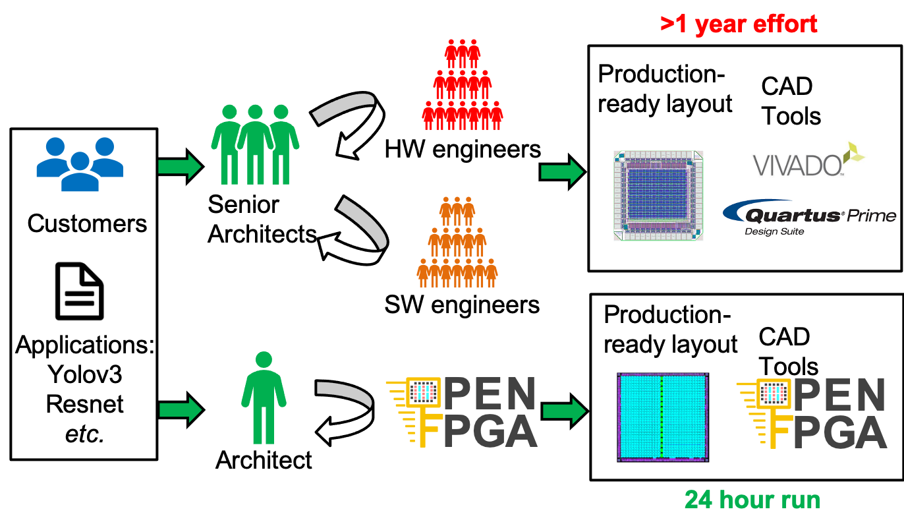
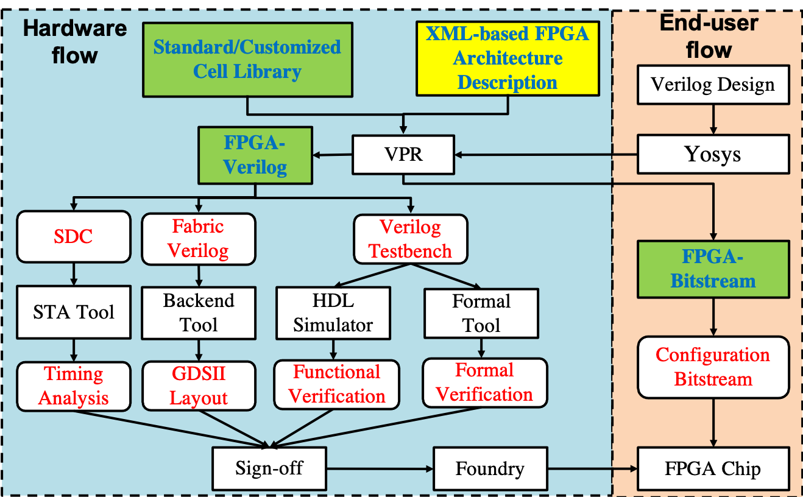

Why OpenFPGA?
-------------

OpenFPGA aims to be an open-source framework that enables rapid prototyping of customizable FPGA architectures. As shown in :numref:`fig_openfpga_motivation`, a conventional approach will take a large group of experienced engineers more than one year to achieve production-ready layout and assoicated CAD tools. In fact, most of the engineering efforts are spent on manual layouts and developing ad-hoc CAD support.

.. _fig_openfpga_motivation:

   Comparison on engineering time and effort to prototype an FPGA using OpenFPGA and conventional approaches [All the layout figures are permitted to publish under proper licenses]

Using OpenFPGA, the development cycle in both hardware and software can be significantly accelerated. OpenFPGA can automatically generate Verilog netlists describing a full FPGA fabric based on an XML-based description file. Thanks to modern semi-custom design tools, production-ready layout generation can be achieved within 24 hours. To help sign-off, OpenFPGA can auto-generate Verilog testbenches to validate the correctness of FPGA fabric using modern verification tools.
OpenFPGA also provides native bitstream generation support based the same XML-based description file used in Verilog generation. This avoid the recurring engineering in developing CAD tools for different FPGAs. Once the FPGA architecture is finalized, the CAD tool is ready to use.

OpenFPGA can support any architecture that VPR can describe, covering most of the architecture enhancements available in modern FPGAs, and hence unlocks a large design space in prototyping customizable FPGAs. In addition, OpenFPGA provides enriched syntax which allows users to customized primitive circuit designed downto transistor-level parameters. This helps developers to customize the P.P.A. (Power, Performance and Area) to the best. All these features open the door of prototyping/studying flexible FPGAs to a small group of junior engineers or researchers. 

In terms of tool functionality, OpenFPGA consists of the following parts: FPGA-Verilog, FPGA-SDC, FPGA-Bitstream and FPGA-SPICE.
The rest of this section will focus on detailed motivation on each of them, as depicted in :numref:`fig_openfpga_flow`. 

.. _fig_openfpga_flow:

   Design flows in different purposes using OpenFPGA

FPGA-Verilog
~~~~~~~~~~~~

Driven by the strong need in data processing applications, Field Programmable Gate Arrays (FPGAs) are playing an ever-increasing role as programmable accelerators in modern
computing systems. To fully unlock processing capabilities for domain-specific applications, FPGA architectures have to be tailored for seamless cooperation with other computing resources. However, prototyping and bringing to production a customized FPGA is a costly and complex endeavor even for industrial vendors. OpenFPGA, an opensource framework, aims to rapid prototype of customizable FPGA architectures through a semi-custom design approach. We propose an XML-to-Prototype design flow, where the Verilog netlists of a full FPGA fabric can be autogenerated using an extension of the XML language from the VTR framework and then fed into a back-end flow to generate production-ready layouts. 

The technical details can be found in our TVLSI'19 paper :cite:`XTang_TVLSI_2019` and FPL'19 paper :cite:`XTang_FPL_2019`.

FPGA-SDC
~~~~~~~~

Design constraints are indepensible in modern ASIC design flows to guarantee the performance level.
OpenFPGA includes a rich SDC generator in the OpenFPGA framework to deal with both PnR constraints and sign-off timing analysis.
Our flow automatically generates two sets of SDC files. The first set of SDC is designed for the P&R flow, where all the combinational loops are broken to enable wellcontrolled timing-driven P&R. In addition, there are SDC files devoted to constrain pin-to-pin timing for all the resources in FPGAs, in order to obtain nicely constrained and homogeneous delays across the fabric. The second set of SDC is designed for the timing analysis of a benchmark at the post P&R stage.

The technical details can be found in our FPL'19 paper :cite:`XTang_FPL_2019`.

FPGA-Bitstream
~~~~~~~~~~~~~~

EDA support is essential for end-users to implement designs on a customized FPGA. OpenFPGA provides a general-purpose bitstream generator FPGA-Bitstream for any architecture that can be described by VPR. As the native CAD tool for any customized FPGA that is produced by FPGA-Verilog, FPGA-Bitstream is ready to use once users finalize the XML-based architecture description file. This eliminates the huge engineering efforts spent on developing bitstream generator for customized FPGAs.

Using FPGA-Bitstream, users can launch (1) Verilog-to-Bitstream flow. This is the typical implementation flow for end-users; (2) Verilog-to-Verification flow. OpenFPGA can output Verilog testbenches with self-testing features to validate users' implemetations on their customized FPGA fabrics.

The technical details can be found in our TVLSI'19 paper :cite:`XTang_TVLSI_2019` and FPL'19 paper :cite:`XTang_FPL_2019`.

FPGA-SPICE
~~~~~~~~~~

The built-in timing and power analysis engines of VPR are based on analytical models :cite:`VBetz_Book_1999,JGoeders_FPT_2012`. Analytical model-based analysis can promise accuracy only on a limited number of circuit designs for which the model is valid. As the technology advancements create more opportunities on circuit designs and FPGA architectures, the analytical power model require to be updated to follow the new trends. However, without referring to simulation results, the analytical power models cannot prove their accuracy. SPICE simulators have the advantages of generality and accuracy over analytical models. For this reason, SPICE simulation results are often selected to check the accuracy of analytical models. Therefore, there is a strong need for a simulation-based power analysis approach for FPGAs, which can support general circuit designs.

It motivates us to develop FPGA-SPICE, an add-on for the current State-of-Art FPGA architecture exploration tools, VPR :cite:`JRose_FPGA_2012`.
FPGA-SPICE aims at generating SPICE netlists and testbenches for the FPGA architectures supported by VPR. The SPICE netlists and testbenches are generated according to the placement and routing results of VPR. As a result, SPICE simulator can be used to perform precise delay and power analysis. The SPICE simulation results are useful in three aspects: (1) it can provide accurate power analysis; (2) it helps to improve the accuracy of built-in analytical models; and moreover (3) it creates opportunities in developing novel analytical models.

SPICE modeling for FPGA architectures requires detailed transistor-level modeling for all the circuit elements within the considered FPGA architecture. However, current VPR architectural description language :cite:`JLuu_FPGA_2011` does not offer enough transistor-level parameters to model the most common circuit modules, such as multiplexers and LUTs. Therefore, we develop an extension on the VPR architectural description language to model the transistor-level circuit designs.

The technical details can be found in our ICCD’15 paper :cite:`XTang_ICCD_2015` and TVLSI'19 paper :cite:`XTang_TVLSI_2019`.
