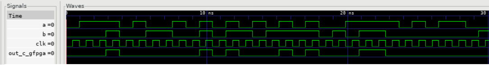
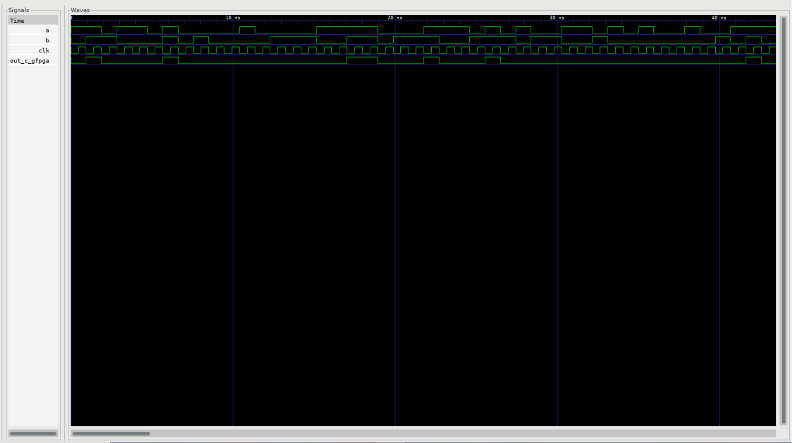

Build an FPGA fabric using Standard Cell Libraries
==================================================

Introduction
~~~~~~~~~~~~

**In this tutorial, we will**
   - Showcase how to create an architecture description based on standard cells, using OpenFPGA's circuit modeling language
   - Use Skywater's Process Development Kit (`PDK`_) cell library to create an OR Gate circuit model for OpenFPGA
   - Verify that the standard cell library file was correctly bound into the selected architecture file by looking at auto-generated OpenFPGA files and checking simulation waveforms in GTKWave
Through this example, we will show how to bind standard cell library files with OpenFPGA Architectures.

.. note:: We showcase the methodology by considering the open-source Skywater 130nm PDK so that users can easily reproduce the results.

Create and Verify the OpenFPGA Circuit Model
~~~~~~~~~~~~~~~~~~~~~~~~~~~~~~~~~~~~~~~~~~~~

.. note:: In this tutorial, we focus on binding a 2-input **OR** gate from a standard cell library to a circuit model in OpenFPGA's architecture description file. Note that the approach can be generalized to any circuit model.

For this tutorial, we start with an example where the HDL netlist of an 2-input **OR** gate that is auto-generated by OpenFPGA. After updating the architecture file, the auto-generated HDL netlist by OpenFPGA will directly instantiate a standard cell from the open-source Skywater 130nm PDK library.
To follow along, go to the root directory of OpenFPGA and enter: 

.. code-block:: bash

   python3 openfpga_flow/scripts_run_fpga_task.py fpga_verilog/adder/hard_adder --debug --show_thread_logs 

This will run a prebuilt task with OpenFPGA cell libraries. When the task is finished, there will be many auto-generated files to look through. For this tutorial, we are interested in the ``luts.v`` and ``and2_formal.vcd`` files. The **OR2** gate is used as a control circuit in the **lut6** circuit model, and the ``and2_formal.vcd`` file will have the resulting waveforms from the simulation run by the task. To open the ``luts.v`` file, run the following command:

.. code-block:: bash

   vi openfpga_flow/tasks/fpga_verilog/adder/hard_adder/latest/k6_frac_N10_tileable_adder_chain_40nm/and2/MIN_ROUTE_CHAN_WIDTH/SRC/sub_module/luts.v

.. note:: Users can find full details about netlist organization in our documentation: :ref:`fabric_netlists`

The ``luts.v`` file represents a Look Up Table within the OpenFPGA architecture. The important lines of this file for the tutorial are highlighted below.
These lines show the instantiation of OpenFPGA's **OR2** cell library.

.. code-block:: verilog
  :emphasize-lines: 58,59,72,73,74,75,76,77,78,79,80 
   
   
   //-------------------------------------------
   //	FPGA Synthesizable Verilog Netlist
   //	Description: Look-Up Tables
   //	Author: Xifan TANG
   //	Organization: University of Utah
   //	Date: Tue Mar 30 15:25:03 2021
   //-------------------------------------------
   //----- Time scale -----
   `timescale 1ns / 1ps
   
   //----- Default net type -----
   `default_nettype none
   
   // ----- Verilog module for frac_lut6 -----
   module frac_lut6(in,
                    sram,
                    sram_inv,
                    mode,
                    mode_inv,
                    lut4_out,
                    lut5_out,
                    lut6_out);
   //----- INPUT PORTS -----
   input [0:5] in;
   //----- INPUT PORTS -----
   input [0:63] sram;
   //----- INPUT PORTS -----
   input [0:63] sram_inv;
   //----- INPUT PORTS -----
   input [0:1] mode;
   //----- INPUT PORTS -----
   input [0:1] mode_inv;
   //----- OUTPUT PORTS -----
   output [0:3] lut4_out;
   //----- OUTPUT PORTS -----
   output [0:1] lut5_out;
   //----- OUTPUT PORTS -----
   output [0:0] lut6_out;
   
   //----- BEGIN wire-connection ports -----
   wire [0:5] in;
   wire [0:3] lut4_out;
   wire [0:1] lut5_out;
   wire [0:0] lut6_out;
   //----- END wire-connection ports -----
   
   
   //----- BEGIN Registered ports -----
   //----- END Registered ports -----
   
   
   wire [0:0] INVTX1_0_out;
   wire [0:0] INVTX1_1_out;
   wire [0:0] INVTX1_2_out;
   wire [0:0] INVTX1_3_out;
   wire [0:0] INVTX1_4_out;
   wire [0:0] INVTX1_5_out;
   wire [0:0] OR2_0_out;
   wire [0:0] OR2_1_out;
   wire [0:0] buf4_0_out;
   wire [0:0] buf4_1_out;
   wire [0:0] buf4_2_out;
   wire [0:0] buf4_3_out;
   wire [0:0] buf4_4_out;
   wire [0:0] buf4_5_out;
   
   // ----- BEGIN Local short connections -----
   // ----- END Local short connections -----
   // ----- BEGIN Local output short connections -----
   // ----- END Local output short connections -----
   
   	OR2 OR2_0_ (
   		.a(mode[0:0]),
   		.b(in[4]),
   		.out(OR2_0_out));
   
   	OR2 OR2_1_ (
   		.a(mode[1]),
   		.b(in[5]),
   		.out(OR2_1_out));
   
   	INVTX1 INVTX1_0_ (
   		.in(in[0:0]),
   		.out(INVTX1_0_out));
   
   	INVTX1 INVTX1_1_ (
   		.in(in[1]),
   		.out(INVTX1_1_out));
   
   	INVTX1 INVTX1_2_ (
   		.in(in[2]),
   		.out(INVTX1_2_out));
   
   	INVTX1 INVTX1_3_ (
   		.in(in[3]),
   		.out(INVTX1_3_out));
   
   	INVTX1 INVTX1_4_ (
   		.in(OR2_0_out),
   		.out(INVTX1_4_out));
   
   	INVTX1 INVTX1_5_ (
   		.in(OR2_1_out),
   		.out(INVTX1_5_out));
   
   	buf4 buf4_0_ (
   		.in(in[0:0]),
   		.out(buf4_0_out));
   
   	buf4 buf4_1_ (
   		.in(in[1]),
   		.out(buf4_1_out));
   
   	buf4 buf4_2_ (
   		.in(in[2]),
   		.out(buf4_2_out));
   
   	buf4 buf4_3_ (
   		.in(in[3]),
   		.out(buf4_3_out));
   
   	buf4 buf4_4_ (
   		.in(OR2_0_out),
   		.out(buf4_4_out));
   
   	buf4 buf4_5_ (
   		.in(OR2_1_out),
   		.out(buf4_5_out));
   
   	frac_lut6_mux frac_lut6_mux_0_ (
   		.in(sram[0:63]),
   		.sram({buf4_0_out, buf4_1_out, buf4_2_out, buf4_3_out, buf4_4_out, buf4_5_out}),
   		.sram_inv({INVTX1_0_out, INVTX1_1_out, INVTX1_2_out, INVTX1_3_out, INVTX1_4_out, INVTX1_5_out}),
   		.lut4_out(lut4_out[0:3]),
   		.lut5_out(lut5_out[0:1]),
   		.lut6_out(lut6_out));
   
   endmodule
   // ----- END Verilog module for frac_lut6 -----
   
   //----- Default net type -----
   `default_nettype none

We will also need to look at the control's simulation waveforms. Viewing the waveforms is done through `GTKWave`_ with the following command:

.. code-block:: bash
   
   gtkwave openfpga_flow/tasks/fpga_verilog/adder/hard_adder/latest/k6_frac_N10_tileable_adder_chain_40nm/and2/MIN_ROUTE_CHAN_WIDTH/and2_formal.vcd &

The simulation waveforms should look similar to the following :numref:`fig_control_output`:

.. _fig_control_output:

   Control Circuit Model's Simulation Waveforms
   

.. note:: The waveform inputs do not need to exactly match because the testbench provides input in random intervals. 

We have now finished creating the control and viewing the important sections for this tutorial. We can now incorporate Skywater's cell library to create a new circuit model.

Clone Skywater PDK into OpenFPGA
~~~~~~~~~~~~~~~~~~~~~~~~~~~~~~~~
We will be using the open-source Skywater Processor Development Kit to aid us in creating our circuit model. We start by cloning the Skywater PDK github repository into the OpenFPGA root directory.
Run the following command in the root directory of OpenFPGA:

.. code-block:: bash

   git clone https://github.com/google/skywater-pdk.git

Once the repository has been cloned, we need to build the cell libraries by running the following command in the Skywater PDK root directory:

.. code-block:: bash
   
   SUBMODULE_VERSION=latest make submodules -j3 || make submodules -j1

This will take some time to complete due to the size of the libraries. Once the libraries are made, creating the circuit model can begin.

Create and Verify the Standard Cell Library Circuit Model
~~~~~~~~~~~~~~~~~~~~~~~~~~~~~~~~~~~~~~~~~~~~~~~~~~~~~~~~~

To create the circuit model, we will modify the ``k6_frac_N10_adder_chain_40nm_openfpga.xml`` OpenFPGA architecture file. We will remove the circuit model 
for OpenFPGA's **OR2** gate, replace the circuit model with one referencing the Skywater cell library, and modify the LUT that references the old **OR2** 
circuit model to reference our new circuit model. We begin by running the following command in the root directory:

.. code-block:: bash

    vi openfpga_flow/openfpga_arch/k6_frac_N10_adder_chain_40nm_openfpga.xml

We begin the circuit model creation process by replacing **LINE67** to **LINE81** with the following:

.. code-block:: xml

   <circuit_model type="gate" name="sky130_fd_sc_ls__or2_1" prefix="sky130_fd_sc_ls__or2_1" verilog_netlist="${OPENFPGA_PATH}/skywater-pdk/libraries/sky130_fd_sc_ls/latest/cells/or2/sky130_fd_sc_ls__or2_1.v">
      <design_technology type="cmos" topology="OR"/>
      <input_buffer exist="false"/>
      <output_buffer exist="false"/>
      <port type="input" prefix="A" size="1"/>
      <port type="input" prefix="B" size="1"/>
      <port type="output" prefix="X" size="1"/>
   </circuit_model>

.. note:: The name of the circuit model must be consistent with the standard cell!

The most significant differences from the control in this section are changing the ``name`` and ``prefix`` to match the module name from Skywater's cell library and including a path
to the verilog file using ``verilog_netlist``. The second change to ``k6_frac_N10_adder_chain_40nm_openfpga.xml`` is at **LINE160**, where we will be replacing the line with the following:

.. code-block:: xml
   
   <port type="input" prefix="in" size="6" tri_state_map="----11" circuit_model_name="sky130_fd_sc_ls__or2_1"/>

This change replaces the input of the LUT with our new circuit model. Everything is in place to begin verification.

Verification begins by running the following command:

.. code-block:: bash

   python3 openfpga_flow/scripts_run_fpga_task.py fpga_verilog/adder/hard_adder --debug --show_thread_logs

The task may output this error:

.. code-block:: bash

   ERROR (00_and2_MIN_ROUTE_CHAN_WIDTH) - iverilog_verification run failed with returncode 1
   ERROR (00_and2_MIN_ROUTE_CHAN_WIDTH) - command iverilog -o compiled_and2 ./SRC/and2_include_netlists.v -s and2_top_formal_verification_random_tb
   ERROR (00_and2_MIN_ROUTE_CHAN_WIDTH) - -->>error: Unable to find the root module "and2_top_formal_verification_random_tb" in the Verilog source.
   ERROR (00_and2_MIN_ROUTE_CHAN_WIDTH) - -->>1 error(s) during elaboration.
   ERROR (00_and2_MIN_ROUTE_CHAN_WIDTH) - Current working directory : OpenFPGA/openfpga_flow/tasks/fpga_verilog/adder/hard_adder/run057/k6_frac_N10_tileable_adder_chain_40nm/and2/MIN_ROUTE_CHAN_WIDTH
   ERROR (00_and2_MIN_ROUTE_CHAN_WIDTH) - Failed to run iverilog_verification task
   ERROR (00_and2_MIN_ROUTE_CHAN_WIDTH) - Exiting . . . . . .
   ERROR (00_and2_MIN_ROUTE_CHAN_WIDTH) - Failed to execute openfpga flow - 00_and2_MIN_ROUTE_CHAN_WIDTH

This error has occurred because IVerilog could not find the path to the Skywater PDK Cell Library we have selected. To fix this, we need to go to the 
``iverilog_output.txt`` file found here:

.. code-block:: bash

   emacs openfpga_flow/tasks/fpga_verilog/adder/hard_adder/latest/k6_frac_N10_tileable_adder_chain_40nm/and2/MIN_ROUTE_CHAN_WIDTH/iverilog_output.txt

Replace all the text within ``iverilog_output.txt`` with the following:

.. code-block:: bash

   iverilog -o compiled_and2 ./SRC/and2_include_netlists.v -s and2_top_formal_verification_random_tb -I ${OPENFPGA_PATH}/skywater-pdk/libraries/sky130_fd_sc_ls/latest/cells/or2

We can now manually rerun IVerilog, a tutorial on manually running IVerilog can be found at our From Verilog to `Verification`_ tutorial. From the root 
directory, run the following commands:

.. code-block:: bash
   
   cd openfpga_flow/tasks/fpga_verilog/adder/hard_adder/latest/k6_frac_N10_tileable_adder_chain_40nm/and2/MIN_ROUTE_CHAN_WIDTH/

   source iverilog_output.txt

   vvp compiled_and2

With IVerilog complete, we can verify the cell library has been bound correctly by viewing the ``luts.v`` file and the waveforms with GTKWave.

From the root directory, view the ``luts.v`` file with this command:

.. code-block:: bash

   vi openfpga_flow/tasks/fpga_verilog/adder/hard_adder/latest/k6_frac_N10_tileable_adder_chain_40nm/and2/MIN_ROUTE_CHAN_WIDTH/SRC/sub_module/luts.v

Scrolling through ``luts.v``, this should be present in the file:

.. code-block:: verilog
  :emphasize-lines: 64,65,72,73,74,75,76,77,78,79,80
   
   //-------------------------------------------
   //	FPGA Synthesizable Verilog Netlist
   //	Description: Look-Up Tables
   //	Author: Xifan TANG
   //	Organization: University of Utah
   //	Date: Tue Mar 30 20:25:06 2021
   //-------------------------------------------
   //----- Time scale -----
   `timescale 1ns / 1ps
   
   //----- Default net type -----
   `default_nettype none
   
   // ----- Verilog module for frac_lut6 -----
   module frac_lut6(in,
                    sram,
                    sram_inv,
                    mode,
                    mode_inv,
                    lut4_out,
                    lut5_out,
                    lut6_out);
   //----- INPUT PORTS -----
   input [0:5] in;
   //----- INPUT PORTS -----
   input [0:63] sram;
   //----- INPUT PORTS -----
   input [0:63] sram_inv;
   //----- INPUT PORTS -----
   input [0:1] mode;
   //----- INPUT PORTS -----
   input [0:1] mode_inv;
   //----- OUTPUT PORTS -----
   output [0:3] lut4_out;
   //----- OUTPUT PORTS -----
   output [0:1] lut5_out;
   //----- OUTPUT PORTS -----
   output [0:0] lut6_out;
   
   //----- BEGIN wire-connection ports -----
   wire [0:5] in;
   wire [0:3] lut4_out;
   wire [0:1] lut5_out;
   wire [0:0] lut6_out;
   //----- END wire-connection ports -----
   
   
   //----- BEGIN Registered ports -----
   //----- END Registered ports -----
   
   
   wire [0:0] INVTX1_0_out;
   wire [0:0] INVTX1_1_out;
   wire [0:0] INVTX1_2_out;
   wire [0:0] INVTX1_3_out;
   wire [0:0] INVTX1_4_out;
   wire [0:0] INVTX1_5_out;
   wire [0:0] buf4_0_out;
   wire [0:0] buf4_1_out;
   wire [0:0] buf4_2_out;
   wire [0:0] buf4_3_out;
   wire [0:0] buf4_4_out;
   wire [0:0] buf4_5_out;
   wire [0:0] sky130_fd_sc_ls__or2_1_0_X;
   wire [0:0] sky130_fd_sc_ls__or2_1_1_X;
   
   // ----- BEGIN Local short connections -----
   // ----- END Local short connections -----
   // ----- BEGIN Local output short connections -----
   // ----- END Local output short connections -----
   
   	sky130_fd_sc_ls__or2_1 sky130_fd_sc_ls__or2_1_0_ (
   		.A(mode[0:0]),
   		.B(in[4]),
   		.X(sky130_fd_sc_ls__or2_1_0_X));
   
   	sky130_fd_sc_ls__or2_1 sky130_fd_sc_ls__or2_1_1_ (
   		.A(mode[1]),
   		.B(in[5]),
   		.X(sky130_fd_sc_ls__or2_1_1_X));
   
   	INVTX1 INVTX1_0_ (
   		.in(in[0:0]),
   		.out(INVTX1_0_out));
   
   	INVTX1 INVTX1_1_ (
   		.in(in[1]),
   		.out(INVTX1_1_out));
   
   	INVTX1 INVTX1_2_ (
   		.in(in[2]),
   		.out(INVTX1_2_out));
   
   	INVTX1 INVTX1_3_ (
   		.in(in[3]),
   		.out(INVTX1_3_out));
   
   	INVTX1 INVTX1_4_ (
   		.in(sky130_fd_sc_ls__or2_1_0_X),
   		.out(INVTX1_4_out));
   
   	INVTX1 INVTX1_5_ (
   		.in(sky130_fd_sc_ls__or2_1_1_X),
   		.out(INVTX1_5_out));
   
   	buf4 buf4_0_ (
   		.in(in[0:0]),
   		.out(buf4_0_out));
   
   	buf4 buf4_1_ (
   		.in(in[1]),
   		.out(buf4_1_out));
   
   	buf4 buf4_2_ (
   		.in(in[2]),
   		.out(buf4_2_out));
   
   	buf4 buf4_3_ (
   		.in(in[3]),
   		.out(buf4_3_out));
   
   	buf4 buf4_4_ (
   		.in(sky130_fd_sc_ls__or2_1_0_X),
   		.out(buf4_4_out));
   
   	buf4 buf4_5_ (
   		.in(sky130_fd_sc_ls__or2_1_1_X),
   		.out(buf4_5_out));
   
   	frac_lut6_mux frac_lut6_mux_0_ (
   		.in(sram[0:63]),
   		.sram({buf4_0_out, buf4_1_out, buf4_2_out, buf4_3_out, buf4_4_out, buf4_5_out}),
   		.sram_inv({INVTX1_0_out, INVTX1_1_out, INVTX1_2_out, INVTX1_3_out, INVTX1_4_out, INVTX1_5_out}),
   		.lut4_out(lut4_out[0:3]),
   		.lut5_out(lut5_out[0:1]),
   		.lut6_out(lut6_out));
   
   endmodule
   // ----- END Verilog module for frac_lut6 -----
   
   //----- Default net type -----
   `default_nettype none

We can check the waveforms as well to see if they are similar with the command: 

.. code-block:: bash
   
   gtkwave openfpga_flow/tasks/fpga_verilog/adder/hard_adder/latest/k6_frac_N10_tileable_adder_chain_40nm/and2/MIN_ROUTE_CHAN_WIDTH/and2_formal.vcd &

The simulation waveforms should look similar to the following :numref:`fig_custom_output`:

.. _fig_custom_output:

   Custom Circuit Model's Simulation Waveforms

We have now verified that the Skywater PDK Cell Library has been instantiated and bound to the OpenFPGA architecture file. If you have any problems, please reach out to us.

.. _Verification: https://openfpga.readthedocs.io/en/master/tutorials/design_flow/verilog2verification/

.. _PDK: https://github.com/google/skywater-pdk

.. _GTKWave: https://github.com/gtkwave/gtkwave
