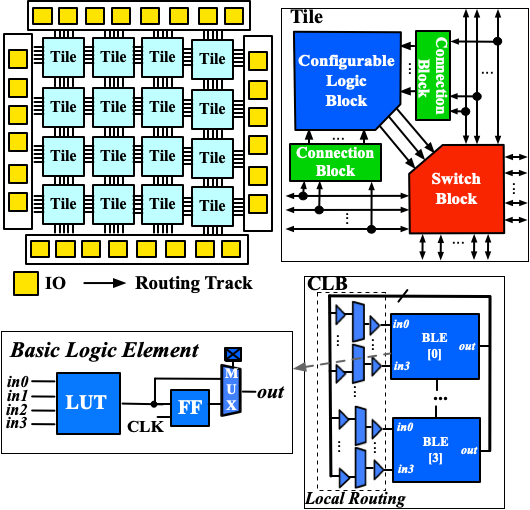

.. _arch_quick_start:

A Quick Start
-------------

In this tutorial, we will consider a simple but representative FPGA architecture to show you how to
  - Adapt a VPR architecture XML file to OpenFPGA acceptable format
  - Create an OpenFPGA architecture XML file to customize the primitive circuits
  - Create a simulation setting XML file to specify the simulation settings 

Through this quick example, we will introduce the key steps to build your own FPGA based on a VPR architecture template.

.. note:: These tips are generic and fundamental to build any architecture file for OpenFPGA.

Adapt VPR Architecture 
~~~~~~~~~~~~~~~~~~~~~~
We start with the VPR architecture `template
<https://github.com/verilog-to-routing/vtr-verilog-to-routing/blob/master/vtr_flow/arch/timing/k4_N4_90nm.xml>`_.
This file models a homogeneous FPGA, as illustrated in :numref:`fig_k4n4_arch`.

.. _fig_k4n4_arch:

   K4N4 FPGA architecture 

A summary of the architectural features is as follows:
  - An array of tiles surrounded by a ring of I/O blocks
  - K4N4 Configurable Logic Block (CLB), which consists of four Basic Logic Elements (BLEs) and a fully-connected crossbar. Each BLE contains a 4-input Look-Up Table (LUT), a Flip-Flop (FF) and a 2:1 routing multiplexer
  - Length-1 routing wires interconnected by Wilton-Style Switch Block (SB)

The VPR architecture description is designed for EDA needs mainly, which lacks the details physical modelingrequired by OpenFPGA.
Here, we show a step-by-step adaption on the architecture template.

Physical I/O Modeling
^^^^^^^^^^^^^^^^^^^^^
OpenFPGA requires a physical I/O block rather the abstract I/O modeling of VPR.
The ``<pb_type name="io">`` under the ``<complexblocklist>`` should be adapted to the following:

.. code-block:: xml

   <!-- Define I/O pads begin -->
   <pb_type name="io">
     <input name="outpad" num_pins="1"/>
     <output name="inpad" num_pins="1"/>

     <!-- A mode denotes the physical implementation of an I/O 
           This mode will not be used by packer but is mainly used for fabric verilog generation   
       -->
     <mode name="physical" packable="false">
       <pb_type name="iopad" blif_model=".subckt io" num_pb="1">
         <input name="outpad" num_pins="1"/>
         <output name="inpad" num_pins="1"/>
       </pb_type>
       <interconnect>
         <direct name="outpad" input="io.outpad" output="iopad.outpad">
           <delay_constant max="1.394e-11" in_port="io.outpad" out_port="iopad.outpad"/>
         </direct>
         <direct name="inpad" input="iopad.inpad" output="io.inpad">
           <delay_constant max="4.243e-11" in_port="iopad.inpad" out_port="io.inpad"/>
         </direct>
       </interconnect>
     </mode>

     <!-- Operating modes of I/O used by VPR
          IOs can operate as either inputs or outputs. -->
     <mode name="inpad">
       <pb_type name="inpad" blif_model=".input" num_pb="1">
         <output name="inpad" num_pins="1"/>
       </pb_type>
       <interconnect>
         <direct name="inpad" input="inpad.inpad" output="io.inpad">
           <delay_constant max="9.492000e-11" in_port="inpad.inpad" out_port="io.inpad"/>
         </direct>
       </interconnect>
     </mode>
     <mode name="outpad">
       <pb_type name="outpad" blif_model=".output" num_pb="1">
         <input name="outpad" num_pins="1"/>
       </pb_type>
       <interconnect>
         <direct name="outpad" input="io.outpad" output="outpad.outpad">
           <delay_constant max="2.675000e-11" in_port="io.outpad" out_port="outpad.outpad"/>
         </direct>
       </interconnect>
     </mode>
  </pb_type>

Note that, there are several major changes in the above codes, when compared to the original code.
  - We added a physical ``mode`` of I/O in addition to the original VPR I/O modeling, which is close to the physical implementation of an I/O cell. OpenFPGA will output fabric netlists base on the physical implementation rather than the operating modes.
  - We remove the ``clock`` port of I/O is actually a dangling port.
  - We specify that the phyical ``mode`` to be disabled for VPR packer by using ``packable=false``. This can help reduce packer's runtime.

Since, we have added a new BLIF model ``subckt io`` to the architecture modeling, we should update the ``<models>`` XML node by adding a new I/O model. 
  
.. code-block:: xml
   
  <models>
    <!-- A virtual model for I/O to be used in the physical mode of io block -->
    <model name="io">
      <input_ports>
        <port name="outpad"/>
      </input_ports>
      <output_ports>
        <port name="inpad"/>
      </output_ports>
    </model>
  </models>

Tileable Architecture
^^^^^^^^^^^^^^^^^^^^^
OpenFPGA does support fine-grained tile-based architecture as shown in :numref:`fig_k4n4_arch`.
The tileable architecture leads to fast netlist generation as well as enables highly optimized physical designs through backend flow.
To turn on the tileable architecture, the ``tileable`` property should be added to ``<layout>`` node.

.. code-block:: xml

  <layout tileable="true">

By enabling this, all the Switch Blocks and Connection Blocks will be generated as identical as possible.
As a result, for any FPGA array size, there are only 9 unique tiles to be generated in netlists.
See details in :cite:`XTang_FPT_2019`.

Detailed guidelines can be found at :ref:`addon_vpr_syntax`.

Craft OpenFPGA Architecture
~~~~~~~~~~~~~~~~~~~~~~~~~~~

OpenFPGA needs another XML file which contains detailed modeling on the physical design of FPGA architecture.
This is designed to minimize the modification on the original VPR architecture file, so that it can be reused.
You may create an XML file `k4_n4_openfpga_arch.xml` and then add contents shown as follows.

Overview on the Structure
^^^^^^^^^^^^^^^^^^^^^^^^^

An OpenFPGA architecture including the following parts.
  - Architecture modeling with a focus on circuit-level description
  - Configuration protocol definition
  - Annotation on the VPR architecture modules

These parts are organized as follows in the XML file.

.. code-block:: xml

  <openfpga_architecture>
    <!-- Technology-related (device/transistor-level) information
    <technology_library>
      ...
    </technology_library>

    <!-- Circuit-level description -->
    <circuit_library>
      ...
    </circuit_library>

    <!-- Configuration protocol definition --> 
    <configuration_protocol>
      ...
    </configuration_protocol>

    <!-- Annotation on VPR architecture modules -->
    <connection_block>
      ...
    </connection_block>
    <switch_block>
      ...
    </switch_block>
    <routing_segment>
      ...
    </routing_segment>
    <pb_type_annotations>
      ...
    </pb_type_annotations>
  </openfpga_architecture>

Technology Library Definition
^^^^^^^^^^^^^^^^^^^^^^^^^^^^^
Technology information are all stored under the ``<technology_library>`` node, which contains transistor-level information to build the FPGA.
Here, we bind to the open-source ASU Predictive Technology Modeling (PTM) 45nm process library.
See details in :ref:`technology_library`.

.. code-block:: xml

  <technology_library>
    <device_library>
      <device_model name="logic" type="transistor">
        <lib type="industry" corner="TOP_TT" ref="M" path="${OPENFPGA_PATH}/openfpga_flow/tech/PTM_45nm/45nm.pm"/>
        <design vdd="0.9" pn_ratio="2"/>
        <pmos name="pch" chan_length="40e-9" min_width="140e-9" variation="logic_transistor_var"/>
        <nmos name="nch" chan_length="40e-9" min_width="140e-9" variation="logic_transistor_var"/>
      </device_model>
      <device_model name="io" type="transistor">
        <lib type="academia" ref="M" path="${OPENFPGA_PATH}/openfpga_flow/tech/PTM_45nm/45nm.pm"/>
        <design vdd="2.5" pn_ratio="3"/>
        <pmos name="pch_25" chan_length="270e-9" min_width="320e-9" variation="io_transistor_var"/>
        <nmos name="nch_25" chan_length="270e-9" min_width="320e-9" variation="io_transistor_var"/>
      </device_model>
    </device_library>
    <variation_library>
      <variation name="logic_transistor_var" abs_deviation="0.1" num_sigma="3"/>
      <variation name="io_transistor_var" abs_deviation="0.1" num_sigma="3"/>
    </variation_library>
  </technology_library>

.. note:: These information are important for FPGA-SPICE to correctly generate netlists. If you are not using FPGA-SPICE, you may provide a dummy technology library.

Circuit Library Definition
^^^^^^^^^^^^^^^^^^^^^^^^^^^^^

Circuit library is the crucial component of the architecture description, which contains a list of ``<circuit_model>``, each of which describes how a circuit is implemented for a FPGA component.

Typically, we will defined a few atom ``<circuit_model>`` which are used to build primitive ``<circuit_model>``.

.. code-block:: xml

  <circuit_library>
    <!-- Atom circuit models begin-->
    <circuit_model>
      ...
    </circuit_model>
    <!-- Atom circuit models end-->

    <!-- Primitive circuit models begin -->
    <circuit_model>
      ...
    </circuit_model>
    <!-- Primitive circuit models end -->
  </circuit_library>

.. note:: Primitive ``<circuit_model>`` are the circuits which are directly used to build a FPGA component, such as Look-Up Table (LUT). Atom ``<circuit_model>`` are the circuits which are only used inside primitive ``<circuit_model>``.

In this tutorial, we need the following atom ``<circuit_model>``, which are inverters, buffers and pass-gate logics.

.. code-block:: xml

  <!-- Atom circuit models begin-->
  <circuit_model type="inv_buf" name="INVTX1" prefix="INVTX1" is_default="true">
    <design_technology type="cmos" topology="inverter" size="1"/>
    <port type="input" prefix="in" size="1"/>
    <port type="output" prefix="out" size="1"/>
    <delay_matrix type="rise" in_port="in" out_port="out">
      10e-12
    </delay_matrix>
    <delay_matrix type="fall" in_port="in" out_port="out">
      10e-12
    </delay_matrix>
  </circuit_model>
  <circuit_model type="inv_buf" name="buf4" prefix="buf4" is_default="false">
    <design_technology type="cmos" topology="buffer" size="1" num_level="2" f_per_stage="4"/>
    <port type="input" prefix="in" size="1"/>
    <port type="output" prefix="out" size="1"/>
    <delay_matrix type="rise" in_port="in" out_port="out">
      10e-12
    </delay_matrix>
    <delay_matrix type="fall" in_port="in" out_port="out">
      10e-12
    </delay_matrix>
  </circuit_model>
  <circuit_model type="inv_buf" name="tap_buf4" prefix="tap_buf4" is_default="false">
    <design_technology type="cmos" topology="buffer" size="1" num_level="3" f_per_stage="4"/>
    <port type="input" prefix="in" size="1"/>
    <port type="output" prefix="out" size="1"/>
    <delay_matrix type="rise" in_port="in" out_port="out">
      10e-12
    </delay_matrix>
    <delay_matrix type="fall" in_port="in" out_port="out">
      10e-12
    </delay_matrix>
  </circuit_model>
  <circuit_model type="pass_gate" name="TGATE" prefix="TGATE" is_default="true">
    <design_technology type="cmos" topology="transmission_gate" nmos_size="1" pmos_size="2"/>
    <input_buffer exist="false"/>
    <output_buffer exist="false"/>
    <port type="input" prefix="in" size="1"/>
    <port type="input" prefix="sel" size="1"/>
    <port type="input" prefix="selb" size="1"/>
    <port type="output" prefix="out" size="1"/>
    <delay_matrix type="rise" in_port="in sel selb" out_port="out">
      10e-12 5e-12 5e-12
    </delay_matrix>
    <delay_matrix type="fall" in_port="in sel selb" out_port="out">
      10e-12 5e-12 5e-12
    </delay_matrix>
  </circuit_model>
  <circuit_model type="chan_wire" name="chan_segment" prefix="track_seg" is_default="true">
    <design_technology type="cmos"/>
    <input_buffer exist="false"/>
    <output_buffer exist="false"/>
    <port type="input" prefix="in" size="1"/>
    <port type="output" prefix="out" size="1"/>
    <wire_param model_type="pi" R="101" C="22.5e-15" num_level="1"/> <!-- model_type could be T, res_val and cap_val DON'T CARE -->
  </circuit_model>
  <circuit_model type="wire" name="direct_interc" prefix="direct_interc" is_default="true">
    <design_technology type="cmos"/>
    <input_buffer exist="false"/>
    <output_buffer exist="false"/>
    <port type="input" prefix="in" size="1"/>
    <port type="output" prefix="out" size="1"/>
    <wire_param model_type="pi" R="0" C="0" num_level="1"/> <!-- model_type could be T, res_val cap_val should be defined -->
  </circuit_model>
  <!-- Atom circuit models end-->

In this tutorial, we require the following primitive ``<circuit_model>``, which are routing multiplexers, Look-Up Tables, I/O cells in FPGA architecture (see :numref:`fig_k4n4_arch`).

.. note:: We use different routing multiplexer circuits to maximum the performance by considering it fan-in and fan-out in the architecture context.

.. note:: We specify that external Verilog netlists will be used for the circuits of Flip-Flops (FFs) ``static_dff`` and ``sc_dff_compact``, as well as the circuit of I/O cell ``iopad``. Other circuit models will be auto-generated by OpenFPGA.

.. code-block:: xml

  <!-- Primitive circuit models begin -->
  <circuit_model type="mux" name="mux_2level" prefix="mux_2level" dump_structural_verilog="true">
    <design_technology type="cmos" structure="multi_level" num_level="2" add_const_input="true" const_input_val="1"/>
    <input_buffer exist="true" circuit_model_name="INVTX1"/>
    <output_buffer exist="true" circuit_model_name="INVTX1"/>
    <pass_gate_logic circuit_model_name="TGATE"/>
    <port type="input" prefix="in" size="1"/>
    <port type="output" prefix="out" size="1"/>
    <port type="sram" prefix="sram" size="1"/>
  </circuit_model>
  <circuit_model type="mux" name="mux_2level_tapbuf" prefix="mux_2level_tapbuf" dump_structural_verilog="true">
    <design_technology type="cmos" structure="multi_level" num_level="2" add_const_input="true" const_input_val="1"/>
    <input_buffer exist="true" circuit_model_name="INVTX1"/>
    <output_buffer exist="true" circuit_model_name="tap_buf4"/>
    <pass_gate_logic circuit_model_name="TGATE"/>
    <port type="input" prefix="in" size="1"/>
    <port type="output" prefix="out" size="1"/>
    <port type="sram" prefix="sram" size="1"/>
  </circuit_model>
  <circuit_model type="mux" name="mux_1level_tapbuf" prefix="mux_1level_tapbuf" is_default="true" dump_structural_verilog="true">
    <design_technology type="cmos" structure="one_level" add_const_input="true" const_input_val="1"/>
    <input_buffer exist="true" circuit_model_name="INVTX1"/>
    <output_buffer exist="true" circuit_model_name="tap_buf4"/>
    <pass_gate_logic circuit_model_name="TGATE"/>
    <port type="input" prefix="in" size="1"/>
    <port type="output" prefix="out" size="1"/>
    <port type="sram" prefix="sram" size="1"/>
  </circuit_model>
  <!--DFF subckt ports should be defined as <D> <Q> <CLK> <RESET> <SET>  -->
  <circuit_model type="ff" name="static_dff" prefix="dff" spice_netlist="${OPENFPGA_PATH}/openfpga_flow/SpiceNetlists/ff.sp" verilog_netlist="${OPENFPGA_PATH}/openfpga_flow/VerilogNetlists/ff.v">
     <design_technology type="cmos"/>
     <input_buffer exist="true" circuit_model_name="INVTX1"/>
     <output_buffer exist="true" circuit_model_name="INVTX1"/>
     <port type="input" prefix="D" size="1"/>
     <port type="input" prefix="set" size="1" is_global="true" default_val="0" is_set="true"/>
     <port type="input" prefix="reset" size="1" is_global="true" default_val="0" is_reset="true"/>
     <port type="output" prefix="Q" size="1"/>
     <port type="clock" prefix="clk" size="1" is_global="true" default_val="0" />
  </circuit_model>
  <circuit_model type="lut" name="lut4" prefix="lut4" dump_structural_verilog="true">
    <design_technology type="cmos"/>
    <input_buffer exist="true" circuit_model_name="INVTX1"/>
    <output_buffer exist="true" circuit_model_name="INVTX1"/>
    <lut_input_inverter exist="true" circuit_model_name="INVTX1"/>
    <lut_input_buffer exist="true" circuit_model_name="buf4"/>
    <pass_gate_logic circuit_model_name="TGATE"/>
    <port type="input" prefix="in" size="4"/>
    <port type="output" prefix="out" size="1"/>
    <port type="sram" prefix="sram" size="16"/>
  </circuit_model>
  <!--Scan-chain DFF subckt ports should be defined as <D> <Q> <Qb> <CLK> <RESET> <SET>  -->
  <circuit_model type="ccff" name="sc_dff_compact" prefix="scff" spice_netlist="${OPENFPGA_PATH}/openfpga_flow/SpiceNetlists/ff.sp" verilog_netlist="${OPENFPGA_PATH}/openfpga_flow/VerilogNetlists/ff.v">
     <design_technology type="cmos"/>
     <input_buffer exist="true" circuit_model_name="INVTX1"/>
     <output_buffer exist="true" circuit_model_name="INVTX1"/>
     <port type="input" prefix="pReset" lib_name="reset" size="1" is_global="true" default_val="0" is_reset="true" is_prog="true"/>
     <port type="input" prefix="D" size="1"/>
     <port type="output" prefix="Q" size="1"/>
     <port type="output" prefix="Qb" size="1"/>
     <port type="clock" prefix="prog_clk" lib_name="clk" size="1" is_global="true" default_val="0" is_prog="true"/>
  </circuit_model>
  <circuit_model type="iopad" name="iopad" prefix="iopad" spice_netlist="${OPENFPGA_PATH}/openfpga_flow/SpiceNetlists/io.sp" verilog_netlist="${OPENFPGA_PATH}/openfpga_flow/VerilogNetlists/io.v">
    <design_technology type="cmos"/>
    <input_buffer exist="true" circuit_model_name="INVTX1"/>
    <output_buffer exist="true" circuit_model_name="INVTX1"/>
    <port type="inout" prefix="pad" size="1" is_global="true" is_io="true"/>
    <port type="sram" prefix="en" size="1" mode_select="true" circuit_model_name="sc_dff_compact" default_val="1"/>
    <port type="input" prefix="outpad" size="1"/>
    <port type="output" prefix="inpad" size="1"/>
  </circuit_model>
  <!-- Primitive circuit models end -->

See details in :ref:`circuit_library` and :ref:`circuit_model_examples`.

Annotation on VPR Architecture
^^^^^^^^^^^^^^^^^^^^^^^^^^^^^^
In this part, we bind the ``<circuit_model>`` defined in the circuit library to each FPGA component.

We specify that the FPGA fabric will be configured through a chain of Flip-Flops (FFs), which is built with the ``<circuit_model name=sc_dff_compact>``.

.. code-block:: xml

  <configuration_protocol>
    <organization type="scan_chain" circuit_model_name="sc_dff_compact"/>
  </configuration_protocol>

For the routing architecture, we specify the ``circuit_model`` to be used as routing multiplexers inside Connection Blocks (CBs), Switch Blocks (SBs), and also the routing wires.

.. code-block:: xml

  <connection_block>
    <switch name="ipin_cblock" circuit_model_name="mux_2level_tapbuf"/>
  </connection_block>
  <switch_block>
    <switch name="0" circuit_model_name="mux_2level_tapbuf"/>
  </switch_block>
  <routing_segment>
    <segment name="L4" circuit_model_name="chan_segment"/>
  </routing_segment>

.. note:: For a correct binding, the name of connection block, switch block and routing segment should match the name definition in your VPR architecture description! 

For each ``<pb_type>`` defined in the ``<complexblocklist>`` of VPR architecture, we need to specify

- The physical mode for any ``<pb_type>`` that contains multiple ``<mode>``. The name of the physical mode  should match a mode name that is defined in the VPR architecture. For example:

.. code-block:: xml

  <pb_type name="io" physical_mode_name="physical"/>

- The circuit model used to implement any primitive ``<pb_type>`` in physical modes. It is required to provide full hierarchy of the ``pb_type``. For example:

.. code-block:: xml

  <pb_type name="io[physical].iopad" circuit_model_name="iopad" mode_bits="1"/> 

.. note:: Mode-selection bits should be provided as the default configuration for a configurable resource. In this example, an I/O cell has a configuration bit, as defined in the ``<circuit_model name="iopad">``. We specify that by default, the configuration memory will be set to logic ``1``.

- The physical ``<pb_type>`` for any ``<pb_type>`` in the operating modes (mode other than the physical mode). This is required to translate mapping results from operating modes to their physical modes, in order to generate bitstreams. It is required to provide full hierarchy of the ``pb_type``. For example, 

.. code-block:: xml

  <pb_type name="io[inpad].inpad" physical_pb_type_name="io[physical].iopad" mode_bits="1"/> 

.. note:: Mode-selection bits should be provided so as to configure the circuits to be functional as required by the operating mode. In this example, an I/O cell will be configured with a logic ``1`` when operating as an input pad.

- The circuit model used to implement interconnecting modules. The interconnect name should match the definition in the VPR architecture file. For example, 

.. code-block:: xml

  <interconnect name="crossbar" circuit_model_name="mux_2level"/>

.. note:: If not specified, each interconnect will be binded to its default ``circuit_model``. For example, the crossbar will be binded to the default multiplexer ``<circuit_model name="mux_1level_tapbuf">``, if not specified here. 

.. note:: OpenFPGA automatically infers the type of circuit model required by each interconnect.

The complete annotation is shown as follows:

.. code-block:: xml

  <pb_type_annotations>
    <!-- physical pb_type binding in complex block IO -->
    <pb_type name="io" physical_mode_name="physical"/>
    <pb_type name="io[physical].iopad" circuit_model_name="iopad" mode_bits="1"/> 
    <pb_type name="io[inpad].inpad" physical_pb_type_name="io[physical].iopad" mode_bits="1"/> 
    <pb_type name="io[outpad].outpad" physical_pb_type_name="io[physical].iopad" mode_bits="0"/> 
    <!-- End physical pb_type binding in complex block IO -->

    <!-- physical pb_type binding in complex block CLB -->
    <!-- physical mode will be the default mode if not specified -->
    <pb_type name="clb">
      <!-- Binding interconnect to circuit models as their physical implementation, if not defined, we use the default model -->
      <interconnect name="crossbar" circuit_model_name="mux_2level"/>
    </pb_type>
    <pb_type name="clb.fle[n1_lut4].ble4.lut4" circuit_model_name="lut4"/>
    <pb_type name="clb.fle[n1_lut4].ble4.ff" circuit_model_name="static_dff"/>
    <!-- End physical pb_type binding in complex block IO -->
  </pb_type_annotations>

See details in :ref:`annotate_vpr_arch`.

Simulation Settings
~~~~~~~~~~~~~~~~~~~

OpenFPGA needs an XML file where detailed simulation settings are defined.
The simulation settings contain critical parameters to build testbenches for verify the FPGA fabric. 

You may create an XML file `k4_n4_openfpga_simulation.xml` and then add contents shown as follows.

The complete annotation is shown as follows:

.. code-block:: xml

  <openfpga_simulation_setting>
    <clock_setting>
      <operating frequency="auto" num_cycles="auto" slack="0.2"/>
      <programming frequency="100e6"/>
    </clock_setting>
    <simulator_option>
      <operating_condition temperature="25"/>
      <output_log verbose="false" captab="false"/>
      <accuracy type="abs" value="1e-13"/>
      <runtime fast_simulation="true"/>
    </simulator_option>
    <monte_carlo num_simulation_points="2"/>
    <measurement_setting>
      <slew>
        <rise upper_thres_pct="0.95" lower_thres_pct="0.05"/>
        <fall upper_thres_pct="0.05" lower_thres_pct="0.95"/>
      </slew>
      <delay>
        <rise input_thres_pct="0.5" output_thres_pct="0.5"/>
        <fall input_thres_pct="0.5" output_thres_pct="0.5"/>
      </delay>
    </measurement_setting>
    <stimulus>
      <clock>
        <rise slew_type="abs" slew_time="20e-12" />
        <fall slew_type="abs" slew_time="20e-12" />
      </clock>
      <input>
        <rise slew_type="abs" slew_time="25e-12" />
        <fall slew_type="abs" slew_time="25e-12" />
      </input>
    </stimulus>
  </openfpga_simulation_setting>

The ``<clock_setting>`` is crucial to create clock signals in testbenches.

.. note:: FPGA has two types of clocks, one is the operating clock which controls applications that mapped to FPGA fabric, while the other is the programming clock which controls the configuration protocol.

In this example, we specify 

- the operating clock will follow the maximum frequency achieved by VPR routing results
- the number of operating clock cycles to be used will follow the average signal activities of the RTL design that is mapped to the FPGA fabric.
- the actual operating clock frequency will be relaxed (reduced) by 20% by considering the errors between VPR results and physical designs.
- the programming clock frequency is fixed at 200MHz

The ``<simulator_option>`` are the options for SPICE simulator.
Here we specify

- SPICE simulations will consider a 25 :math:`^\circ C` temperature.
- SPICE simulation will output results in a compact way without details on node capacitances.
- SPICE simulation will use ``0.1ps`` as the minimum time step.
- SPICE simulation will consider fast algorithms to speed up runtime.

The ``<monte_carlo num_simulation_points="2"/>`` are the options for SPICE simulator.
Here we specify that for each testbench, we will consider two Monte-Carlo simulations to evaluate the impact of process variations.

The ``<measurement_setting>`` specify how the output signals will be measured for delay and power evaluation.
Here we specify that 

- for slew calculation (used in power estimation), we consider from the 5% of the ``VDD`` to the 95% of the ``VDD`` for both rising and falling edges.
- for delay calculation, we consider from the 50% of the ``VDD`` of input signal to the 50% of the ``VDD`` of output signals for both rising and falling edges.

In the ``<stimulus>``, we specify that ``20ps`` slew time will be applied to built clock waverforms in SPICE simulations.

See details in :ref:`simulation_setting`.
