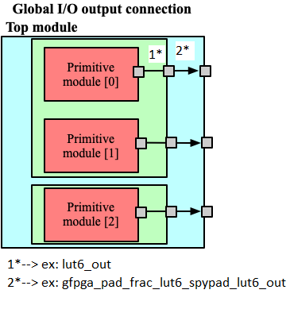
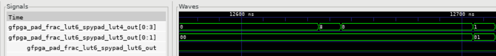
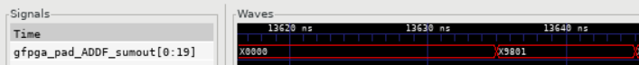

Creating Spypads Using XML Syntax
=================================

Introduction
~~~~~~~~~~~~

**In this tutorial, we will**
   - Show the XML Syntax for Global Outputs
   - Showcase an example with Spypads
   - Modify an existing architecture to incorporate Spypads
   - Verify correctness through GTKWave

Through this tutorial, we will show how to create Spypads in OpenFPGA.

Spypads are physical output pins on a FPGA chip through which you can read out internal signals when doing silicon-level debugging. The XML syntax for spypads and other 
global signals can be found on our :ref:`circuit_library` documentation page.

To create a spypad, the ``port type`` needs to be set to **output** and ``is_global`` and ``is_io`` need to be set to **true**:

.. code-block:: xml

   <port type="output" is_global="true" is_io="true"/>

When the port is syntactically correct, the outputs are independently wired from different instances to separated FPGA outputs and would physically look like :ref:`fig_gpout_ports` 

Pre-Built Spypads
~~~~~~~~~~~~~~~~~

An OpenFPGA architecture file that contains spypads and has a task that references it is the `k6_frac_N10_adder_register_scan_chain_depop50_spypad_40nm_openfpga.xml <https://github.com/lnis-uofu/OpenFPGA/blob/tutorials/openfpga_flow/openfpga_arch/k6_frac_N10_adder_register_scan_chain_depop50_spypad_40nm_openfpga.xml>`_ 
file. We can view ``k6_frac_N10_adder_register_scan_chain_depop50_spypad_40nm_openfpga.xml`` by entering the following command at the root directory of OpenFPGA:

.. code-block:: bash

   emacs openfpga_flow/openfpga_arch/k6_frac_N10_adder_register_scan_chain_depop50_spypad_40nm_openfpga.xml

The spypads are defined from **LINE181** to **LINE183** and belong to the ``frac_lut6_spypad`` ``circuit_model`` that begins at **LINE172**

.. code-block:: xml
   
   <circuit_model type="lut" name="frac_lut6_spypad" prefix="frac_lut6_spypad" dump_structural_verilog="true">
      <design_technology type="cmos" fracturable_lut="true"/>
      <input_buffer exist="true" circuit_model_name="INVTX1"/>
      <output_buffer exist="true" circuit_model_name="INVTX1"/>
      <lut_input_inverter exist="true" circuit_model_name="INVTX1"/>
      <lut_input_buffer exist="true" circuit_model_name="buf4"/>
      <lut_intermediate_buffer exist="true" circuit_model_name="buf4" location_map="-1-1-"/>
      <pass_gate_logic circuit_model_name="TGATE"/>
      <port type="input" prefix="in" size="6" tri_state_map="----11" circuit_model_name="OR2"/>
      LINE181 <port type="output" prefix="lut4_out" size="4" lut_frac_level="4" lut_output_mask="0,1,2,3" is_global="true" is_io="true"/>
      LINE182 <port type="output" prefix="lut5_out" size="2" lut_frac_level="5" lut_output_mask="0,1" is_global="true" is_io="true"/>
      LINE183 <port type="output" prefix="lut6_out" size="1" lut_output_mask="0" is_global="true" is_io="true"/>
      <port type="sram" prefix="sram" size="64"/>
      <port type="sram" prefix="mode" size="2" mode_select="true" circuit_model_name="DFFR" default_val="1"/>
   </circuit_model>

The spypads are instantiated in the top-level verilog module ``fpga_top.v``. ``fpga_top.v`` is automatically generated when we run our task from the OpenFPGA root
directory. However, we need to modify the task configuration file to run the **full testbench** instead of the **formal testbench** to view the spypads' waveforms in 
GTKWave. 

.. note:: To read about the differences between the **formal testbench** and the **full testbench**, please visit our page on testbenches: :ref:`testbench`.

To open the task configuration file, run this command from the root directory of OpenFPGA:

.. code-block:: bash

   emacs openfpga_flow/tasks/fpga_verilog/spypad/config/task.conf

The last line of the task configuration file (**LINE44**) sets the **formal testbench** to be the desired testbench. To use the **full testbench**, comment out **LINE44**.
The file will look like this when finished:

.. code-block:: python
   :linenos:
   :emphasize-lines: 44
   
   # = = = = = = = = = = = = = = = = = = = = = = = = = = = = = = = = = = = = = = =
   # Configuration file for running experiments
   # = = = = = = = = = = = = = = = = = = = = = = = = = = = = = = = = = = = = = = =
   # timeout_each_job : FPGA Task script splits fpga flow into multiple jobs
   # Each job execute fpga_flow script on combination of architecture & benchmark
   # timeout_each_job is timeout for each job
   # = = = = = = = = = = = = = = = = = = = = = = = = = = = = = = = = = = = = = = =

   [GENERAL]
   run_engine=openfpga_shell
   power_tech_file = ${PATH:OPENFPGA_PATH}/openfpga_flow/tech/PTM_45nm/45nm.xml
   power_analysis = true
   spice_output=false
   verilog_output=true
   timeout_each_job = 20*60
   fpga_flow=vpr_blif

   [OpenFPGA_SHELL]
   openfpga_shell_template=${PATH:OPENFPGA_PATH}/openfpga_flow/openfpga_shell_scripts/example_script.openfpga
   openfpga_arch_file=${PATH:OPENFPGA_PATH}/openfpga_flow/openfpga_arch/k6_frac_N10_adder_register_scan_chain_depop50_spypad_40nm_openfpga.xml
   openfpga_sim_setting_file=${PATH:OPENFPGA_PATH}/openfpga_flow/openfpga_simulation_settings/auto_sim_openfpga.xml

   [ARCHITECTURES]
   arch0=${PATH:OPENFPGA_PATH}/openfpga_flow/vpr_arch/k6_frac_N10_tileable_adder_register_scan_chain_depop50_spypad_40nm.xml

   [BENCHMARKS]
   bench0=${PATH:OPENFPGA_PATH}/openfpga_flow/benchmarks/micro_benchmark/and2/and2.blif
   # Cannot pass automatically. Need change in .v file to match ports
   # When passed, we can replace the and2 benchmark
   #bench0=${PATH:OPENFPGA_PATH}/openfpga_flow/benchmarks/micro_benchmark/test_mode_low/test_mode_low.blif

   [SYNTHESIS_PARAM]
   bench0_top = and2
   bench0_act = ${PATH:OPENFPGA_PATH}/openfpga_flow/benchmarks/micro_benchmark/and2/and2.act
   bench0_verilog = ${PATH:OPENFPGA_PATH}/openfpga_flow/benchmarks/micro_benchmark/and2/and2.v

   #bench0_top = test_mode_low
   #bench0_act = ${PATH:OPENFPGA_PATH}/openfpga_flow/benchmarks/micro_benchmark/test_mode_low/test_mode_low.act
   #bench0_verilog = ${PATH:OPENFPGA_PATH}/openfpga_flow/benchmarks/micro_benchmark/test_mode_low/test_mode_low.v
   bench0_chan_width = 300

   [SCRIPT_PARAM_MIN_ROUTE_CHAN_WIDTH]
   end_flow_with_test=
   #vpr_fpga_verilog_formal_verification_top_netlist=

Our OpenFPGA task will now run the full testbench. We run the task with the following command from the root directory of OpenFPGA:

.. code-block:: bash

   python3 openfpga_flow/scripts/run_fpga_task.py fpga_verilog/spypad --debug --show_thread_logs

.. note:: Python 3.8 or later is required to run this task

We can now see the instantiation of these spypads in ``fpga_top.v`` and ``luts.v``. We will start by viewing ``luts.v`` with the following command:

.. code-block:: bash

   emacs openfpga_flow/tasks/fpga_verilog/spypad/latest/k6_frac_N10_tileable_adder_register_scan_chain_depop50_spypad_40nm/and2/MIN_ROUTE_CHAN_WIDTH/SRC/sub_module/luts.verilog

The spypads are coming from the ``frac_lut6_spypad`` circuit model. In ``luts.v``, the ``frac_lut6_spypad`` module is defined around **LINE150** and looks as follows:

.. code-block:: verilog

   module frac_lut6_spypad(in,
   sram,
   sram_inv,
   mode,
   mode_inv,
   lut4_out,
   lut5_out,
   lut6_out);
   //----- INPUT PORTS -----
   input [0:5] in;
   //----- INPUT PORTS -----
   input [0:63] sram;
   //----- INPUT PORTS -----
   input [0:63] sram_inv;
   //----- INPUT PORTS -----
   input [0:1] mode;
   //----- INPUT PORTS -----
   input [0:1] mode_inv;
   //----- OUTPUT PORTS -----
   output [0:3] lut4_out;
   //----- OUTPUT PORTS -----
   output [0:1] lut5_out;
   //----- OUTPUT PORTS -----
   output [0:0] lut6_out;

The ``fpga_top.v`` file has some similarities. We can view the ``fpga_top.v`` file by running the following command:

.. code-block:: bash

   emacs openfpga_flow/tasks/fpga_verilog/spypad/latest/k6_frac_N10_tileable_adder_register_scan_chain_depop50_spypad_40nm/and2/MIN_ROUTE_CHAN_WIDTH/SRC/fpga_top.v

If we look at the module definition and ports of ``fpga_top.v`` we should see the following:

.. code-block:: verilog

   module fpga_top(pReset,
                prog_clk,
                TESTEN,
                set,
                reset,
                clk,
                gfpga_pad_frac_lut6_spypad_lut4_out,
                gfpga_pad_frac_lut6_spypad_lut5_out,
                gfpga_pad_frac_lut6_spypad_lut6_out,
                gfpga_pad_GPIO_PAD,
                ccff_head,
                ccff_tail);
   //----- GLOBAL PORTS -----
   input [0:0] pReset;
   //----- GLOBAL PORTS -----
   input [0:0] prog_clk;
   //----- GLOBAL PORTS -----
   input [0:0] TESTEN;
   //----- GLOBAL PORTS -----
   input [0:0] set;
   //----- GLOBAL PORTS -----
   input [0:0] reset;
   //----- GLOBAL PORTS -----
   input [0:0] clk;
   //----- GPOUT PORTS -----
   output [0:3] gfpga_pad_frac_lut6_spypad_lut4_out;
   //----- GPOUT PORTS -----
   output [0:1] gfpga_pad_frac_lut6_spypad_lut5_out;
   //----- GPOUT PORTS -----
   output [0:0] gfpga_pad_frac_lut6_spypad_lut6_out;
   //----- GPIO PORTS -----
   inout [0:7] gfpga_pad_GPIO_PAD;
   //----- INPUT PORTS -----
   input [0:0] ccff_head;
   //----- OUTPUT PORTS -----
   output [0:0] ccff_tail;

Using :ref:`fig_gpout_ports` as a guide, we can relate our task like :numref:`fig_gpout_example`

.. _fig_gpout_example:

   Diagram for ``lut6_out``

   
We can view testbench waveforms with GTKWave by running the following command from the root directory:

.. code-block:: bash

   gtkwave openfpga_flow/tasks/fpga_verilog/spypad/latest/k6_frac_N10_tileable_adder_register_scan_chain_depop50_spypad_40nm/and2/MIN_ROUTE_CHAN_WIDTH/and2_formal.vcd &

.. note:: Information on GTKWave can be found on our documentation page located here: :ref:`from_verilog_to_verification`

The waveforms will appear similar to :numref:`fig_spypad_waves`

.. _fig_spypad_waves:

   Spypad Waveforms

Building Spypads
~~~~~~~~~~~~~~~~

We will modify the `k6_frac_N10_adder_chain_40nm_openfpga.xml <https://github.com/lnis-uofu/OpenFPGA/blob/tutorials/openfpga_flow/openfpga_arch/k6_frac_N10_adder_chain_40nm_openfpga.xml>`_ file found in OpenFPGA to expose the **sumout** output from the **ADDF** module. We can start modifying
the file by running the following command:

.. code-block:: bash

   emacs openfpga_flow/openfpga_arch/k6_frac_N10_adder_chain_40nm_openfpga.xml

Replace **LINE214** with the following:

.. code-block:: xml

   <port type="output" prefix="sumout" lib_name="SUM" size="1" is_global=”true” is_io=”true”/>

**sumout** is now a global output. **sumout** will show up in the ``fpga_top.v`` file and will have waveforms in GTKWave if we run the **full testbench**. To run the 
**full testbench**, we have to modify the ``hard_adder`` configuration file:

.. code-block:: bash

   emacs openfpga_flow/tasks/fpga_verilog/adder/hard_adder/config/task.conf

Comment out the last line of the file to run the **full testbench**:

.. code-block:: python

   #vpr_fpga_verilog_formal_verification_top_netlist=

We now run the task to see our changes:

.. code-block:: bash

   python3 openfpga_flow/scripts/run_fpga_task.py fpga_verilog/adder/hard_adder --debug --show_thread_logs

We can view the global ports in ``fpga_top.v`` by running the following command:

.. code-block:: bash

   emacs openfpga_flow/tasks/fpga_verilog/adder/hard_adder/run064/k6_frac_N10_tileable_adder_chain_40nm/and2/MIN_ROUTE_CHAN_WIDTH/SRC/fpga_top.v

The ``fpga_top.v`` should have the following in its module definition:

.. code-block:: verilog

   module fpga_top(pReset,
                prog_clk,
                set,
                reset,
                clk,
                gfpga_pad_ADDF_sumout,
                gfpga_pad_GPIO_PAD,
                ccff_head,
                ccff_tail);
   //----- GLOBAL PORTS -----
   input [0:0] pReset;
   //----- GLOBAL PORTS -----
   input [0:0] prog_clk;
   //----- GLOBAL PORTS -----
   input [0:0] set;
   //----- GLOBAL PORTS -----
   input [0:0] reset;
   //----- GLOBAL PORTS -----
   input [0:0] clk;
   //----- GPOUT PORTS -----
   output [0:19] gfpga_pad_ADDF_sumout;

We can view the waveform by running GTKWave:

.. code-block:: bash

   gtkwave openfpga_flow/tasks/fpga_verilog/adder/hard_adder/latest/k6_frac_N10_tileable_adder_chain_40nm/and2/MIN_ROUTE_CHAN_WIDTH/and2_formal.vcd &

The waveform should have some changes to its value. An example of what it may look like is displayed in :numref:`fig_spy_adder`

.. _fig_spy_adder:

   Sumout Waveform

Conclusion
~~~~~~~~~~

In this tutorial, we have shown how to build spypads into OpenFPGA Architectures using XML Syntax. If you have any issues, feel free to :ref:`contact` us.
