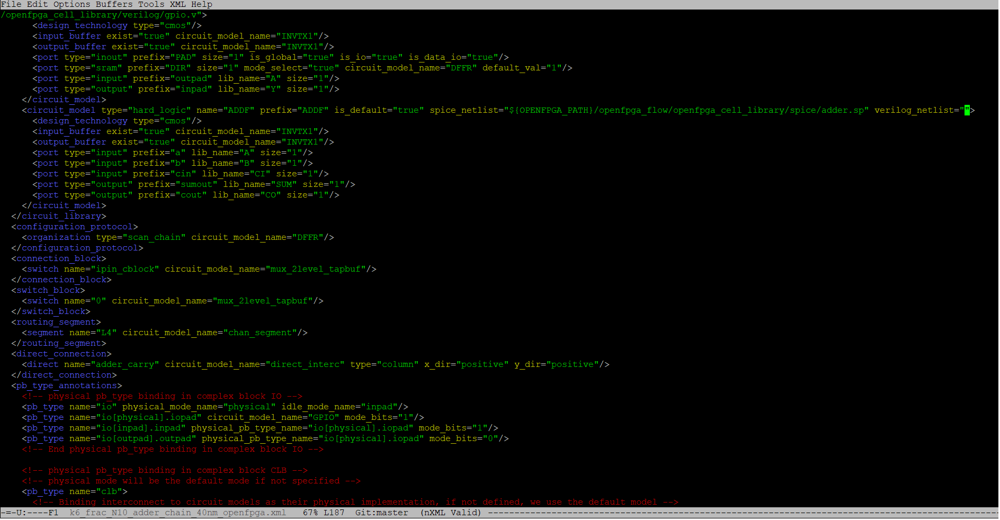
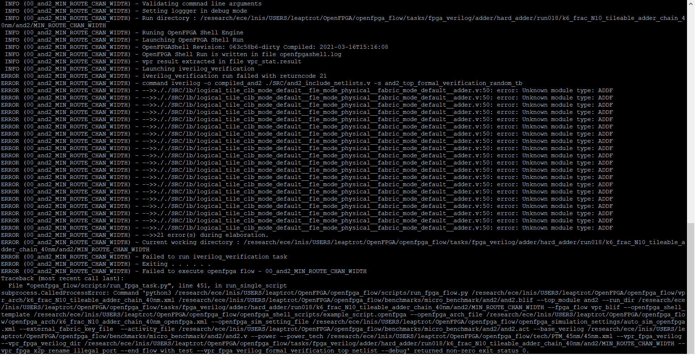
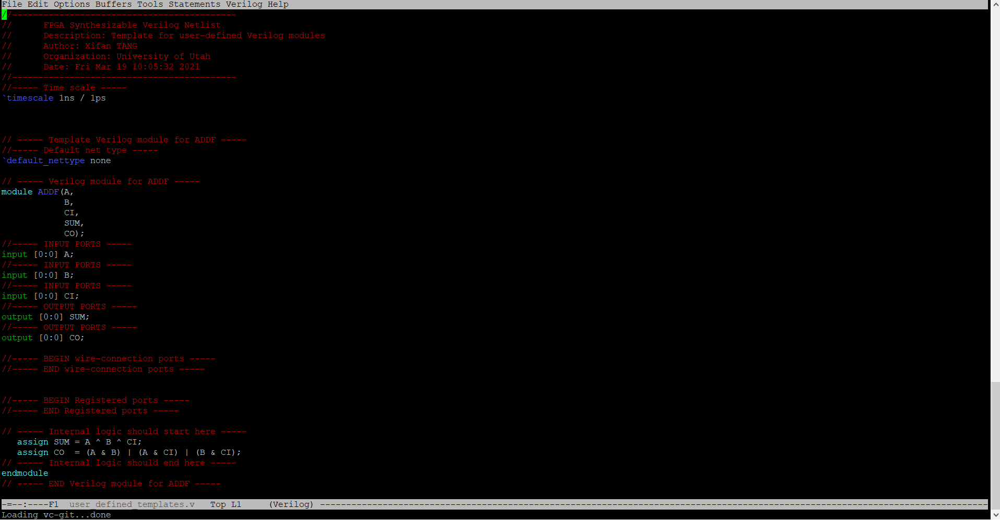

================================================================
Integrating Custom Verilog Modules with user_defined_templates.v
================================================================
1. Introduction
===============
**In this tutorial, we will**
- Provide motivation for generating the user_defined_templates.v verilog file
- Go through a generated user_defined_templates.v file to demonstrate how to use it
For this examaple, we are using a modified version of the hard adder task that comes with OpenFPGA
To follow along, remove the path for the verilog_netlist in the file k6_frac_N10_adder_chain_40nm_openfpga.xml at line 187.

From the OpenFPGA root directory run the command
``python3 openfpga_flow/scripts_run_fpga_task.py fpga_verilog/adder/hard_adder --debug --show_thread_logs``
Running this command should fail and produce output similar to this

This command failed during the verification step because the path to the module definition for ADDF is missing. In our architecture file, user-defined verilog modules are those ``<circuit_model>`` with the key term verilog_netlist. The user_defined_templates.v file provides a module template for incorporating Hard IPs with no external library into the architecture. 
This error can be resolved by putting the following line back into the k6_frac_N10_adder_chain_40nm_openfpga.xml file at line 187 in the verilog_netlist:
``${OPENFPGA_PATH}/openfpga_flow/openfpga_cell_library/verilog/adder.v``
The above line provides a path for now to generate the user_defined_templates.v file. 
Now we can return to the root directory and run this command again:
``python3 openfpga_flow/scripts_run_fpga_task.py fpga_verilog/adder/hard_adder --debug --show_thread_logs``
The user_defined_templates.v file can be found within the sub_module directory located at:
``./openfpga_flow/tasks/fpga_verilog/adder/hard_adder/latest/k6_frac_N10_tileable_adder_chain_40nm/and2/MIN_ROUTE_CHAN_WIDTH/SRC/sub_module``
The file contains user-defined verilog modules that are found in the openfpga_cell_library with ports declaration (compatible with other netlists that are auto-generated by OpenFPGA) but without functionality. This file is used as a reference for engineers to check what is the port sequence required by top-level verilog netlists. This file can be included in simulation only if there are modifications to the file.
To implement our own ADDF module, we need to remove all other module definitions (they are already defined elsewhere and will cause an error if left in). The file should look similar to this once ADDF is defined

We can now link this definition into the architecture file and run the task script again.
There should be no errors if this is done correctly.
