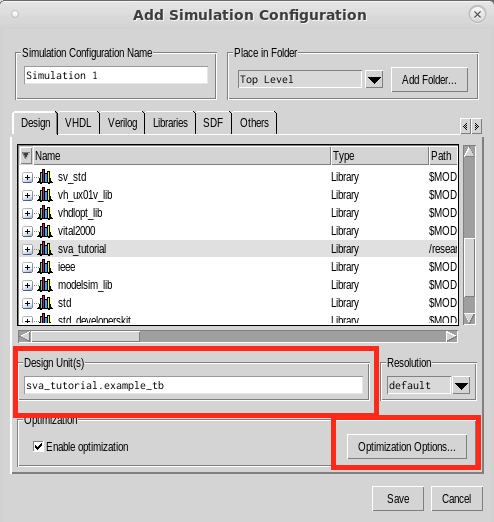
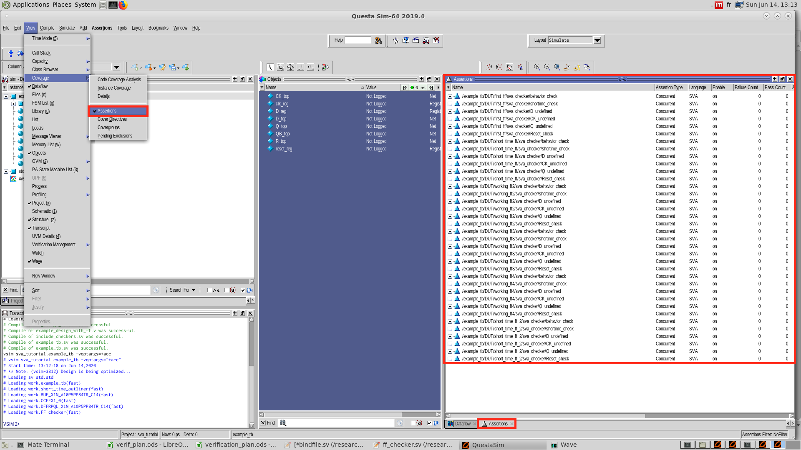
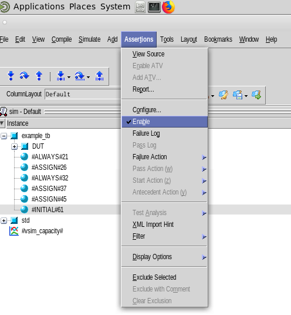
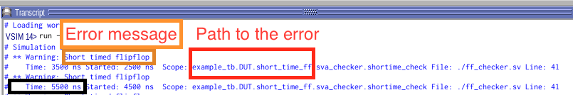
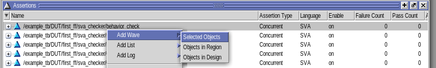
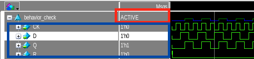
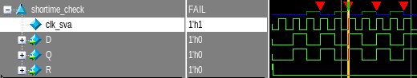
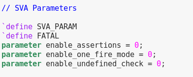

.. _sva_tutorial:

SVA Tutorial
------------

This tutorial will show an example how to 
  - Run the sva checker using Modelsim implemented in OpenFPGA
  - Use the checker to debug the design
  - Use parameters to improve simulation runtime
  
After generating a netlist following :ref:`from_blif_to_verification` , OpenFPGA flow will also generate an SVA checker.

.. note:: Checker generation is supported with a frame-base configuration protocol FPGA.

.. note:: Content described here : https://github.com/LNIS-Projects/OpenFPGA/tree/samy_sva-1/openfpga_flow/sva

Run the sva checker in Modelsim
~~~~~~~~~~~~~~~~~~~~~~~~~~~~~~~

Let's create a modelsim project with sample design and testbench files :

.. _fig_compile_checker:

.. figure:: ./figures/compile_fpga.png
   
 First step is to create a simulation configuration with in full debug mode :
   
.. _fig_simu_opt:

   
.. _fig_simu_debug:

.. figure:: ./figures/simu_full_debug.png
   :scale: 90%
   :alt: map to buried treasure
   
   Then we need to add assertion to the coverage viewer :
   
.. _fig_enable_assertions:

   
   Enable the assertion trigger :
   
.. _fig_enable_assertion2:

   
At this point, the checker is ready to be used.

Use the checker to debug
~~~~~~~~~~~~~~~~~~~~~~~~

Run the simulation and look at the transcript.

If you get a "Simulation succeed" without warning message, simulation passed.
However, you may get warning message coming from the sva checker looking like this :

.. _fig_error_message:

   
   The checker provides information regarding the module where the error occured, the error type, timestamp aswell as location of the module in the transcript.
   You can add assertion to the waveform to understand why a warning signal was fired :
.. _fig_addwave:

   
   Here's an example of an assertion that didn't detect any error :
.. _fig_working_assertion:

First line is the state of the assertion :
  - ACTIVE : The trigger condition of the assertion is TRUE, and it will perform verification of it's property next clock cycle(s).
  - INACTIVE : No verification to be performed on this clock cycle / Or the assertion is immediate and has passed.
  - FAIL : The assertion property isn't respected by design's signal, it fires an error message.
  - DISABLED : The assertion is disabled by $assertoff statement and is not running.

Below are the signal involved in the assertion check.
In our example, we're looking at a FlipFlop module's behavior.
If Reset(R) isn't asserted, Q signal should raise one clock(CK) cycle after D raised.
This is always the case here, so the assertion doesn't fire any error.

Now let's take a look at an incorrect FlipFlop module :
.. _fig_not_working_assertion:

   
   Here Q raise at the same clock cycle D raised, which is wrong, and is the reason why the assertion fires an error.

Use parameter to improve runtime
~~~~~~~~~~~~~~~~~~~~~~~~~~~~~~~~
   
   In the testbench are defined multiple parameters to control assertion activity :
   

   
   enable_assertions(0) : Set to 1 to enable all assertions
   
   enable_one_fire_mode(0) : Set to 1 to allow part of the assertions to fire once and then be disabled (saves runtime)
   
   enable_undefined_check(0) : Set to 1 to enable signal state checking ( Assertions that fire if undefined signals are to be found in the design )
   
   `define FATAL : By default, firing assertions will stop the simulation. You can set the error to warnings instead by commenting the FATAL define.
   
   
