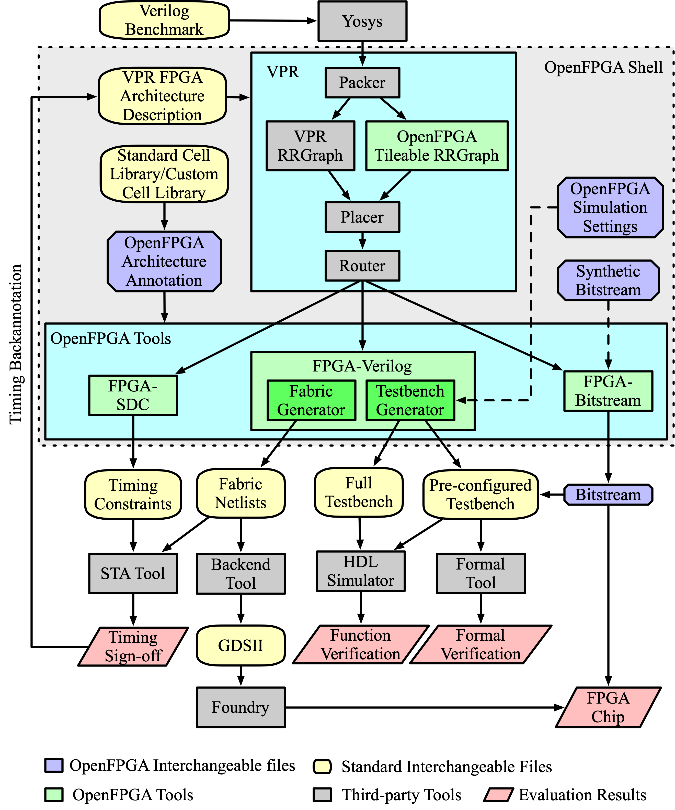

.. _openfpga_tools:

Supported Tools
---------------

Internal Tools
^^^^^^^^^^^^^^

To enable various design purposes, OpenFPGA integrates several tools to i.e., FPGA-Verilog, FPGA-SDC and FPGA-bitstream (highlighted green in :ref:`fig_openfpga_tools`, with other popular open-source EDA tools, i.e., VPR and Yosys.

.. _fig_openfpga_tools:

   OpenFPGA tool suites and design flows 

Third-Party Tools
^^^^^^^^^^^^^^^^^

OpenFPGA accepts and outputs in standard file formats, and therefore can 
interface a wide range of commercial and open-source tools.

+--------------+-------------------------+
| Usage        | Tools                   |
+==============+=========================+
| Backend      | Synopsys IC Compiler II |
|              |                         |
|              | Cadence Innovus         |
+--------------+-------------------------+
| Timing       | Synopsys PrimeTime      |
| Analyzer     |                         |
|              | Cadence Tempus          |
+--------------+-------------------------+
| Verification | Synopsys VCS            |
|              |                         |
|              | Synopsys Formality      |
|              |                         |
|              | Mentor ModelSim         |
|              |                         |
|              | Mentor QuestaSim        |
|              |                         |
|              | Cadence NCSim           |
|              |                         |
|              | Icarus iVerilog         |
+--------------+-------------------------+
